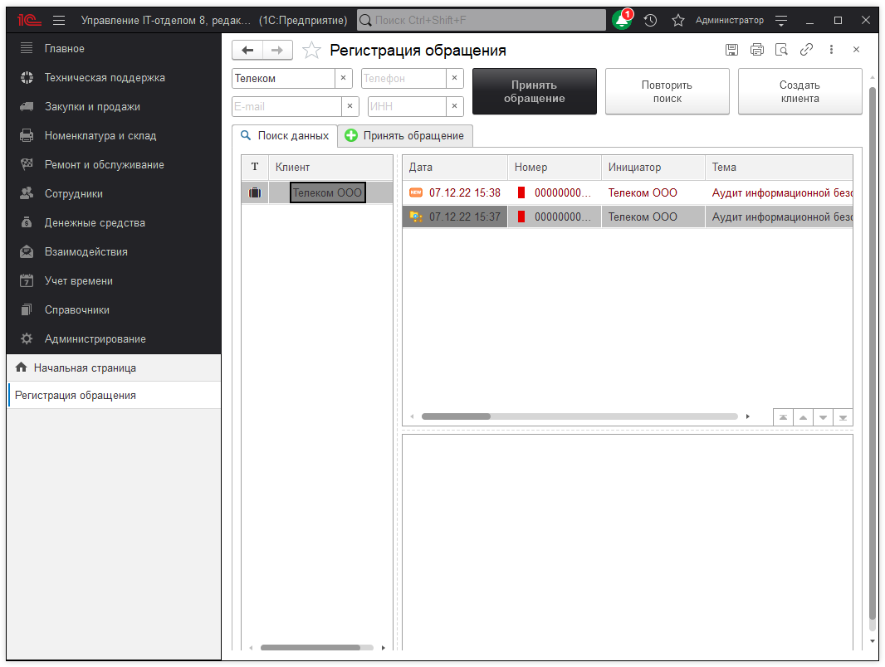
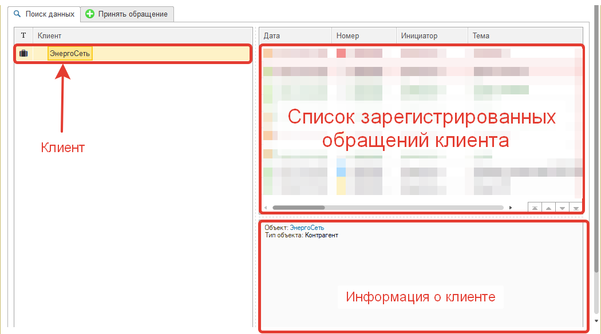
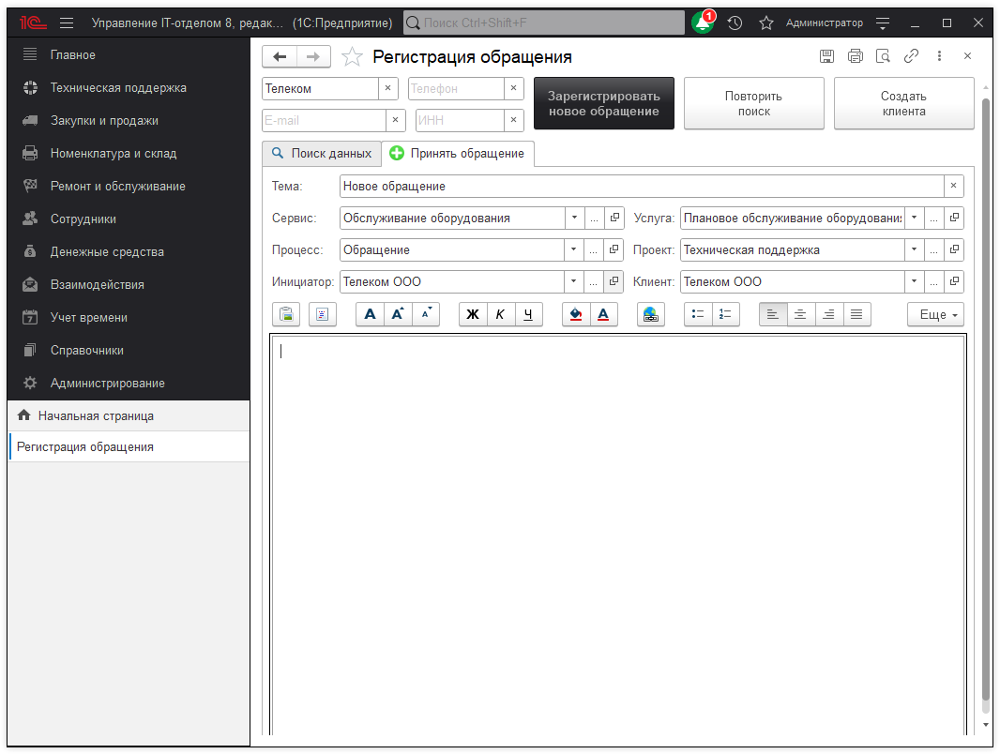

# Мастер регистрации

В работе сотрудников службы технической поддержки одним из важных критериев оценки их работы является скорость. Это понятие разделяется на сроки реакции и сроки выполнения. В виду этого специалистам Service Desk жизненно необходим функционал, позволяющий максимально быстро и просто регистрировать все входящие обращения, а также выполнять уже поступившие. Поэтому в конфигурации появился такой механизм, как "Мастер регистрации". Для того, чтобы открыть этот функционал перейдем в раздел "Техническая поддержка"-"Мастер регистрации" (альтернативный вызов клавишей F12 в форме списка документа "Задание").

Этот механизм полноправно можно считать рабочем местом диспетчера технической поддержки или сотрудника первой линии. Так как большую часть рабочего времени они проводят в этом месте. Представим ситуацию, когда поступает входящий звонок от клиента и он просит прояснить ситуацию по той или иной заявке. С помощью мастера регистрации, диспетчер вводит данные для поиска. Это может быть наименование клиента, телефон, e-mail или ИНН. После чего по данному клиенту в соответствующем окне будут выведены все обращения. 

Согласитесь, такой подход очень удобен на практике и занимает минимум времени. Также мастер регистрации позволяет быстро регистрировать входящие заявки. Для этого нужно нажать кнопку "Принять обращение", после чего вы будете автоматически перемещены на форму заполнения основных реквизитов задания. Где нужно заполнить набор реквизитов и нажать кнопку "Зарегистрировать новое обращение".

