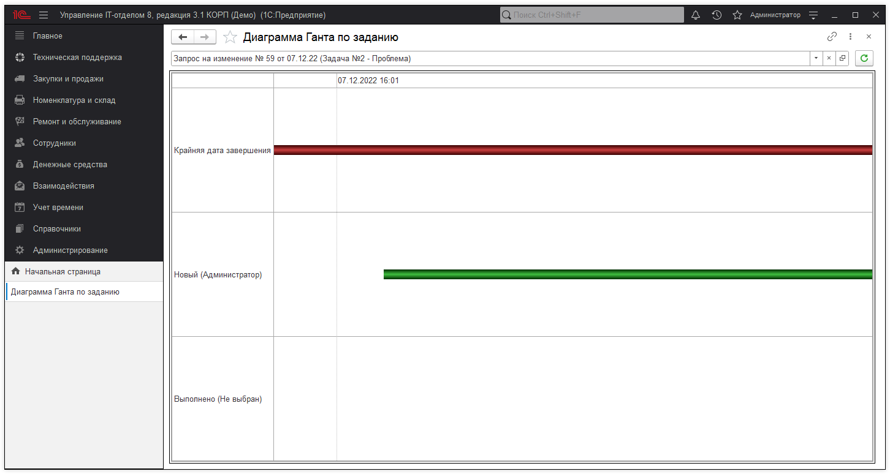
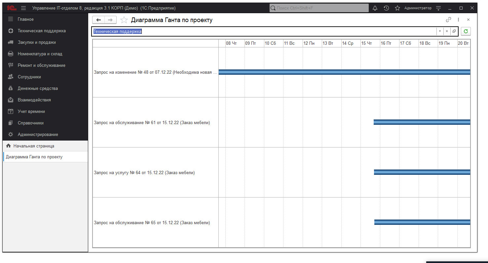

# Диаграмма Ганта (по заданию/проекту)

!!!
**Диагра́мма Га́нта** — это популярный тип столбчатых диаграмм, который используется для иллюстрации плана, графика работ по какому-либо проекту. Является одним из методов планирования проектов. Используется в приложениях по управлению проектами. Первый формат диаграммы был разработан Генри Л. Гантом в 1910 году.
!!!

В конфигурации реализован функционал "Диаграмм Ганта (по заданиям/проектам)". Пример, диаграммы по заданию:

