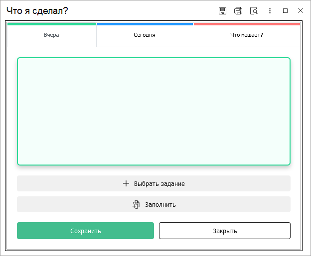
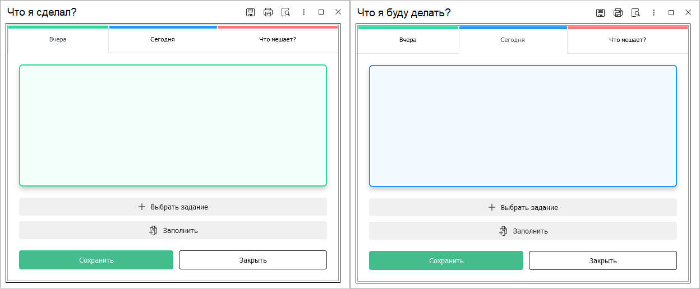
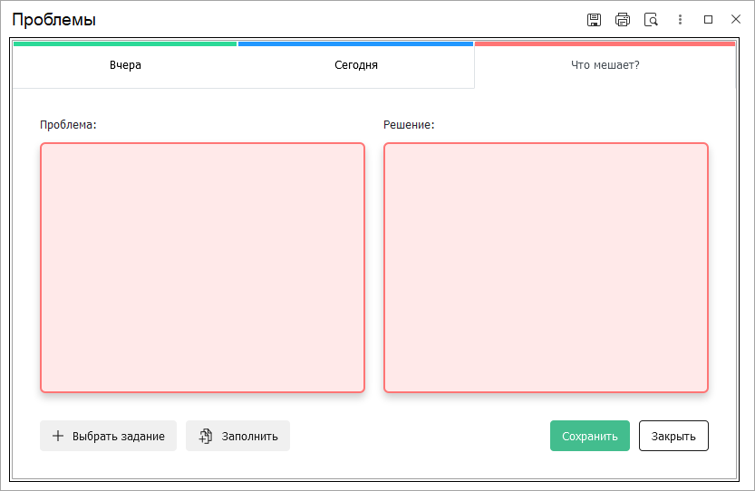
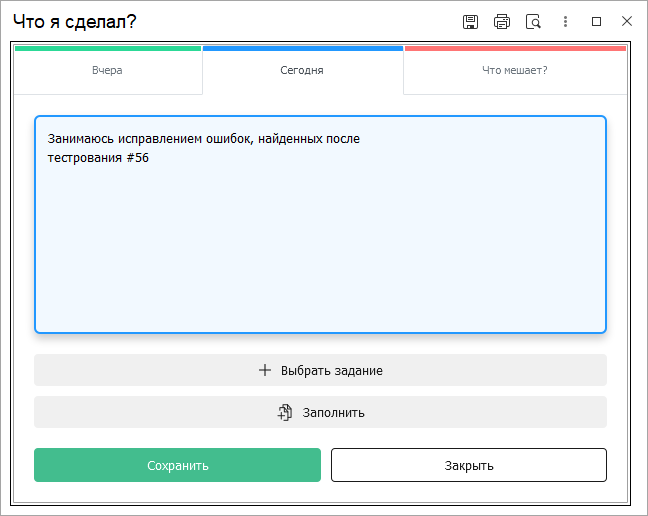

# Добавление и редактирование заметок ежедневного стендапа

## Добавление и редактирование заметок стендапа

Для того, чтобы в основном документе стендапа появились новые записи или имеющиеся были отредактированы, необходимо перейти в соответствующую форму. По нажатию в основной части документа кнопок "Добавить запись" или "Редактировать стикер" открывается форма, которая выглядит следующим образом:

## Новая запись
При создании новой записи, пользователю доступны три одноименные закладки, на которых есть возможность указать текст содержимого той или иной заметки. Способ добавления новых заметок полностью динамический, то есть Вы можете создавать заметки как по одной штуке каждого вида, так и создать сразу трех видов. После ввода необходимого текста, чтобы стикер был добавлен нужно нажать на кнопку **"Сохранить"**, которая запишет новую заметку. Как и в основной форме, так и здесь закладки "Вчера" и "Сегодня" идентичны и различаются лишь своей цветовой гаммой.

Закладка же "Что мешает" немного отличается, так в своем составе имеет тело стикера **"Решение"**, текст которого записывается в стикер проблемы в виде второй его составляющей.

## Редактирование заметок

Как и для добавления, так и для редактирования стикеров используется данная форма. Однако отличие заключается в том, что изменять можно только один стикер. Например, Вам необходимо подправить какую-либо информацию в заметке, Вы нажимаете кнопку редактировать. Открывается данная форма с уже открытой закладкой нужного типа и редактируемым текстом. При этом остальные закладки становятся недоступными для перехода по ним. Отличительным поведением выделяется является лишь стикер с типом "Что мешает", который открывается для редактирования сразу двух заметок: "Проблема" и "Решение".

## Работа с формой

Каждая из закладок имеет в своем составе поле, где отображается вводимый текст, а также общий для всей формы набор кнопок управления:

* **Выбрать задание** - С помощью данной кнопки осуществляется добавление одного задания в текст заметки. При нажатии на эту кнопку открывается форма выбора документа "Задание", где Вы можете выбрать необходимую задачу. Стоит отменить, что задача будет добавлена именно в то место текста, где находился курсор в момент нажатия кнопки. Если курсор вообще не был установлен в тело стикера, тогда задача будет добавлена в самое начало текста.
* **Заполнить** - С помощь данной кнопки выполняется добавление сразу нескольких заданий, которые были выполнены или завершены в период между прошлым ежедневным стендапом и текущей датой. При нажатии этой кнопки будет произведен поиск и добавление задач в начало текста с переносом строки, независимо где был ранее установлен курсор. Алгоритм поиска следующий: сначала ищется последний ежедневный стендап, в котором пользователь принимал участие (была добавлена хотя бы одна заметка) и берется дата найденного документа. Далее осуществляется поиск заданий, дата выполнения или завершения которых попадает в интервал от даты найденного стендапа до текущей даты (дата и время нажатия на кнопку).
* **Сохранить** - Выполняет сохранение (перезапись) редактируемой заметки, новыми значениями.
* **Закрыть** - Закрывает форму.

Помимо добавления в текст стикера заданий с помощью кнопок, у пользователя есть возможность добавлять задачи "вручную", указывая номера заданий в специальном формате **(#Номер_задания)**. При этом сам номер задания может быть указан как номер числом "22", так и с лидирующими нулями **"00000000022"**. При сохранении заметки, текст будет обработан и введенные номера заданий будут конвертированы к единому виду ссылки. Единственный нюанс при таком подходе, это то, что пользователь должен точно знать, что задача с таким номером существует иначе номер не будет обработан и выведен как обычный текст. 