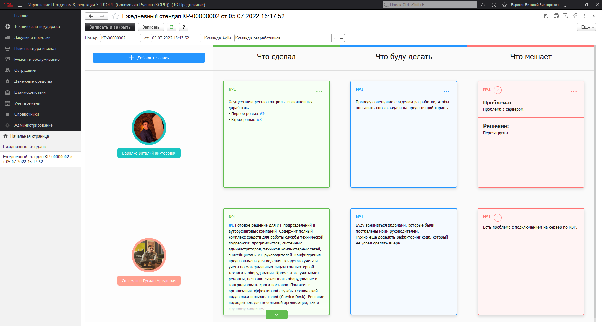
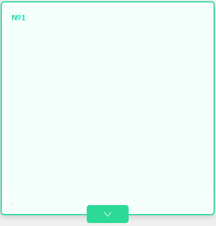
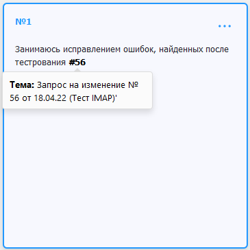
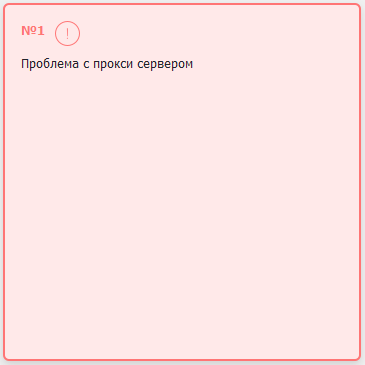
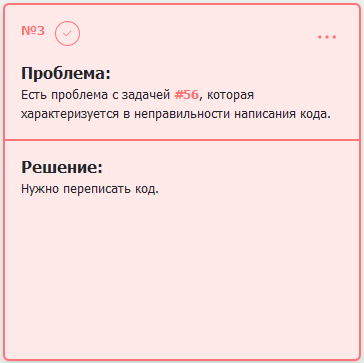
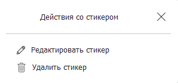

# Ежедневный стендап

!!!
**Ежедневный стендап или Daily**
Это регулярная короткая встреча Agile-команды, которая предназначена обеспечить некую синхронизацию информации для всех участников, обеспечить прозрачность рабочего процесса и таким образом поддерживать эффективность и производительность работы команды.
!!!

Суть этого ежедневного процесса заключается в том, что каждый участник докладывает остальным ответы на три ключевых вопроса:

* **Что я сделал?** - какой фронт работ был выполнен мной вчера.
* **Что я буду делать?** - какими задачами я займусь сегодня.
* **Что мешает?** - с какими проблемами я столкнулся.  

Таким образом внутри команды появляется прозрачность, которая показывает насколько хорошо или наоборот плохо обстоят дела. Еще немаловажный фактор это повышение коммуникабельности внутри коллектива, каждый кто сталкивается с затруднительной проблемой может попросить помощи в ее разрешении у сотрудников с более высокой компетенцией.
Чтобы данная методика прекрасно показала себя на практике ее нужно придерживаться, а именно проводить данные собрания регулярно каждый рабочий день, при этом длительность собрания обычно должна занимать не более **15 минут**. Если какой-либо вопрос требует более детального разбора, лучше его оставить на индивидуальное рассмотрение дабы не тратить драгоценное время. Ведь не забываем, что основная цель это отчитаться каждому участнику о своей работе перед коллективом.

В нашем решение был разработан одноименный механизм, который позволит каждому участнику ежедневного стендапа заранее подготовить список собственных заметок. Это позволяет не только четко формулировать собственные доклады перед коллегами, но и структурирует информацию в конкретном месте.
Данный механизм располагается в разделе основного меню **"Техническая поддержка" - "Agile" - "Ежедневные стендапы"**. Основная форма выглядит следующим образом:

Основная форма предназначена для отображения в табличном виде всех добавленных записей пользователей. По каждому пользователю строится отдельная строка, которая хранит заметки ключевого столбца. Для лучшего визуального представления, стикеры выделяются цветами в соответствии с расположением в конкретном столбце. Рассмотрим стикеры ежедневного стендапа подробнее:

## Стикеры ежедневного стендапа

Каждый стикер хранит в себе текст, который был добавлен пользователем для дальнейшего его использования при проведении Deily. Размер текста помещающегося в заметку **неограничен**. Если текст превышает размеры стандартного стикера, то он сворачивается до стандартных масштабов. Каждая заметка нумеруется в рамках своего типа и номер конкретной заметки отображается в ее левом верхнем углу. Вывод реализован по убыванию, что позволяет отображать последние добавленные заметки в самом верху строки.

Внутри текста любого из стикеров можно вставлять номера заданий, о которых идет речь. Вставленные номера формируются в хэштеги, по которым в дальнейшем можно открыть форму интересующей нас задачи. Каждое задание, присутствующее в тексте подсвечивается синим цветом и при наведении на него мышью выводится подсказка с полным представлением задачи.

Стикеры типов "Вчера" и "Сегодня" по своей функциональной возможности схожи, но в ежедневном стендапе присутствует третий вид стикера "Что мешает", который объединяет в себе фиксацию проблемной ситуации и ее решение. Именно эта возможность в корне отличает от остальных видов стикеров. Данный вид заметки разделяется на две составляющей в зависимости от своего содержания. Если в стикере указана только проблема, тогда применяется стандартный вид для каждого из типов стикеров и при этом в левом верхнем углу рядом с номером отображается индикатор в виде восклицательного знака (!), сигнализирующий о не решенной проблеме.

Если входе проведения совещания проблема была решена, тогда найденное решение можно зафиксировать. При этом индикатор будет изменен и само решение будет отображаться в теле стикера.

Каждый пользователь и участник ежедневного стендапа может управлять ранее добавленными заметками. Нажав на кнопку в виде трех точек, раскроется меню, в котором пользователь может выбрать одно из предложенных действий:

* **Редактировать стикер** - [переход к редактированию содержимого заметки.](https://softonit.ru/FAQ/courses/?COURSE_ID=1&LESSON_ID=869)
* **Удалить стикер** - выполнить удаление заметки.

Стоит отменить, что использовать данное меню и взаимодействовать со стикером может только автор этой заметки. Права на доступность меню не влияют.

## Пользователи и основные реквизиты

У данного функционала в шапке профиля присутствуют несколько реквизитов:

* **Номер** - Автоматически формирующейся номер документа с префиксацией, которая позволит в дальнейшем сортировать документы по префиксу.
* **Дата** - Дата записи документа.
* **Команда Agile** - Команда agile, участники которой имеют отношение к конкретному ежедневному стендапу. Данный реквизит является обязательным к заполнению и без него нельзя записать документ. При создании пользователем нового документа "Ежедневный стендап" в качестве команды указывается команда автора этого документа, если она найдена, в противном случае реквизит остается незаполненным.
Самый первый столбец таблицы предназначен для вывода пользователей в алфавитном порядке. Каждый из пользователей представлен в виде блока фотографии и его полного имени, а также этот блок приминает автоматически подобранный цвет, который закрепляется за конкретным пользователем. Также имеется возможность перейти прямо в карточку, нажав на необходимого пользователя.

Если у пользователя не установлена фотография, тогда выводится сформированная замена фотографии в виде инициалов полного имени.

Также в этой части таблицы в левом верхнем углу располагается основная кнопка добавления новых заметок в документ.

### Роли:

|             |            | 
| ----------- | ---------- | 
|**Добавление и изменение ежедневных стендапов**| Возможность добавления, редактирования, установки пометки на удаления ежедневных стендапов. Полные возможности для работы с данным документом. | 
| **Чтение ежедневных стендапов** | Чтение ежедневных стендапов | 

