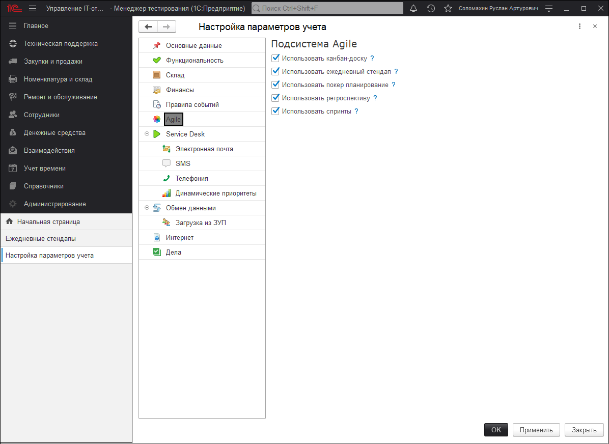

# Команды "Agile"

!!!
Команда Agile
Это кросс-функциональная группа сотрудников размером от 5 до 11 человек, которая наделена полномочиями и способна определить, создать, протестировать и внедрить инкремент ценности за короткий временной интервал.
!!!

1. **Зачем нужна команда Agile?**
Для быстрой реализации поставленных задач, что позволяет ускорить поставку продукта на рынок. Для определения точных потребностей и предпочтений клиентского сегмента. Для снижения количества микроменеджмента.

2. **Какой должна быть Agile команда?**
Она должна быть кросс-функциональной, самодостаточной и самоорганизованной. Команда отвечает за общий успех и конечный результат, именно поэтому члены команды должны протягивать руку помощи друг другу в рабочем процессе. Участники не должны оставлять все на самотек и ограничиваться работой собственной компетенции. Основная идея команды Agile - командная и слаженная работа механизма часов. Каждая шестеренка работает совместно с другой частью механизма.

3. **Когда нужна Agile команда?**
В тот момент, когда стартует или уже реализуется большой и сложный продукт. Когда имеется высокая степень неопределенности, рисков. Когда есть проблемы с реализацией "конвейера" поставки продукта в нужные сроки.  
Создание Agile команды позволит поставлять продукт чаще и сразу же получать обратную связь от заказчика. Как результат, появление более ценного, качественного и востребованного продукта, который начнет приносить прибыль.

В нашем решение создано такое понятие как "Команды Agile", которое в свою очередь взаимодействует со всеми сущностями подсистемы Agile. Команды используются в "Ежедневном стендапе", "Покер планировании", "Ретроспективе" и "Спринтах".

Перейти к созданию новой команды Agile можно в разделе **"Техническая поддержка" - "Agile" - "Команды Agile"**.

Функционал команд Agile представляет собой справочник, где хранятся все созданные команды сотрудников по ключевым назначениям. Каждая из команд имеет в своем составе определенный набор участников со своими ключевыми видами, которые характеризуют основную роль сотрудника.

В шапке располагаются основные реквизиты справочника:

* **Наименование** - название команды.
* **Префикс** - префикс команды, который используется для префиксации кода команды. В дальнейшем от этого префикса измениться нумерация, например, ежедневного стендапа, в котором данная команда будет участвовать. Данный реквизит является обязательным к заполнению и может иметь любое текстовое значение длиной 2 символа.
* **Код** - порядковый код команды.
* **Активность** - определяется активность текущей команды "Работает\Не работает".
В основной части справочника располагается табличная часть участников, в которой указываются сотрудники имеющие отношение к данной команде Agile. Помимо самого участника ему присваивается вид, который характеризует его роль в системе команды. Список видов может расширяться при необходимости, но по умолчанию есть предопределенный состав видов, который можно использовать в любой команде.

|                                                  |                                  | 
| ------------------------------------------------ | -------------------------------- | 
| **Добавление и изменение ежедневных стендапов**  |  Возможность добавления, редактирования, установки пометки на удаления команд Agile. Полные возможности для работы с данным справочником.| 
| **Добавление и изменение покер планирования**    | Возможность добавления, редактирования, установки пометки на удаления команд Agile. Полные возможности для работы с данным справочником. | 
| **Чтение ежедневных стендапов**                  |	Возможность только просмотра справочника. | 
| **Чтение покер планирования**                    | 	Возможность только просмотра справочника. | 
| **Чтение покер планирования**                    | 	Возможность только просмотра справочника. | 
