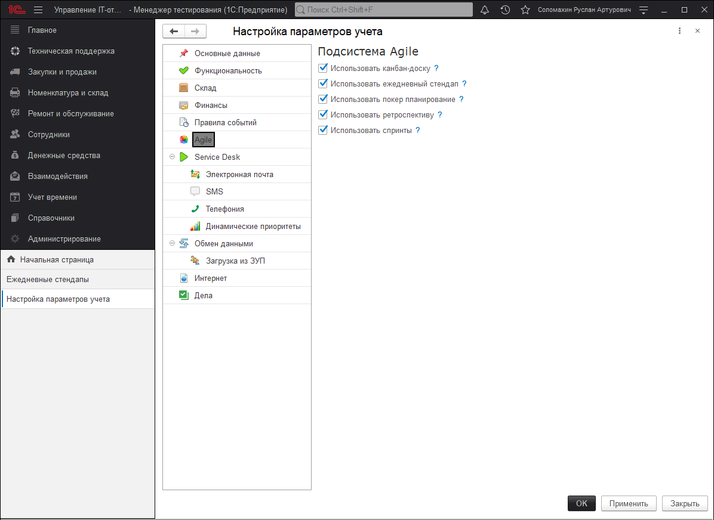

# Подсистема "Agile"

!!!
**Agile (Agile software development)** — гибкий подход к разработке программного обеспечения, который все чаще применяют в командах разработчиков.
!!!

Такой подход к управлению проектами и в разработке продукта, позволяет командам ускорить создание программного продукта (ценности) и избежать ошибок. При таком подходе не выпускают весь продукт целиком, а наоборот разработчики (agile – команда) выполняет работу в рамках небольших, но понятных задач. Требования, планы и результаты постоянно проходят проверку на актуальность, благодаря чему команды могут быстро реагировать на изменения. Для управления Agile-проектами можно использовать разные фреймворки. К самым популярным относятся:

* **Scrum** - это методика, помогающая командам вести совместную работу.
* **Kanban** - это популярный подход к реализации принципов Agile при разработке ПО

Элементы этих методологий, включены в нашу подсистему Agile. В разделе **"Администрирование"-"Настройки параметров учета"**-"Agile" Вы можете включить или отключить функциональные опции всех сущностей данной подсистемы.

!!!
Функционал доступен с версии 3.1.13.7 только для редакции КОРП.
!!!