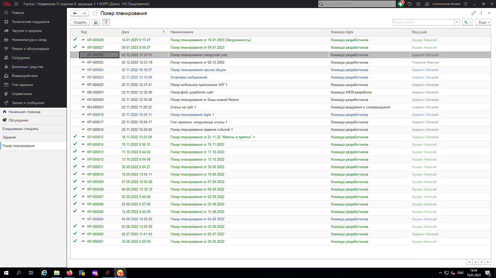

# Как показать/скрыть уже законченные сессии

Начиная с версии **8.3.15.6**  появилась возможность скрывать уже завершенные сессии
Для этого в форме списка сессий появилась специально обученная кнопка: 

Нажав на нее, мы увидим список всех элементов с цветовой дифференциацией: зеленый и галочка - все задачи оценены, синий - есть задачи без оценки, черный - нет оценок. Пример можно посмотреть на рисунке ниже.

