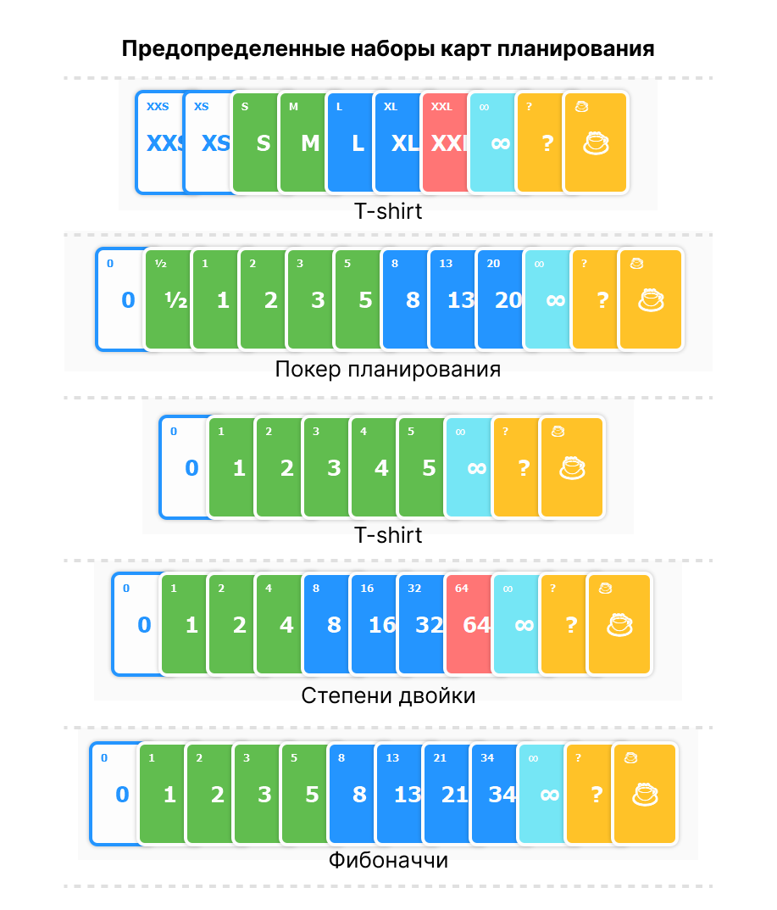
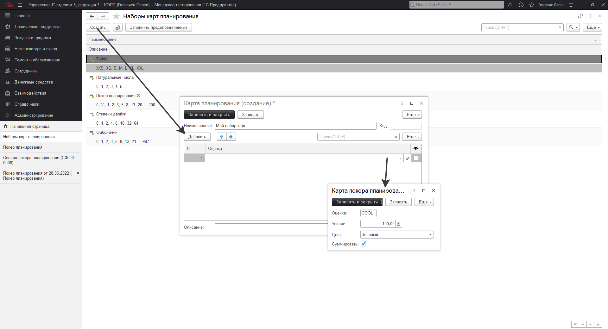
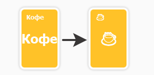

# Наборы карт планирования

## Предопределенные наборы карт
Наборы карт планирования необходимы для оценки заданий с помощью сессий планирования, существуют предопределенные наборы:

## Создание собственного набора карт планирования  
Для создания набора карт планирования необходимо перейти в раздел *"Техническая поддержка" -> "Наборы карт планирования" -> "Создать"*

Установите произвольное наименование набору карт, заполните таблицу существующими оценками или создайте собственные, не забудьте установить видимость карты в таблице оценок (столбец с пиктограммой глаза).

## Замена надписи "Кофе" на символ чашки кофе
К сожалению не все операционные системы поддерживают символ "Горячий напиток", поэтому в предопределенных оценках вместо оценки с символом чашки кофе, просто написана надпись "Кофе", если Вы хотите использовать символ кофе, перейти в раздел *"Техническая поддержка" -> "Наборы карт планирования" -> "Покер планирования ®" ->* В списке оценок откройте оценку *"Кофе"* -> В поле *"Оценка"* замените надпись *"Кофе"* на символ "☕" -> Готово! Необходимо записать и закрыть окно.

