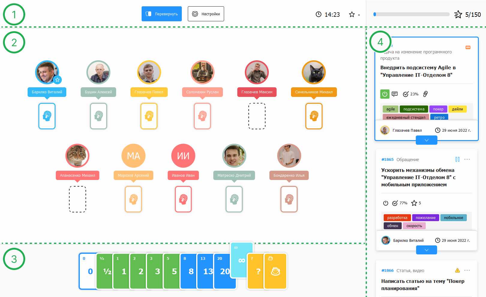
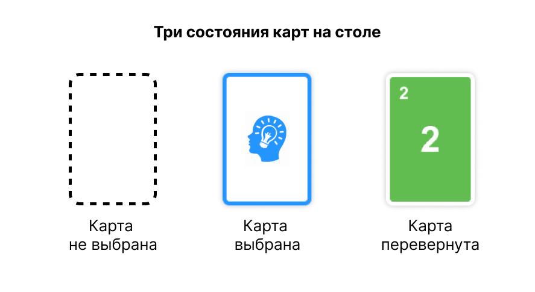
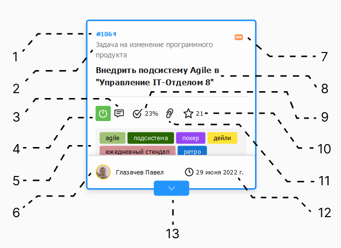

# Описание элементов игрового окна

## Составляющие окна покера планирования
Для лучшего понимания, интерфейс сессии можно разделить на 4 зоны:

### 1. Шапка покера планирования.

Шапка содержит в себе, основные элементы управления ведущего и информацию о текущей сессии:

* **Кнопка справки** - выполняет переход в браузер на соответствующую статью базы знаний SoftOnIt
* **Кнопка "Перевернуть"** - Видна только для ведущего. При нажатии перевернет все выложенные карты на столе и вычислит среднюю карту, колоды карт у участников будут заблокированы, ход делать нельзя. (Можно не дожидаться хода всех участников, в таком случае пустые карты в результат среднего вычисления не попадут)
* **Кнопка "Повторить"** - Видна только для ведущего. При нажатии на кнопку, оценка будет сброшена и очищены все выложенные карты, карты в руках станут доступными для выбора.
* **Кнопка "Настройки"** - Видна только для ведущего. Открывает настройки текущей сессии.
* **Таймер** - Таймер остатка времени на обсуждение и оценку текущего задания, таймер несет информационный характер, если достигнет "00:00" будет гореть красным, при этом можно продолжать оценку.
* **Средняя оценка** - После того, как карты будут перевернуты, механизм автоматически вычислит среднюю карту. Если на стол будет выложено более трех подряд идущих карт или будет обнаружена "Спецкарта" (кофе, бесконечность, вопрос...), оценка будет вычислена, но подсветится красным цветом, процесс оценки текущего задания желательно повторить, но можно оставить и так.
* **Скорость команды** - Шкала границы усилий для текущий команды-Agile (Velocity)

### 2. Игровой стол.
На столе находятся блоки каждого участника со статусом карты. Участники заполняются ведущим в настройках сессии. Если ведущий является участником рядом с его фотографией будет отображаться звездочка.

Состояния карт:

### 3. Карты в руках.
Набор карт текущей сессии (настраивается ведущим), если карты на столе рубашкой вверх - можно ходить (для сброса хода вновь нажмите на выбранную карту), если карты на столе раскрыты, то блок карт в руке будет серым цветом и ход сделать не получится, необходимо ждать действий ведущего.

### 4. Список историй / заданий.
Данный список необходим для четкой очередности оценки заданий, набирается и редактируется ведущим сессии, текущее задание выделено обводкой синим цветом.

* **1** - Номер задания, при нажатии откроется окно задания.
* **2** - Текущий процесс.
* **3** - Наличие значка свидетельствует о существующих комментариях в задании.
* **4** - Вкл/выкл задание из текущего спринта. (Если горит зеленым, значит задание включено в спринт).
* **5** - Теги задания.
* **6** - Текущий исполнитель.
* **7** - Картинка текущего этапа.
* **8** - Тема задания.
* **9** - Процент выполнения задания.
* **10** - Оценка задания.
* **11** - Наличие значка свидетельствует о существующих прикрепленных файлах в задании.
* **12** - Крайняя дата, когда задача должна быть выполнена по SLA.
* **13** - Если стикер не вмещает информацию, то появляется данная кнопка для показа скрытых элементов.