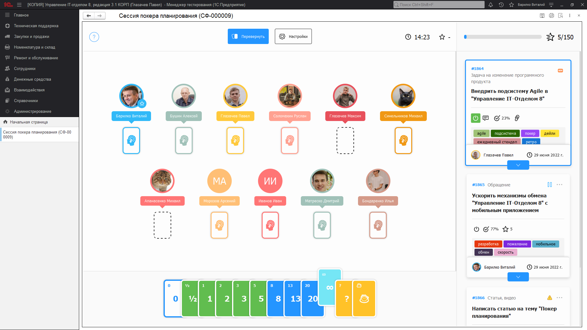
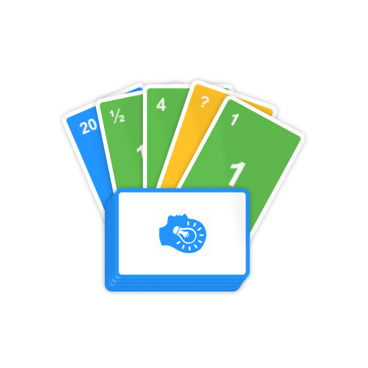

# Покер планирования

!!!
**Покер планирования (англ. Planning Poker, а также англ. Scrum poker)**
Техника оценки, основанная на достижении договорённости, главным образом используемая для командной оценки сложности предстоящей работы или относительного объёма решаемых задач при разработке программного обеспечения.
!!!

Суть этого процесса заключается в том, что эта техника минимизирует эффект привязки путём опроса каждого из участников команды таким образом, что никто не знает чужого решения до одновременного оглашения выбора каждого из участников. Оценки, полученные с помощью покера планирования, являются более точными, чем оценки, полученные иными методами.

## Основные достоинства:

* **Повышает эффективность** - одна их периодических встреч Agile-команды - это собрания посвященные планированию, "Покер планирования" призван стать инструментом повышающим единство команды, сосредоточенность и скорость.
* **Убирает эффект** привязки - каждый член Agile-команды уникален, потому что имеет свой опыт, мнение, оценку задания... По этой причине в процессе оценки важно не мнение одного, а мнение каждого, поэтому необходимо не привязываться к мнению других. В этом поможет инструмент планирования, ведь каждый оценивает индивидуально и карты переворачиваются одновременно.
* **Контроль процесса оценки**  - инструмент контролирует количество потраченного времени на обсуждение задачи и суммарные возможности команды (скорость команды, англ. Velocity).

Избавление от эффекта привязки
Эффект привязки возникает, когда команда открыто обсуждает оценки. Команда обычно имеет в своём составе как сдержанных, так и импульсивных участников, могут быть участники, у которых есть определённые планы; разработчики, вероятно, захотят как можно больше времени заниматься работой над проектом, а владелец продукта или заказчик, вероятно, захочет, чтобы работа была закончена как можно скорее.

Оценка становится подверженной эффекту привязки, когда владелец продукта говорит нечто подобное: «Я думаю, это несложная работа, вряд ли это займёт больше пары недель». Либо когда разработчик говорит: «Думаю, это очень сложная задача, я с подобным работал». Если начинающий обсуждение говорит: «Думаю, это займёт 50 дней», — он сразу устанавливает рамки мышления остальных участников; возникает эффект привязки, то есть, если 50 дней, значит задача сложная и это подсознательно будет отправной точкой для всех участников.

Те, кто хотел сказать что задача настолько сложная что может занять 100 дней, захотят уменьшить свою оценку, а те, кто думал что на задачу требуется минимальное количество усилий, захотят увеличить её. Это становится серьёзной проблемой, особенно если изначально оценка сказана влиятельным участником. Это может быть опасным и приводить к оценкам, на которые повлияли планы или личные мнения людей, не сфокусированных на качественном выполнении задачи.

Покер планирования выявляет потенциально влиятельного участника команды, изолируя его мнение от других участников группы. Затем необходимо, чтобы участник аргументировал свой выбор, если он не совпадает с превалирующим мнением. Если участники группы могут выражать свою сплочённость таким образом, они более склонны верить в свои первоначальные оценки.

Если у влиятельного участника есть хорошие аргументы для спора, все остальные будут видеть смысл и прислушиваться, но, по крайней мере, остальные участники не будут подвержены эффекту привязки; вместо этого они должны будут исходить только из разумных соображений.

--

**Как использовать?** Правила использования очень просты. Команда-Agile встречается  
в одном помещении или удаленно с помощью видеоконференции.  
Ведущий пользователь создает новый элемент справочника "Покер планирования",  
выбирает команду, заполняет список заданий и начинает сессию, в этот момент другие пользователи  
подключаются и начинают обсуждать первую задачу,  
как только задача была разобрана пользователи выкладывают карты, ведущий нажимает  
"Перевернуть", все увидят чужие оценки и автоматически будет вычислена средняя карта,  
можно приступать к следующему заданию. Подробнее о настройках сессии...

**Роли:**

|  |  |
| ------------------------------------------------| ----------------- |
| **Добавление и изменение покера планирования**  | Возможность добавления, редактирования, установки пометки на удаления сессий покера планирования. Полные возможности для работы с данным справочником.     |
| **Чтение покера планирования**                  | 	Возможность участия. |