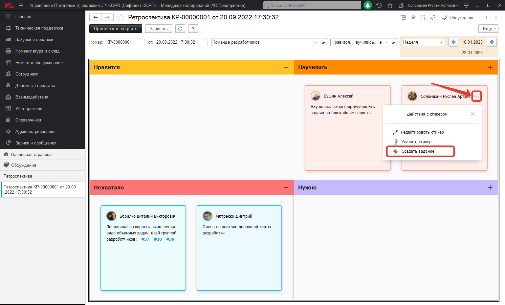
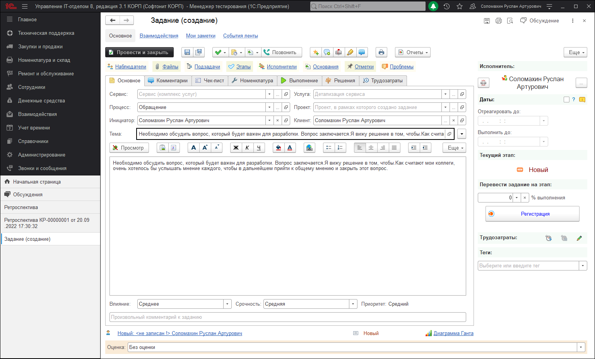

# Новая задача на основании стикера

В меню управления стикером документа "Ретроспектива", которое открывается по нажатию трех точек в правом верхнем углу. Есть возможность быстро создать новое задание на основании выбранной Вами заметки. Это очень упрощает процесс фиксирования каких-либо договоренностей, которые могли родиться в ходе обсуждения той или иной темы.

После нажатия на кнопку "Создать задание" откроется форма создания нового задания, при этом само задание еще не будет записано. Поэтому у Вас будет возможность внести какие-либо корректировки в оформление создаваемой задачи и только после этого записать форму. При этом содержание и автор стикера будет использоваться для автоматического заполнения. Автор будет поставлен в качестве инициатора создаваемого задания, а текст стикера будет использоваться для заполнения темы. Если текст стикера будет превышать **150** символов, тогда в тему будет вставлен текст размером **147 символов и дополнен "..."**. А также весь текст будет указан в качестве описания к задаче. В противном случае, текст стикера будет просто полностью вставлен в качестве темы задания.

