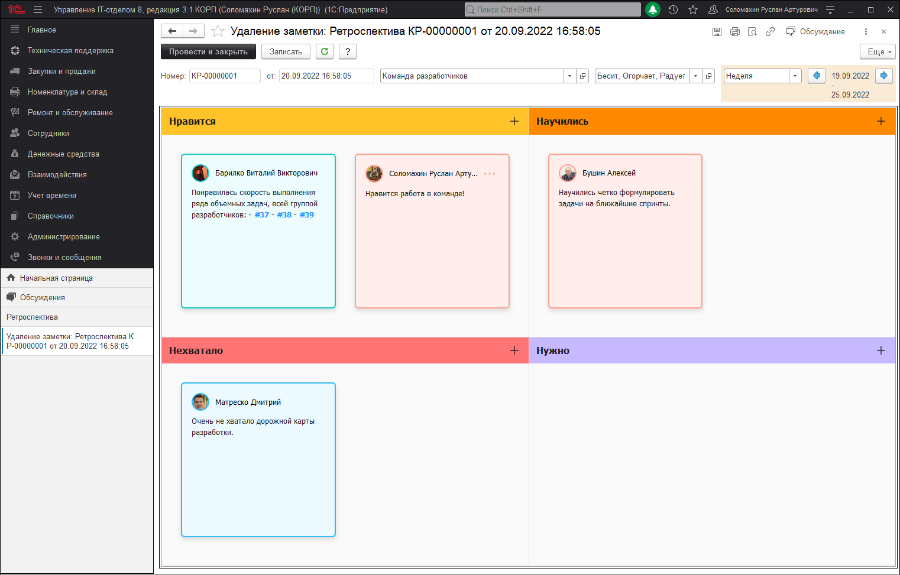
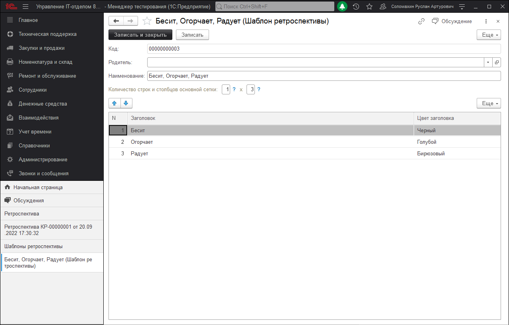
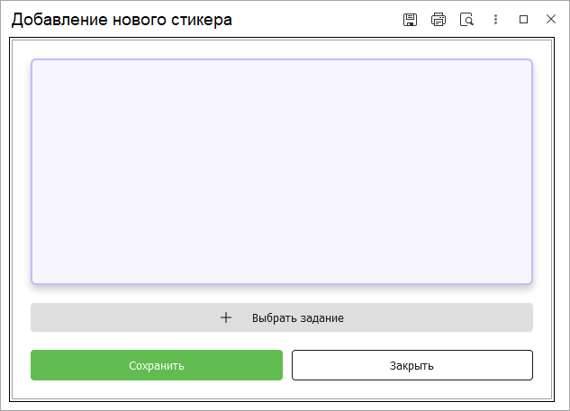
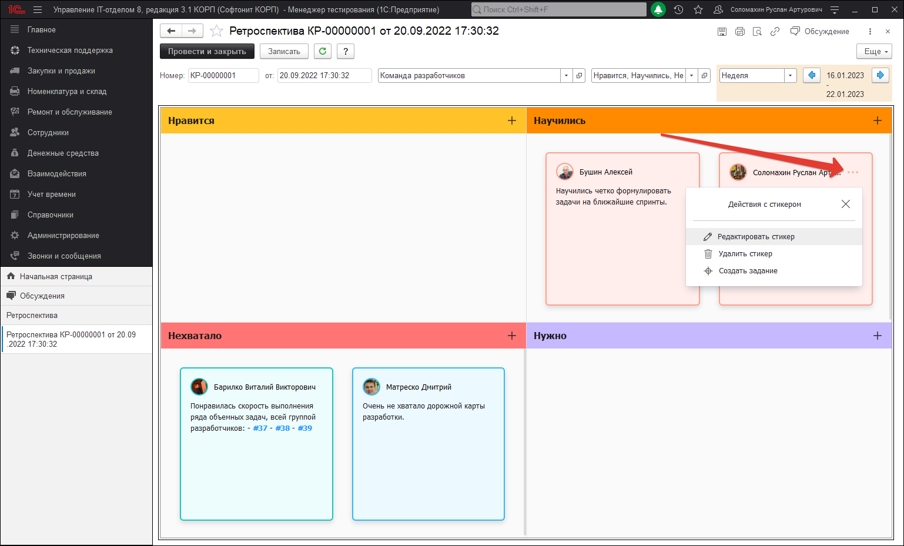
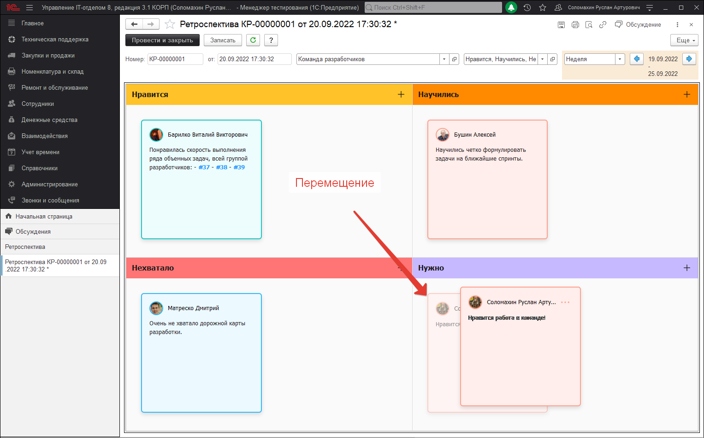

# Ретроспектива

!!!
**Ретроспектива**
Это регулярная встреча участников Agile команды для подведения итогов и решения возникших проблем, с которым пришлось столкнуться. Другими словами, это взгляд в прошлое, чтобы улучшить будущее.
!!!

Замыкающей составляющей блока Agile в нашей конфигурации является документ "Ретроспектива", который позволит провести одноименную встречу сотрудников в режиме онлайн. Данный документ как и остальные механизмы Agile расположен в разделе **"Техническая поддержка"-"Agile"-"Ретроспектива"** и выглядит как на скриншоте ниже.

## Шаблоны ретроспективы
Механизм документа представляет из себя доску, формирующуюся из заранее созданных шаблонов. Каждый выбранный шаблон ретроспективы задает документу размерность сетки, а также оформление каждой ячейки. В конфигурации в качестве предопределенных реализовано 4 шаблона, которые отражают сетку и оформление разных вариаций. Если стандартных вариантов мало, всегда можно создать собственные. Для этого необходимо перейти в раздел **"Техническая поддержка"-"Agile"-"Шаблоны ретроспективы"**.

Для более точного понимания предназначения справочника "Шаблоны ретроспективы", необходимо подробно рассмотреть каждый реквизит:

* **Код** - стандартный реквизит, который определяет уникальность шаблона ретроспективы.
* **Родитель** - указывается родитель элемента справочника.
* **Наименование** - указывается наименование шаблона ретроспективы.
* **Строки и столбцы** - в данных реквизитах указывается соответствующее количество строк и столбцов, которое будет содержать сетка ретроспективы.
* **Табличная часть** - содержит в себе ячейки: "Заголовок" - в нем указывается наименование заголовка; "Цвет заголовка" - указывается цветовое оформление заголовка ячейки.
* 
Количество строк и столбцов введенных в соответствующих реквизитах шаблона ретроспективы перемножается, и создают итоговую сетку документа. Например, размерность сетки 1*3, 2*3, 3*3.

## Работа с ретроспективой.

При создании нового документа, необходимо заполнить ряд обязательных реквизитов, без которых невозможна запись. В число таких реквизитов относятся:

* **Команда Agile** - в данном реквизите указывается команда Agile, принимающая участие в проводимой ретроспективе.
* **Шаблон сетки** - указывается шаблон ретроспективы, с помощью которого будет формироваться доска.
* **Вид периода** - реквизит, отвечающий за предпочтительный формат установки необходимого периода, которому соответствует текущая ретроспектива.
* **Дата периода** - дата, которая будет установлена в качестве периода ретроспективы. Текущая дата будет установлена в соответствии с выбранным видом периода.   
Другими словами, если указан вид "Спринт", тогда дополнительно необходимо указать нужный спринт и в качестве периода будут установлена дата начала спринта и дата окончания. Если в качестве вида периода указывается, например, неделя, тогда период будет установлен с начала по конец текущей недели. Аналогично будет происходить и с остальными видами периода.

Для того, чтобы добавить новый стикер на доску ретроспективы необходимо в нужной ячейки сетки нажать на кнопку:

После этого откроется форма добавления нового стикера, в которой можно будет указать необходимый текст и выбрать какое-либо связующее задание. Принцип работы данной формы практически полностью аналогичен форме добавления нового стикера документа ["Ежедневный стендап"](https://softonit.ru/FAQ/courses/?COURSE_ID=1&LESSON_ID=869). Стоит отметить, что для удобства восприятия поле ввода текста формы добавления нового стикера перекрашивается в цвет заголовка ячейки, из которой оно было вызвано. Таким образом можно сориентироваться в какую именно ячейку сетки ретроспективы добавляется новый стикер.

Добавлять новые задания в текст стикера можно с помощью кнопки **"Выбрать задание"** или введя номер задания вручную, придерживаясь стандартного шаблона: **(#Номер_задания)**.

Для редактирования или удаления стикера необходимо открыть меню взаимодействия, которое активируется при нажатии на три точки в правом верхнем углу стикера и выбрать необходимое действие.

Помимо возможностей описанных выше, на доске ретроспективы имеется возможность перемещать текущие стикеры между ячейками, с помощью функционала drag and drop. Таким образом можно быстро и удобно расположить стикеры на доске текущего документа.

