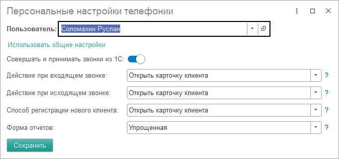
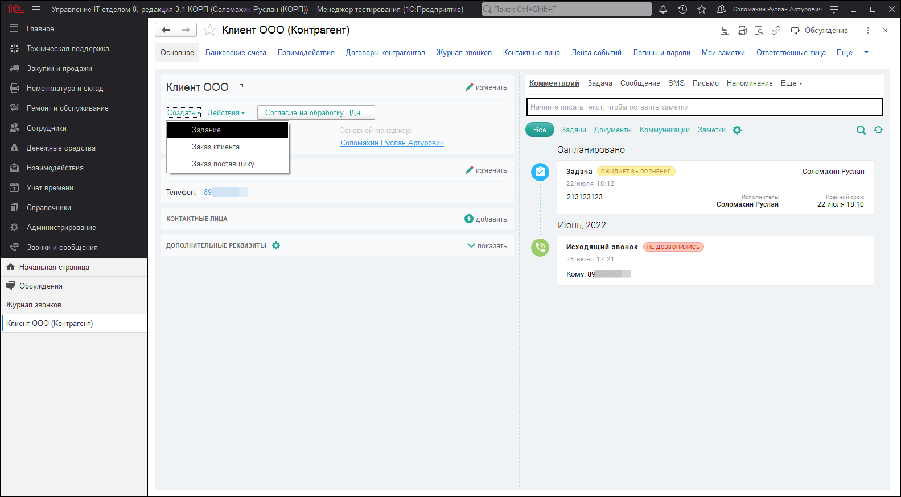

# Звонки и работа с панелью софтфона

Осуществлять звонки, используя подсистему "Телефония", можно как из самой конфигурации, так и из панели софтфона. Однако стоит заметить, что для осуществления звонков в принципе, наличие панели софтфона обязательно, так как основной процесс вызова или принятия звонка проходит именного через него. Для того, чтобы совершать звонки из конфигурации необходимо каждому пользователю назначить персональные настройки, которые можно найти в разделе **"Администрирование"-"Настройки параметров учета"-"Телефония"-"Персональные настройки"**. Данные настройки можно задавать как конкретному пользователю, так и всем пользователям, но при этом должна быть установлена настройка "Использовать общие настройки".

Подробное описание настроек, представленных в данном окне можно найти в статьей ["Настройка телефонии в программе"](https://softonit.ru/FAQ/courses/?COURSE_ID=1&LESSON_ID=815). При настройках показанных на скриншоте пользователю будет доступна возможность звонить прямо из конфигурации, а также при входящем или исходящем звонке будет открываться карточка клиента.

!!!
Карточка клиента работает со справочником "Контрагент", что не позволяет открывать при звонке остальные элементы справочников, например, пользователей или сотрудников. Но у Вас есть возможность указать в качестве действия "Открывать мастер регистрации", через который уже можно попасть в карточку любого справочника конфигурации.
!!!

## Знакомство с панелью софтфона

Панель софтфона имеет ряд настроек, которые можно открыть, нажав на имя пользователя, и перейти в настройки, либо нажать сочетание клавиш ctrl+s. В настройках можно настроить профиль пользователя, аудио устройства, оформление, поведение и чаты.

### Входящие и исходящие звонки. Карточка клиента и мастер регистрации

При входящем звонке свернутая панель софтфона отобразит небольшую панель входящего вызова, которая будет содержать в себе две кнопки "Принять" и "Отклонить".

После принятия оператором входящего звонка, если данный звонящий зарегистрирован в программе, тогда автоматически откроется его карточка с подробной информацией о клиенте. Если звонящий еще не заведен в базе, тогда откроется форма регистрации (создания) нового контрагента с помощью, которой Вы быстро можете завести нового клиента. Это действие будет выполнено в соответствии с персональными настройками, установленными данному пользователю телефонии. Аналогичные действия будут выполняться и при осуществлении исходящего звонка, когда с той стороны будет поднята трубка. Также автоматически может открываться функционал "Мастер регистрации", который позволяет быстро регистрировать новые обращения или открывать уже существующие.

Исходящий вызов может осуществляться как из базы с помощью кнопки "Позвонить", которая доступна во всех справочниках, имеющих табличную часть **"Контактная информация"**, а также из документов **"Задание"**, **"Заказ поставщику"** и **"Заказ клиента"**.

В самой панели софтфона исходящий звонок будет отображаться как на скриншоте ниже.

После того как трубка будет взята с той стороны провода, отображение софтфона измениться и Вам будут доступны дополнительные кнопки управления разговором. Можно будет увеличить или уменьшить звук, отключить микрофон, клавиатура набора, перевести звонок или завершить вызов. Перевод вызова можно осуществить с помощью кнопки **"Перевести"**, которая откроет новое окно со списком сотрудников доступных для переадресации вызова. При этом сотрудники, у которых на текущий момент включена телефония будут показаны со статусом **"Онлайн"**, а остальные будут отображены со статусом **"Офлайн"**, что позволит Вам быстро определить о доступности Вашего коллеги. Также если человек будет в данный момент уже с кем-то общаться, то это тоже будет отражено в статусе **"Разговаривает"**.

## Карточка клиента

Далее рассмотрим карточку клиента, которая является основным информативным пространством телефонии.  
**Карточка клиента** - это переработанная форма элемента справочника "Контрагенты", позволяющая отражать информацию о звонках по конкретному контрагенту. Из формы данной карточки можно создать необходимые документы: "Задание", "Заказ клиента", "Заказ поставщику". Можно совершить звонок либо на номер самого контрагента, либо выполнить вызов на номер его контактного лица. Для этого достаточно нажать на номер телефона, который отображается в разделе "Контактная информация".

Карточка клиента также отражает "Ленту событий" по данному контрагенту, в которой будут показываться связанные с ним документы, история звонков или заметки оставленные менеджером. По каждому звонку можно прямо из ленты прослушать запись разговора или просмотреть комментарий если он был оставлен. Вся лента может фильтроваться по преопределенным фильтрам, а также позволяет осуществлять поиск по части наименования события. В верхней части ленты событий располагается панель быстрых действий.

