# Настройка телефонии в программе

## Установка расширения телефонии в основную конфигурацию.

Первое, что необходимо выполнить - это установить новое расширение телефонии в основную конфигурацию "Управление IT-отделом 8". Сделать это можно двумя способами: через пользовательский режим "1С:Предприятие" или через конфигуратор. Посмотреть как выполняется установка любого расширения в пользовательском режиме можно в статье "Установка расширений из режима 1С: Предприятие". Здесь мы рассмотрим второй способ и установим необходимое нам расширение через конфигуратор.

Открываем конфигуратор и переходим в раздел **"Конфигурация"-"Расширения конфигурации"**.

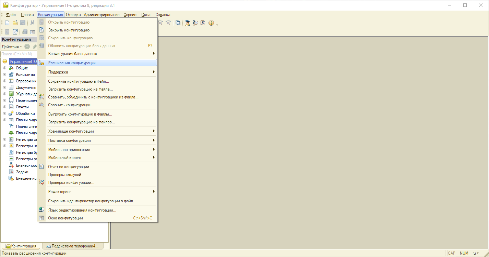

В открывшемся окне списка расширений конфигураций нажимаем кнопку **"Действия" - "Добавить"**. Откроется форма создания нового расширения, можно ничего не менять в этом окне и просто нажать кнопку "Ок".

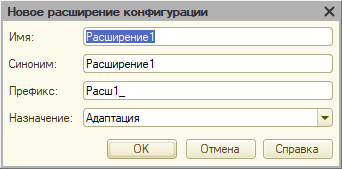

После проделанных манипуляций в списке появится новое пустое расширение, которое мы должны перезаписать файлом расширения телефонии. Нажимаем кнопку **"Конфигурация"-"Загрузить конфигурацию из файла"**.

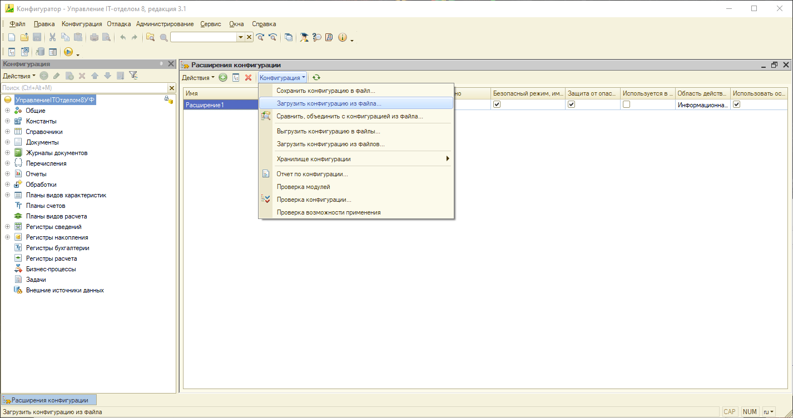

Откроется диалог выбора файла расширения для загрузки. Сам файл расширения телефонии находится по стандартному пути установки шаблона основной конфигурации, при условии, что во время установки шаблона основной конфигурации данный путь не был изменен.
`C:\Users\<Пользователь>\AppData\Roaming\1C\1cv8\tmplts\SoftOnIT\it\3_1_14_1\Общие файлы`

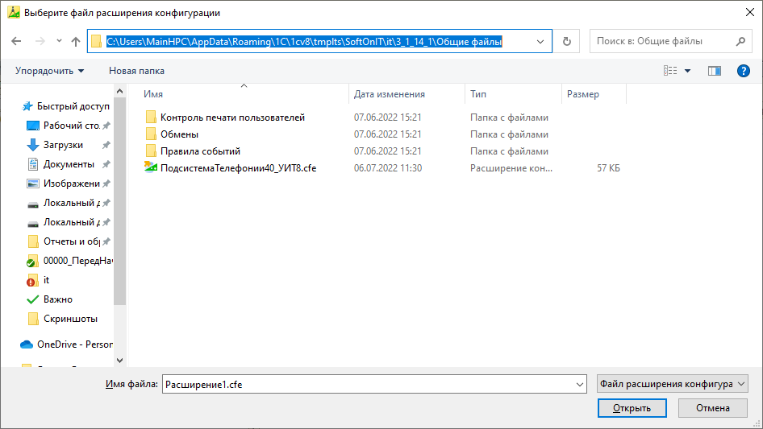

После выбора файла расширения, система загрузит расширение и предложит обновить конфигурацию базы данных. После чего расширение будет успешно установлено.

!!!
Важно!!! Обязательно отключите у расширения безопасный режим (см. рисунок ниже).
!!!

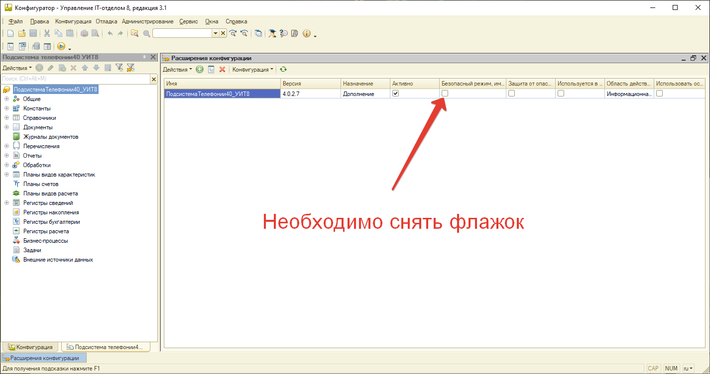

## Публикация Web сервисов

После установки и настройке АТС MikoPBX можно приступить к настройкам подсистемы телефонии в конфигурации. Первое, что необходимо выполнить опубликовать web сервисы, о которых речь шла в статье "[Установка АТС](https://softonit.ru/FAQ/courses/?COURSE_ID=1&LESSON_ID=814)". Открываем конфигуратор и переходим в раздел **"Администрирование"-"Публикация на веб-сервере"**. В окне публикации на закладке "Web-сервисы" активируем галочку **"Публиковать Web-сервисы расширений по умолчанию"**. Система опубликует все необходимые веб-сервисы, которые входят в состав расширения телефонии, после чего публикуем информационную базу.

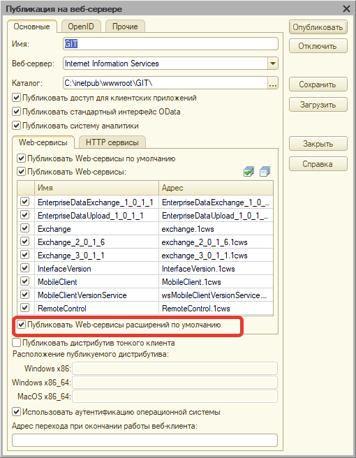

Далее необходимо настроить служебного пользователя, который будет авторизовываться на веб-сервере. В конфигураторе открываем список пользователей и в списке находим предопределенного пользователя **WebService**. Данный пользователь должен появиться после публикации веб-сервисов, если этого не произошло и в списке его нет, тогда создайте его вручную. В настройках пользователя нужно указать пароль, снять галочки "показывать в списке выбора" и "защита от опасных действий".

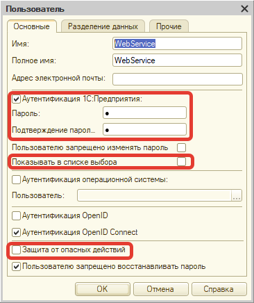

На закладке "Прочие" необходимо убедиться, что у него установлены роли: Телефония: Базовые права и Телефония: Веб сервисы. Без этих ролей пользователь не сможет подключаться к веб сервису.

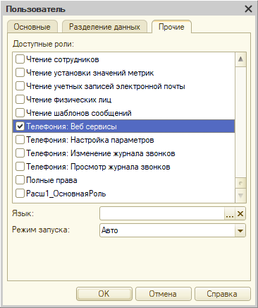

После выполнения этих действий нужно проверить корректно ли работает опубликованный веб-сервис. Для этого в браузере введите адрес и авторизуйтесь под служебным пользователем.

`http://[АдресСервера]/[ИмяПубликации]/ws/miko_crm_api.1cws?wsdl`

Если все в порядке отобразится строка **"Не указан заголовок управления сеансами или куки с идентификатором сеанса."**

Оно говорит, что все в порядке, включен режим повторного использования сеансов для повышения быстродействия в работе веб-сервиса. Вместо сообщения возможно отображение XML представление веб-сервиса.

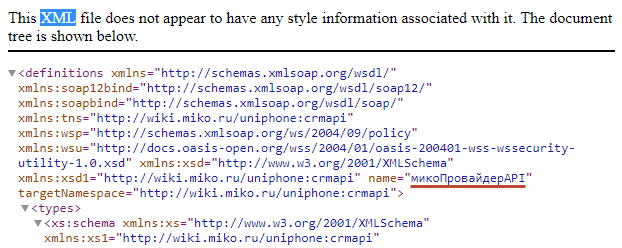

## Настройка подсистемы в конфигурации

После выполненных манипуляций можно запускать конфигурацию и приступать к настройкам подсистемы телефонию непосредственно в программе. После запуска конфигурации можно будет заменить, что в основном разделе меню программы появился дополнительный раздел **"Звонки и сообщения"**, в котором располагаются все функциональные возможности расширения телефонии.

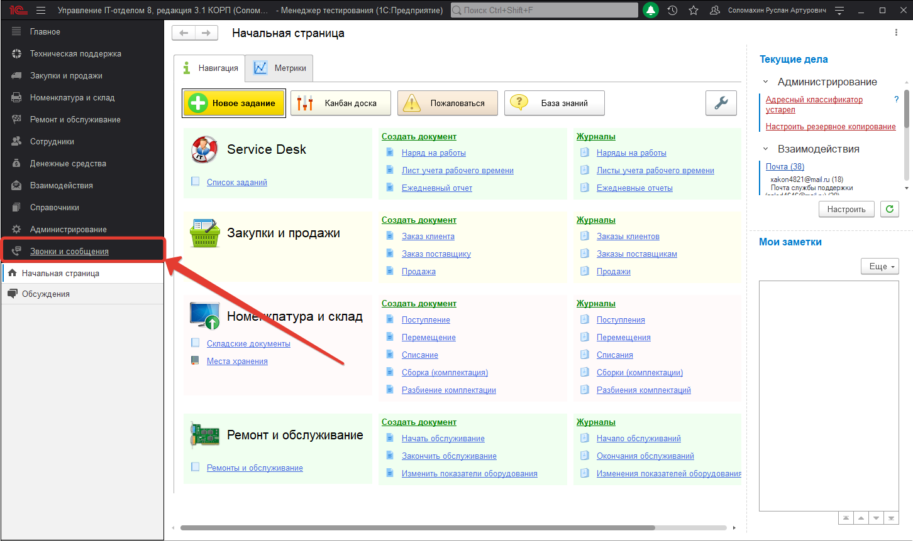

Для первоначальной настройки лучше всего воспользоваться мастером первоначальной настройки, который быстро пошагово проведет нас по основным настройкам. Для этого перейдем в раздел **"Звонки и сообщения" - "Мастер первоначальной настройки"**. Откроется первая страница мастера настройки.

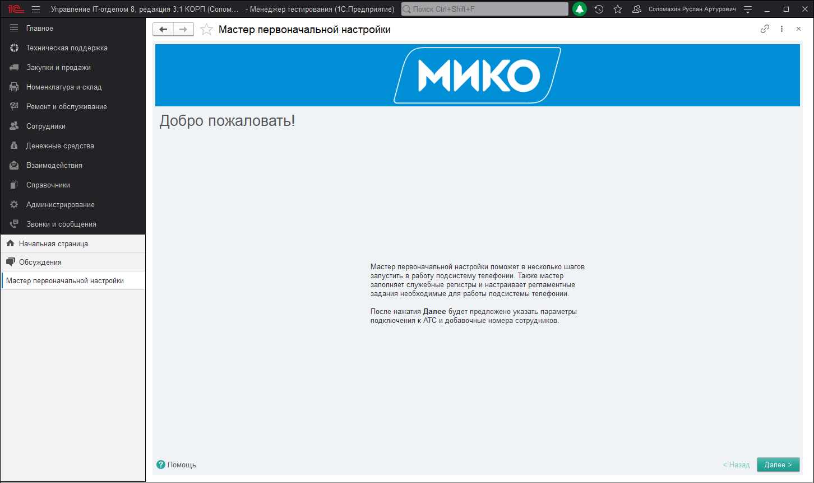

На самом первом шаге Вам необходимо выбрать схему подключения 1С и АТС. Это может быть расположение обоих в одной локальной сети или же, например, расположение АТС в облаке. При этом сразу хочу отметить, что понятие "облако" здесь стоит рассматривать как нечто за пределами локальной сети, это может быть даже просто другая локальная сеть и т.д. В зависимости от выбранной схемы в расширенных настройках подключения будут установлены подходящие к схеме каналы передачи событий и контактных данных. В случае нашей настройки мы выбрали схему **"Сервер 1С и Сервер АТС в одной сети"**. При этом мастер первоначальной настройки напоминает нам, что для этой схемы необходимо опубликовать веб-сервис, что мы и сделали ранее, поэтому не обращаем на это внимание. Если веб-сервис не опубликован, тогда конфигурация не сможет установить связь с сервером АТС и подсистема не будет функционировать. 

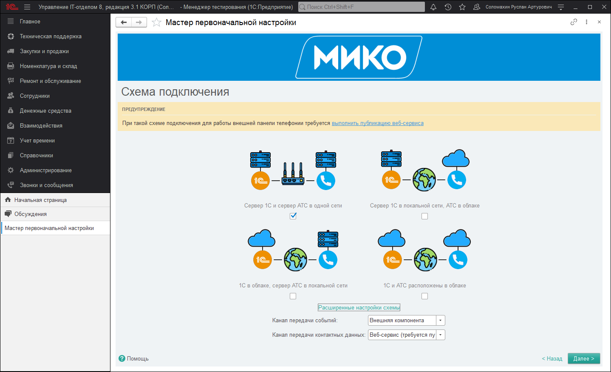

На следующем шаге система проверит подключена ли конфигурация к сервису 1С "Обсуждения" и если подключение не было осуществлено будет предложено настроить данную связь. Функционал обсуждений необходим для работы механизма **"What's App"**. Если Вы не подключитесь к этому сервису, тогда телефония не сможет работать с чатами what's app. На данном шаге необходимо указать адрес электронной почты, который будет служить основным для осуществления регистрации и нажать кнопку зарегистрироваться. На данный адрес почты будет выслан код, который нужно ввести в соответствующее окно для завершения регистрации.

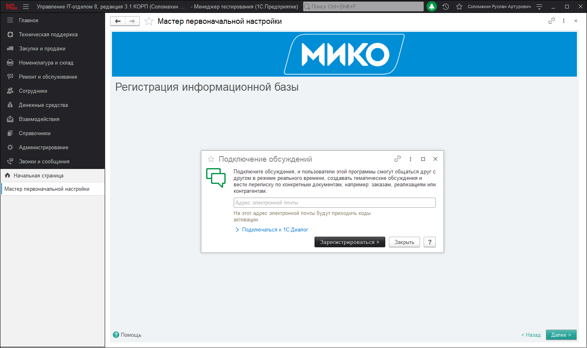

Жмем кнопку "Далее" и на следующем шаге необходимо выбрать одну из доступных АТС. В нашем случае указываем MikoPBX выбираем режим ручной настройки и в пустое поле вводим IP адрес АТС. После этого переходим к следующему шагу. Если подключение прошло успешно, то Вы будете направлены на следующую страницу, в противном случае будет выдано предупреждение. 

!!!
Внимание!!! Если соединение с сервером АТС не устанавливается ОБЯЗАТЕЛЬНО убедитесь, что в MikoPBX установлен и подключен к опубликованному веб-сервису модуль "Панель телефонии 4.0 для 1С:Предприятие". Подключение осуществляется именно благодаря этому модулю и веб-сервису.
!!!

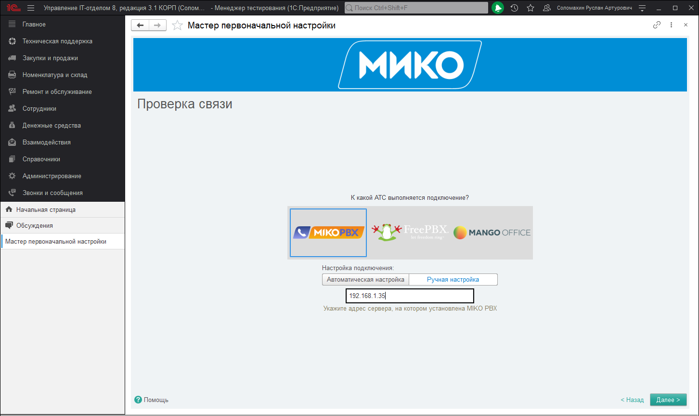

На следующем шаге мастер предложит указать виды внутренних и мобильных номеров. Для вида внутреннего телефона следует использовать предопределенный вид "Телефон", а для мобильных "Телефон, для рассылки оповещений". Вид внутреннего телефона указывать ОБЯЗАТЕЛЬНО.

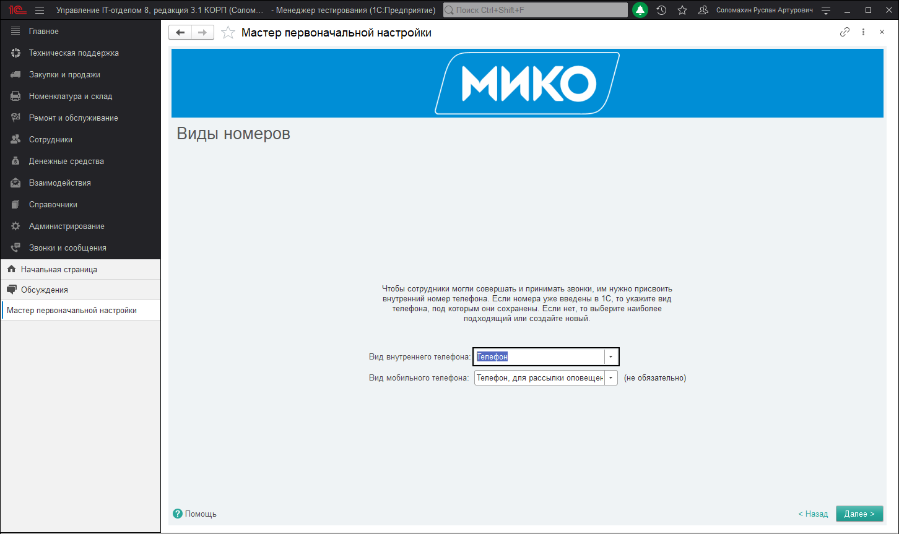

На следующем этапе необходимо каждому пользователю, который будет использовать подсистему "Телефония" указать внутренний номер. Этот номер будет использоваться для подключения к панели софтфона.

!!!
Внимание! Для того, чтобы пользователь мог пользоваться телефонией он должен быть также указан и в списке сотрудников в самой АТС MikoPBX.
!!!

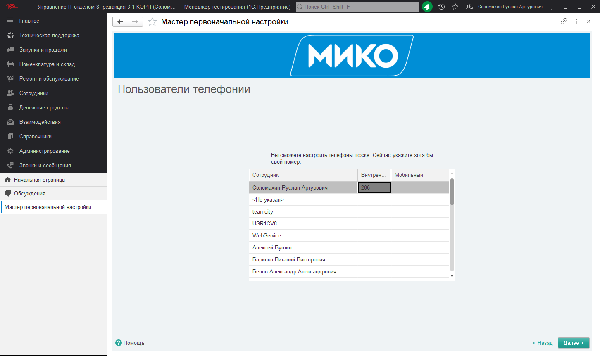

После указания внутренних номеров пользователей жмем кнопку "далее" и дожидаемся окончания применения всех настроек. По завершению Вы будете уведомлены об успешном окончании.

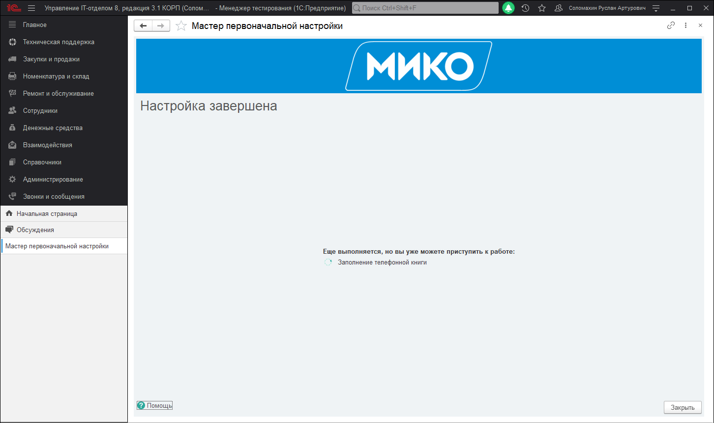

Далее возвращаемся в раздел "Звонки и сообщения" и открываем "Настройки подсистемы". В данном разделе необходимо перейти в настройку "Параметры конфигурации" и проверить, что заполнены все реквизиты появившегося окна:

* [x] **Вид внутренний номер** - вид контактной информации внутреннего номера, обязателен к заполнению и заполняется при первоначальной настройке.
* [x] **Вид мобильный номер** - вид контактной информации для использования мобильных номеров.
* [x] **Группа видов контактной информации компании** - группа видов контактной информации справочника "Контрагенты". В телефонии основной справочник для работы "Контрагенты", поэтому и группу контактной информации необходимо указывать данного справочника.
* [x] **Группа видов контактной информации контактного лица** - группа видов контактной информации справочника "Контактные лица". Необходимо указать справочник контактных лиц, который непосредственно связан со справочником "Контрагенты".
* [x] **Имя справочника компания** - указываем наименование основного справочника для работы подсистемы, это имя справочника "Контрагенты".
* [x] **Имя справочника контактное лицо** - указываем наименование справочника "Контактные лица" и через точку с запятой реквизит "Владелец".
* [x] **Ответственный** - указывается реквизит, который будет использоваться в качестве ответственного менеджера.

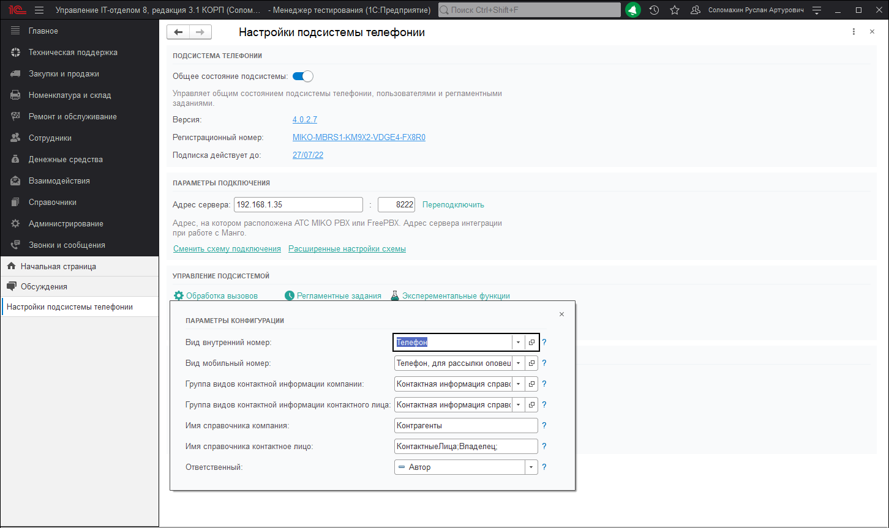

!!!
Обратите внимание, что если данные параметры будут не заполнены подсистема не будет работать корректно.
!!!

После этого возвращаемся в раздел **"Звонки и сообщения"** и открываем раздел настроек телефонии **"Персональные настройки"**. В персональных настройках задаются настройки использования функционала подсистемы конкретному пользователю или для всех пользователей в совокупности (общие настройки). В списке выбора пользователей выбираем необходимого пользователя телефонии и устанавливаем необходимые настройки действий:

* [x] **Использовать общие настройки -** устанавливает выбранному пользователю настройки, которые были заданы для всех пользователей.
* [x] **Совершать и принимать звонки из 1**С - устанавливает настройку, которая позволяет пользователю звонить прямо из конфигурации без использования прямого набора в панели СофтФона.
* [x] **Действие при входящем звонке** - позволяет указать действие, которое будет выполняться при входящем звонке. Можно установить значение "Открыть карточку клиента", которое будет открывать карточку клиента при входящем звонке. Обратите внимание, что карточка будет открыта только при поднятой трубке (принятии звонка).
* [x] **Действие при исходящем звонке** - позволяет указать действие, которое будет выполняться при исходящем звонке. Можно установить значение "Открыть карточку клиента", которое будет открывать карточку при исходящем звонке. Обратите внимание, что карточка будет открыта только после принятия звонка с той стороны провода.
* [x] **Способ регистрации нового клиента** - позволяет указать действие, которое будет выполняться при звонке от неизвестного номера (незанесенного в базу). Указывается форма, которая будет открываться при принятии (входящего вызова) от неизвестного номера.
* [x] **Форма отчетов** - указывается вид формы отчета, который будет использоваться по умолчанию у отчетов, относящихся к подсистеме телефонии.

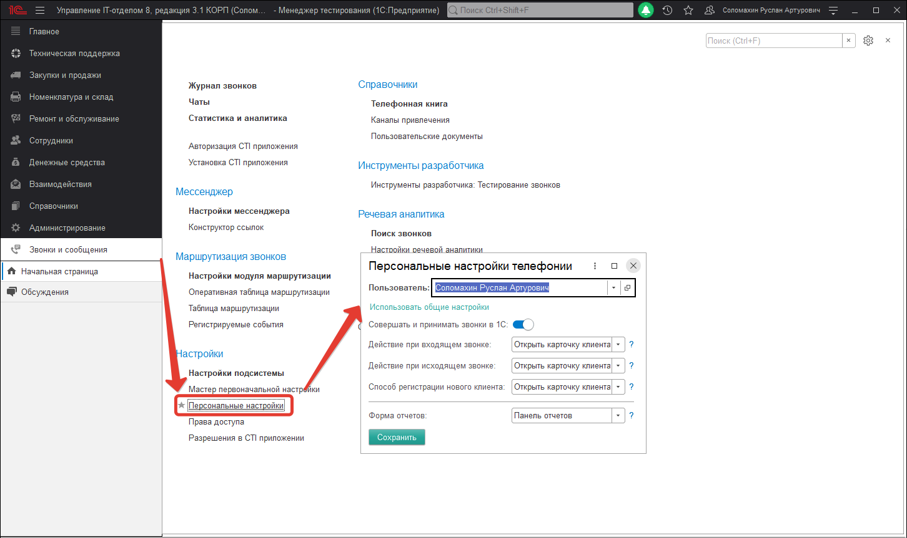

Далее для корректного создания сторонних документов конфигурации на основании контрагента из его карточки, необходимо проверить что созданы пользовательские документы в разделе **"Звонки и сообщения"-"Пользовательские документы"**. В данном списке при первоначальном запуске по умолчанию создаются два пользовательских документа "Заказ клиента" и "Заказ поставщику". Если данных документов нет в списке их необходимо создать.

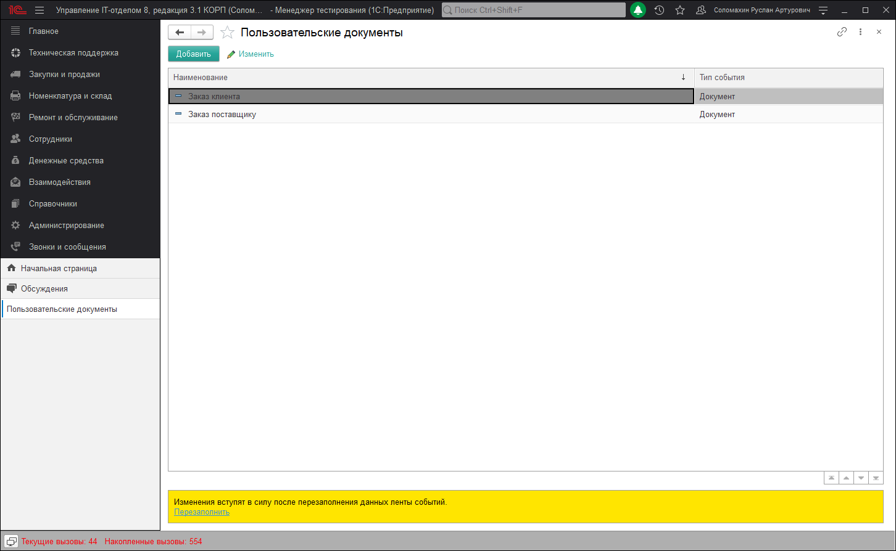

Последнее, что необходимо настроить - это назначить права доступа пользователям, которые будут работать с телефонией. В настройках параметров учета откроем раздел **"Права доступа"** и добавим в группу доступа "МИКО: Пользователи телефонии и мессенджера" пользователей подсистемы, которые будут совершать и принимать звонки.

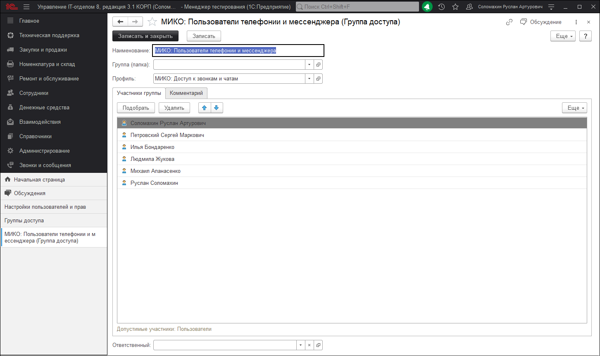
