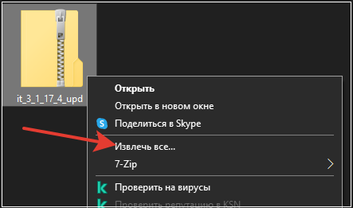
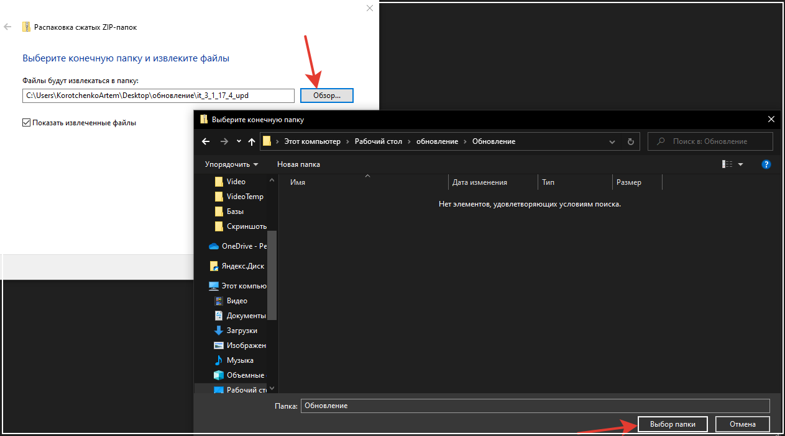
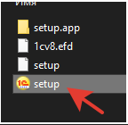
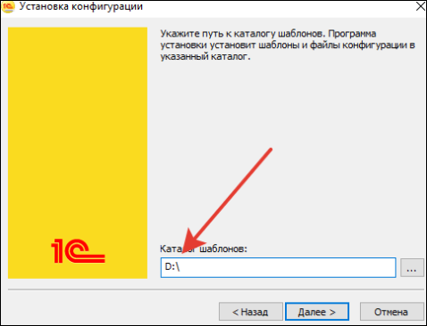
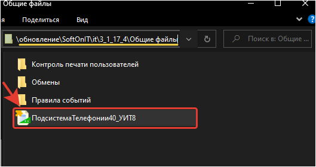

# Обновление расширения телефонии

## Обновление расширения Телефонии "МИКО"

Если вы используете расширение телефонии, тогда эта статья для вас.

Мы позаботились, чтобы значек данного расширения корректно отображался в командном интерфейсе. Для этого, необходимо обновить расширение телефонии в пользовательском режиме. Расширение находится в zip-архиве с обновлением конфигурации.

1. Нажимаем правой кнопкой мыши на архив с обновлением.

2. Извлекаем все в папку.

3. Запускаем дистрибутив.

4. Указываем путь для установки, и запоминаем куда установили. (можно в эту же папку)

5. После установки, открываем папку, куда установили обновление и переходим \SoftOnIT > it > 3_1_17_4 > Общие файлы. Находим файл расширения: "ПодсистемаТелефонии40_УИТ8".

Далее выполняем действия по инструкции в [видео](https://youtu.be/fUJSqIp1wDc)
