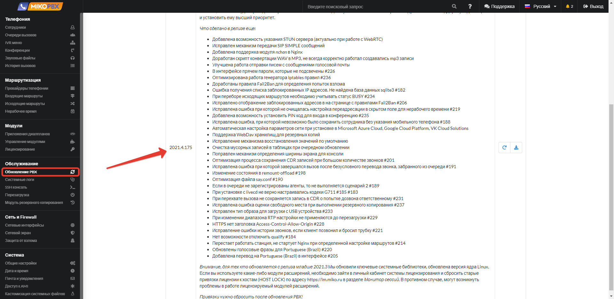
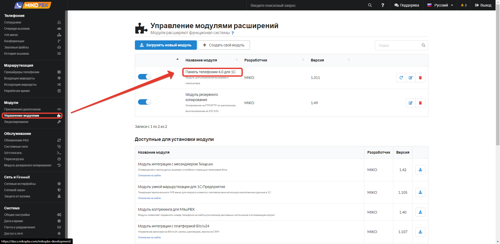
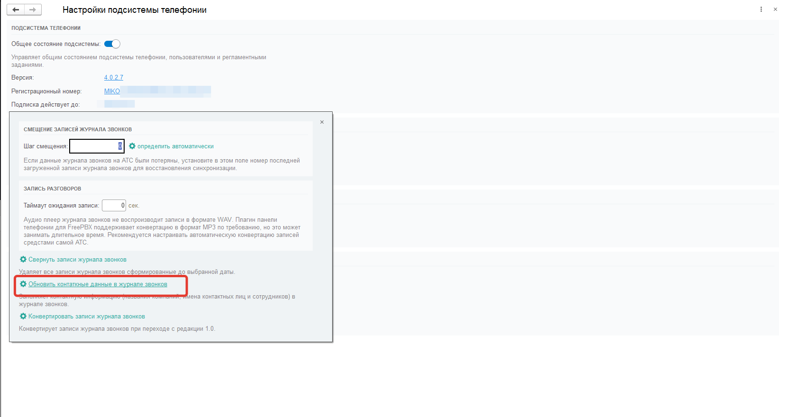

# Переход с телефонии версии 2 на версию 4

В данной статье будет рассмотрен правильный переход на новую телефонию версии 4. Данная инструкция поможет Вам избежать потерю данных по ранее сохраненным звонкам. Стоит отметить, что в данной инструкции будут приведены советы для работы с АТС mikoPBX, для других АТС инструкцию по переходу смотрите на официальном сайте МИКО.

!!!
ВНИМАНИЕ!!! Для перехода на новую версию телефонии Вам не нужно переустанавливать свою АТС. Для перехода достаточно выполнить шаги, описанные ниже.
!!!

1. **Подготовка АТС к переходу.** Первым делом перед переходом на новую версию телефонии Вы должны подготовить АТС. Для этого ее необходимо обновить до релиза **1.281 или выше**. Информация по доступным обновлениям mikoPBX можно посмотреть в веб-интерфейсе в разделе **"Обновления PBX"**.

2. **Установка нового модуля.** После успешного обновления АТС, необходимо установить новый модуль телефонии, который станет доступен. Перейдите в раздел **"Управление модулями"**. В списке доступных модулей найдите и установите модуль **"Панель телефонии 4.0 для 1С"**.

После того, как модуль будет успешно установлен, его необходимо настроить также как это делалось при первоначальной настройке. То есть, ввести все данные для успешной связи модуля и 1С конфигурации.  
3. **Установка лицензионного ключа для 4-ой версии.** Последним этапом настройки перехода АТС это привязка нового ключа лицензирования, который предусмотрен для работы именно с версией 4.0.  
4. **Установка обновления УИТ8.** После проделанных манипуляций с АТС можно приступать к обновлению основной конфигурации "УИТ8". Обращаем внимание, что новая версия телефонии - это расширение, которое устанавливается отдельно. Поэтому после успешного обновления основной конфигурации, прошла подсистема телефонии МИКО полностью удалится из программы.   
5. **Установка расширения телефонии**. Когда обновление основной конфигурации успешно выполнено, приступаем к установки в конфигурацию самого расширения телефонии.  
[Инструкция по установке расширения](https://softonit.ru/FAQ/courses/?COURSE_ID=1&LESSON_ID=815). В данной инструкции, Вам необходимо выполнить все действия до раздела "Настройка подсистемы в конфигурации", так как это не первоначальная установка, а переход.  
6. **Настройка телефонии в программе.** Когда Вы выполнили 5-ый шаг, необходимо запустить конфигурацию и перейти в разделе "Звонки и сообщения" открыть "Мастер первоначальной настройки". По шагам пройдите первоначальную настройку и ОБЯЗАТЕЛЬНО дождитесь последнего шага "Заполнение телефонной книги". Если этот шаг затягивается слишком долго, закройте окно мастера и перейдите в раздел "Звонки и сообщения"-"Телефонная книга" и в открывшейся форме нажмите кнопку "Перезаполнить телефонную книгу". Дождитесь завершения. После можете открыть "Журнал звонков" и убедиться, что все данные звонков подтягиваются корректно с привязкой к конкретному контрагенту, сотруднику и т.д. Если по какой-то причине телефоны подтягиваются без привязки к сущности ИБ, Вы можете перезаполнить эти данные принудительно. Для этого перейдите в раздел "Настройки подсистемы"-"Журнал звонков" и нажмите гиперссылку "Обновить контактные данные журнала звонков".

