# Работа с телефонией

Подсистема "Телефония" позволяет работать с входящими и исходящими звонками прямо в конфигурации без использования лишнего оборудования. Что в свою очередь ускоряет работу сотрудников, так как вся информация по клиенту находится у них перед глазами. В данной статье подробно рассмотрим процесс работы с телефонией и разберем основные нюансы.

## Основное рабочее меню

Основное рабочее меню подсистемы находится в разделе **"Звонки и сообщения"**, именно здесь расположены необходимые механизмы подсистемы, с которыми нужно работать. Каждый из разделов позволяет отразить различную информацию для пользователя, рассмотрим каждый из них подробней:

* **Журнал звонков** - это основной модуль подсистемы, который отражает фильтруемый список по всем осуществленным звонкам в программе.
* **Чаты** - это основной модуль подсистемы, который позволяет работать с чатами What's app прямо из конфигурации 1С.
* **Статистика и аналитика** - это главный модуль отчетности подсистемы, в котором в виде диаграмм или таблиц будет отражена подробная информация по работе с телефонией.

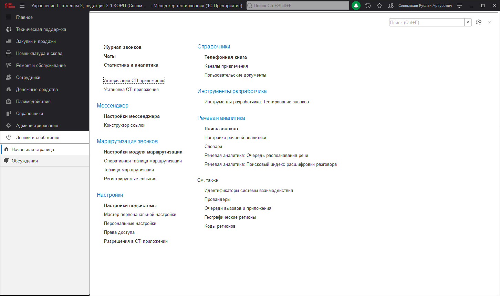

!!!
Для доступности и работы с подразделом "Телефония" у пользователя должны быть установлены роли: "Использование взаимодействий", а также права группы доступа "МИКО: Пользователи телефонии".
!!!

## Журнал звонков
**Журнал звонков** - собирает все звонки Вашей организации в одном месте с привязкой к клиентам и менеджерам, отражением направления звонка, информацией о длительности звонка, а также добавленным комментарием и возможностью прослушивания записи разговора.

Весь список журнала полностью фильтруется по таким направлениям как: 

- Входящие; 

- Исходящие; 

- Непринятые; 

- Мои звонки; 

- А также по дате и времени.

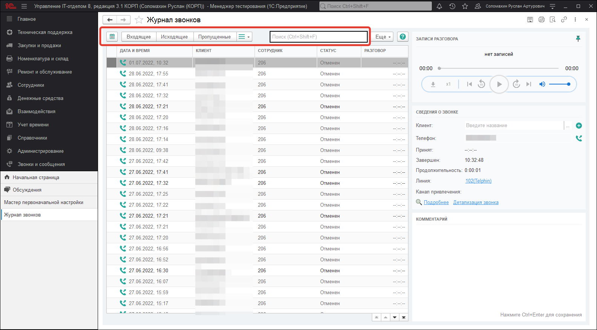

Список журнала разделен на определенные столбцы, каждый из которых отражает важную информацию по звонку. Таким образом каждая строка списка содержит следующие данные:

* Специальная символика звонка в виде определенных иконок для выделения вызова

* Дата и время звонка с иконками входящего, исходящего или пропущенного звонка.
* Представление клиента (наименование) если номер телефона закреплен за контрагентом или контактным лицом. Или же просто номер телефона, когда текущий номер еще не закреплен за контрагентом.
* Сотрудники или группа сотрудников, которые обработали вызов.
* Статус звонка, который отражает состояние вызова: принят, нет ответа, дозвонились, отменен, потерян.
* Комментарий звонка, если он был добавлен менеджером либо в самом журнале звонков или же в карточке клиента, которая открывается во время звонка

* Длительность звонка, отражает фактическую длину разговора по текущему вызову.
* 
Из журнала звонков можно напрямую открывать карточки уже созданных в базе контрагентов или же заводить новых контрагентов и их контактных лиц, если выбранный номер ранее не был зафиксирован. Для того, чтобы открыть карточку созданного контрагента, необходимо выделить нужную строку в списке журнала звонков и в панели **"Записи разговора"** нажать кнопку **"Открыть"**.

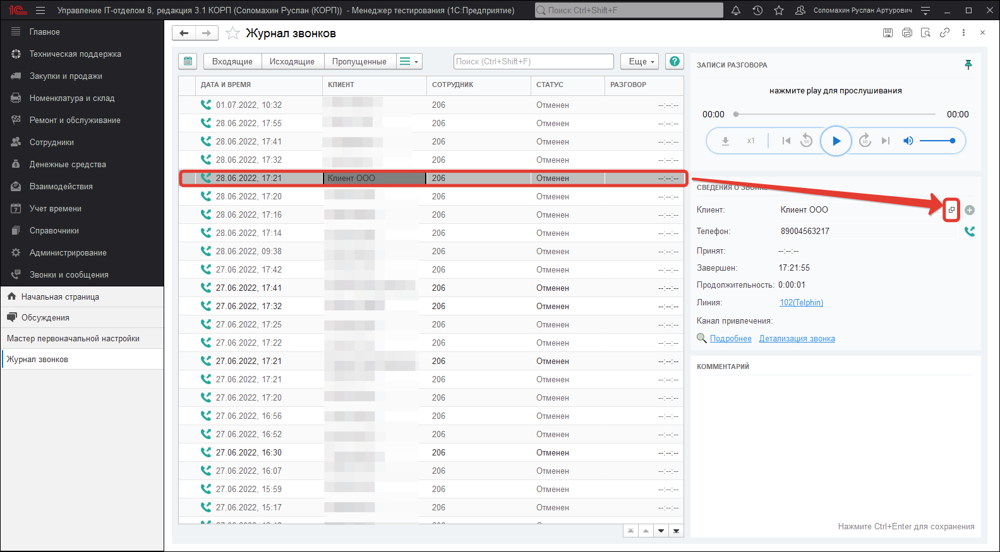

Создавать нового контрагента в новой карточке клиента также можно из журнала звонков. Для этого нужно в списке выбрать незарегистрированный номер. Если данный номер относится к контактному лицу контрагента, тогда введите название уже заведенного в базе контрагента и, программа предложит добавить данный номер, либо контактному лицу, либо же контрагенту.

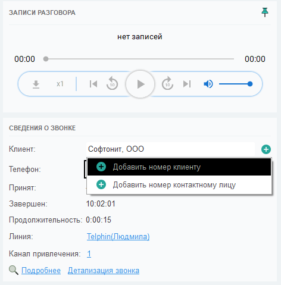

Если выбрать необходимый номер в строке и просто нажать кнопку "+", тогда данный номер сразу же будет присваиваться новому(создаваемому) контрагенту и откроется карточка создания нового объекта соответствующего справочника. Нужно будет заполнить основные реквизиты и записать объект.

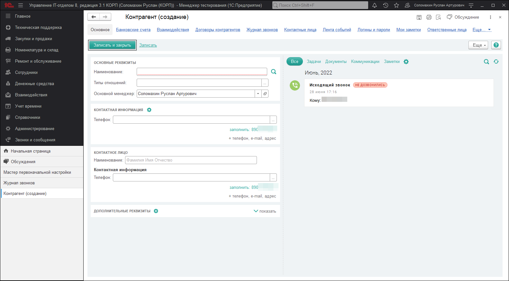

В журнале звонков можно развернуть дополнительное окно детализации звонка, которое будет отображать более подробную информацию по звонку и позволит прослушать запись разговора. Если данное окно не развернуто, его можно открыть, нажав кнопку в виде зеленых стрелочек.

После того, как окно открылось, по каждому звонку будет отражаться более детальная информация. В верхней части располагается панель управления (плеер) записями разговора. Данный проигрыватель позволяет сразу же воспроизвести запись или скачать ее на локальный диск. Также есть возможность ускорить воспроизведение если запись слишком длинная или промотать на необходимый интервал времени.

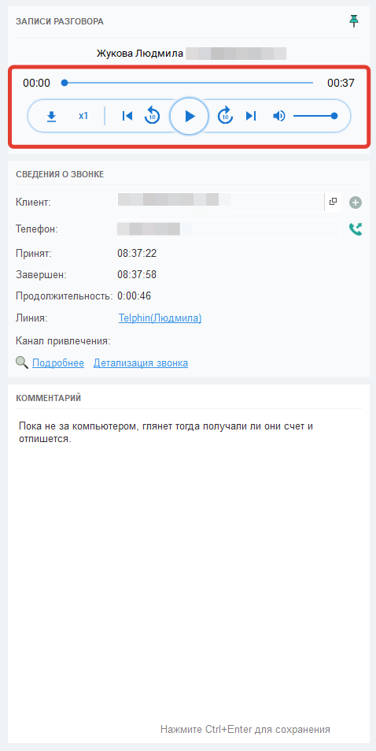

Кнопки "Подробнее" и "Детализация звонка" открывают страницу детализации выбранного Вами звонка, но уже в отдельной полноценной форме, которая отражает практически туже саму информацию.

!!!
Стоит отметить, что механизм записи разговоров настолько мощный, что умеет разделять записи разговоров на несколько частей по множественной переадресации. Другими словами, при переадресации вызова на другого сотрудника начнется запись именно его разговора и будет предоставлена в виде отдельной записи.
!!!

## Чаты
Чаты - здесь хранятся все чаты с клиентами организации, каждая позиция списка данного функционала представляет собой отдельный документ с информацией по конкретному участнику обсуждения, а также сам чат, в котором ведется общение. Список чатов, разделен на три раздела "В очереди", "В работе" и "Закрытые". В каждом разделе отображаются чаты соответствующей категории. Также прямо из списка документа можно создать на основании один из основных документов.

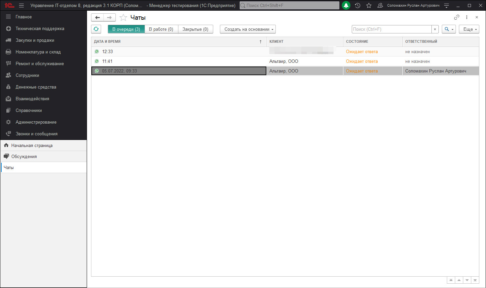

Основная форма чата отражает список следующей информации:

* **Статус** - текущий статус чата, который устанавливается менеджером вручную.
* **Дата создания и номер** - дата создания данного чата, а также порядковый номер.
* **Клиент** - контрагент, с которым ведется общение.
* **Контактное лицо** - контактное лицо контрагента, который также может вести общение в текущем чате.
* **Идентификатор чата** - уникальный идентификатор чата what's app.
* **Ответственный** - ответственный сотрудник нашей организации, который закреплен за данным чатом.
* **Наблюдатели** - список причастных сотрудников нашей организации, которые числятся в качестве наблюдателей данного общения.  
  
Для того, чтобы начать отправку сообщений необходимо активировать кнопку "Обсуждение", которая располагается в правом верхнем углу.

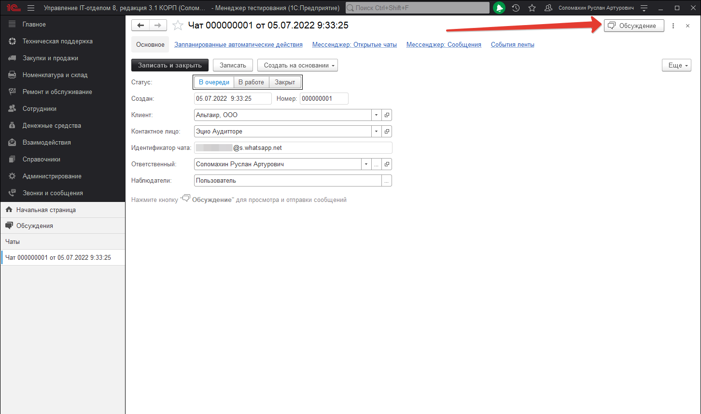

В результате откроется панель, в которой будет вестись вся переписка по текущему чату. В данной панели доступны все стандартные возможности функционала **"Взаимодействий"**.

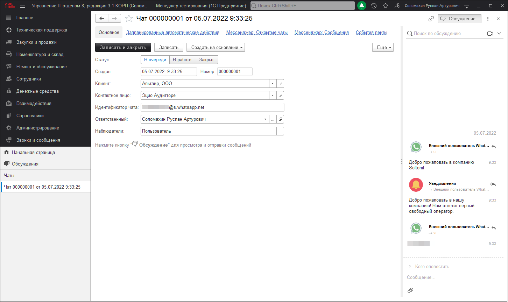

Чтобы подключить основной аккаунт What's App вашей организации для ведения чатов из конфигурации необходимо перейти в раздел **"Звонки и сообщения"-"Настройки мессенджера"**. Откроется окно настроек, в котором подробно отражена первичная настройка мессенджера для работы данного модуля.

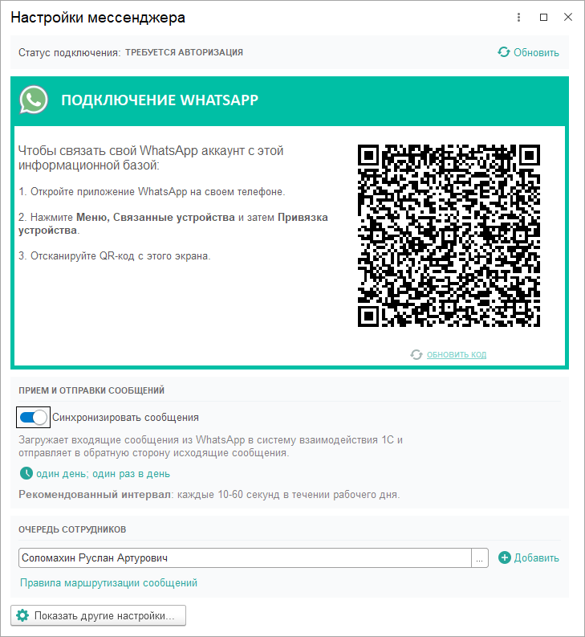

## Статистика и аналитика
Помимо ведения журнала звонков телефония позволяет формировать отчеты по звонкам, которые могут быть представлены в виде таблицы или диаграммы. Первый вариант отчета подходит для анализа отчетности, а второй для более удобного визуального восприятия информации. В любом случае и те, и другие отчеты можно открыть в разделе **"Взаимодействия"-"Статистика и аналитика"**.

Первый отчет, который встречает нас при открытии данного раздела - это "Количество звонков", отражающий информацию по количеству всех звонков произведенных в системе. В табличном и визуальном представлении данный отчет выглядит как на скриншотах ниже.

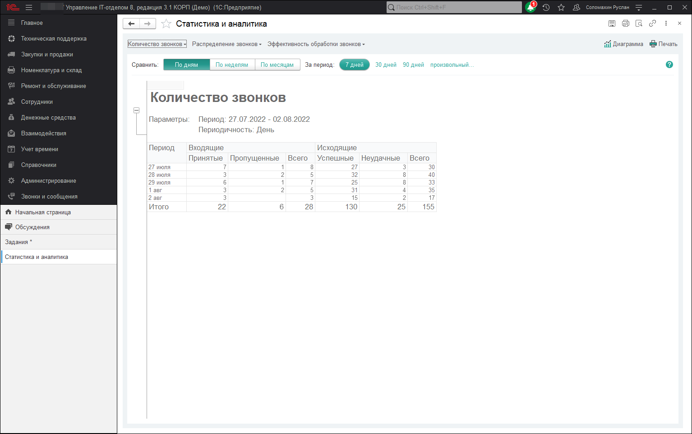

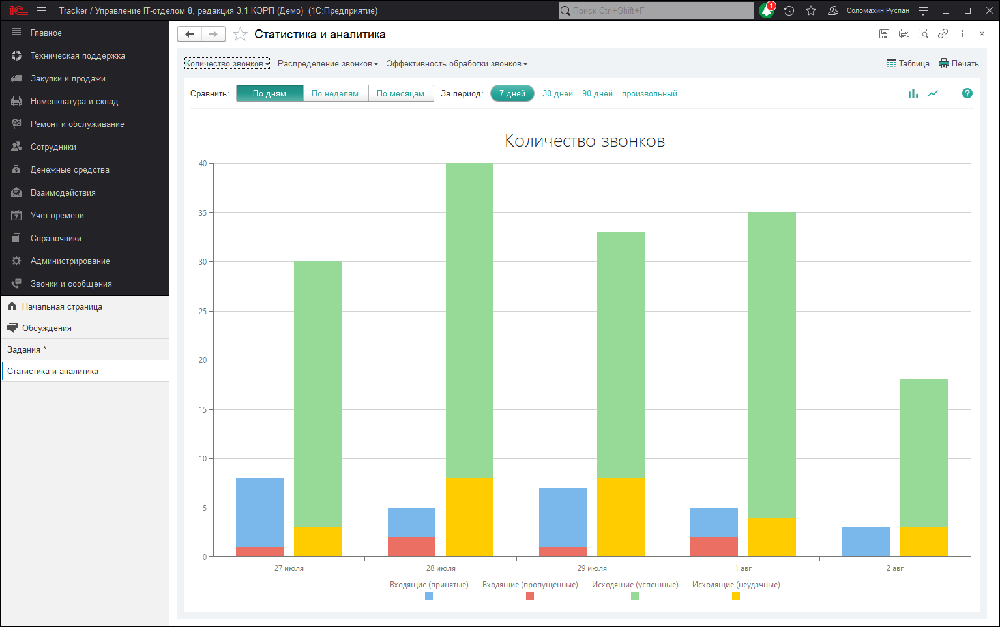

Для визуального типа отчета можно изменить формат отображения диаграммы и вывести информацию в виде линий графика. Для этого необходимо нажать кнопку "Отобразить линиями". Если хотите вернуть формат к стандартному виду "барами" нажмите кнопку "Отобразить барами".

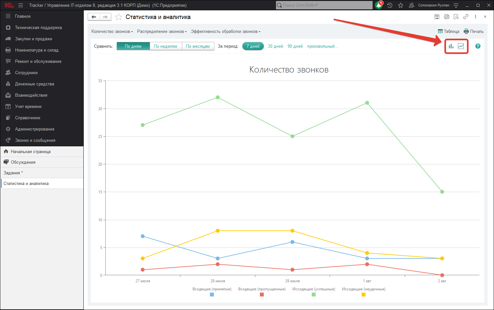

Следующий отчет **"Направление звонков"**, который выбирается в верхней части панели отчета **"Количество звонков"**. Данный отчет формирует информацию по направлениям звонков: мобильные номера, бесплатные вызовы или не установленные. Отчет выглядит следующим образом:

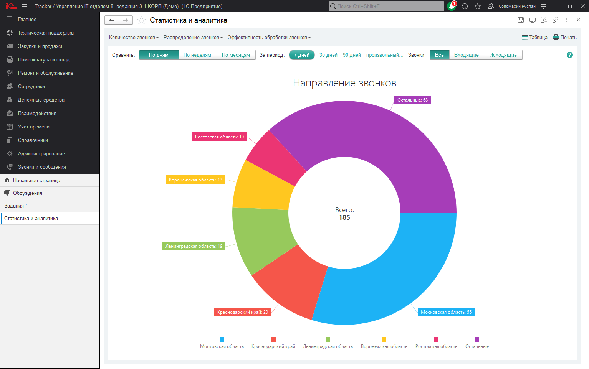

Для пользователей, которые пользуются в конфигурации [механизмом CRM](https://softonit.ru/FAQ/courses/?COURSE_ID=1&CHAPTER_ID=0634) будет полезно использовать отчет "Лиды", который можно выбрать из меню **"Эффективность обработки звонков"**.

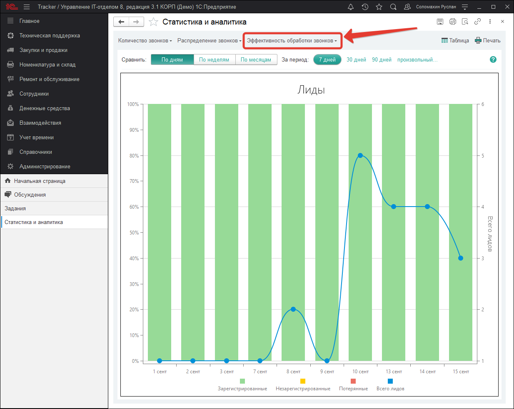
