# Установка АТС

## Инструкция по установке АТС MikoPBX

Подсистема встроенная в нашу конфигурацию работает совместно с АТС станцией, которая в свою очередь уже осуществляет непосредственную связь с провайдером интернет телефонии. Поэтому первым делом нужно установить саму АТС, ее настроить и уже после приступить к настройке самой панели телефонии в конфигурации.

Используемая в нашем решении АТС - это MikoPBX, которая представляет собой полноценную операционную систему и телефонный сервер. MikoPBX можно скачать в виде образов операционной системы в форматах файла: *.iso, *.img, *.raw, которые подходят для установки на отдельный компьютер (сервер, виртуальную машину) или облако. Скачать подходящий Вам образ можно в личном кабинете клиента на сайте компании МИКО или по ссылке ниже. 

[Официальный репозиторий MikoPBX.](https://github.com/mikopbx/Core/releases)

В данной инструкции продемонстрируем установку АТС на виртуальную машину, созданную на VirtualBOX.

## Создание виртуальной машины

Открываем VirtualBOX и нажимаем кнопку "Создать", чтобы создать новую виртуальную машину.

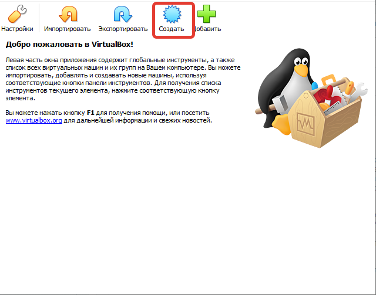

Далее в появившемся окне указываем **Имя, Тип** и **Версию ВМ**, как на рисунке ниже. Папку расположения можете указать любую.

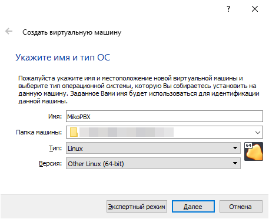

Для работы виртуальной машины необходимы выделить **1024 Мб** оперативной памяти.

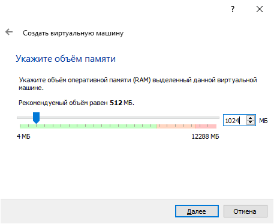

Нажимаем кнопку далее и в следующем окне создания жестких дисков, выбираем пункт **"Создать новый виртуальный жесткий диск"**.

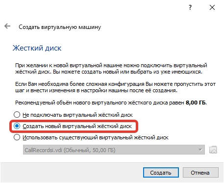

Нажимаем кнопку "Создать" и после указываем тип файла **VDI (Virtual Disk Image)**, определяющий формат нового жесткого диска.

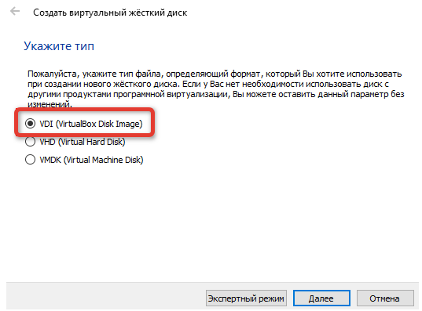

Нажимаем кнопку "Создать" и после указываем тип файла VDI (Virtual Disk Image), определяющий формат нового жесткого диска.

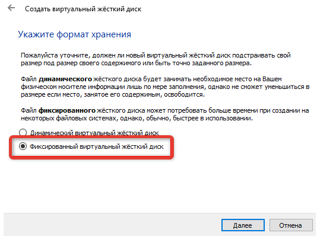

После этого указываем размер жесткого диска **500 Мб** и нажимаем кнопку "Создать".

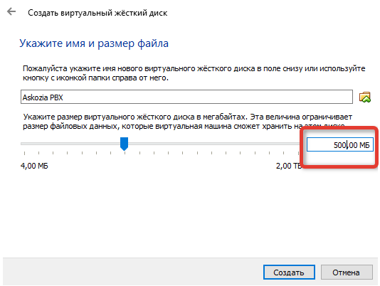

## Настройка виртуальной машины

Открываем настройки созданной виртуальной машины.

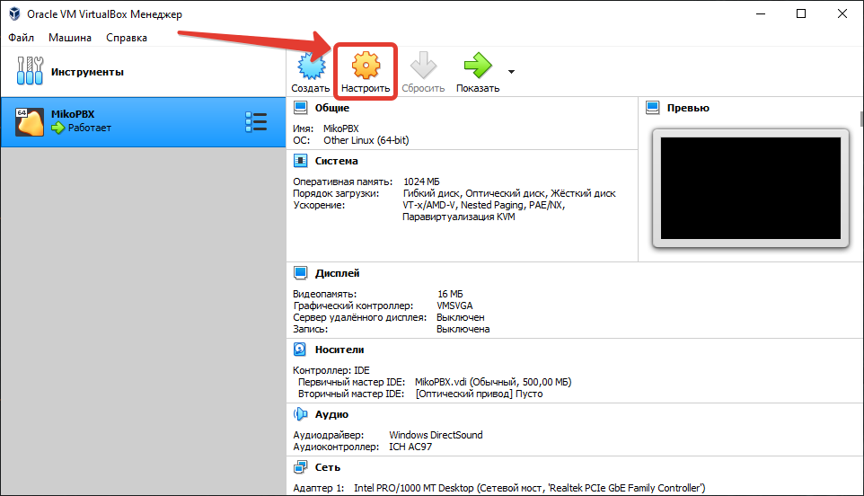

После этого переходим в раздел **"Носители"** и добавляем новый жесткий диск, который будет использоваться для хранения записей разговоров. 

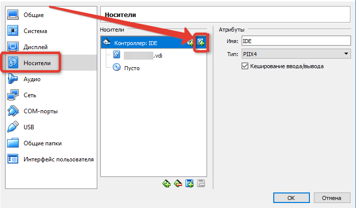

В открывшемся окне выбираем **"Создать новый диск"**.

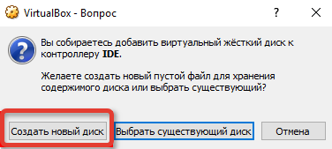

Формат жесткого диска указываем как и при первоначальном создании виртуальной машины **(VDI VirtualBox Disk Image)** и создаем его **фиксированного размера**. Далее задаем произвольное имя и указываем размер. Минимальный рекомендованный размер **50 Гб**, стоит отметить, что запись одного часа разговора весит примерно 14 Мб.

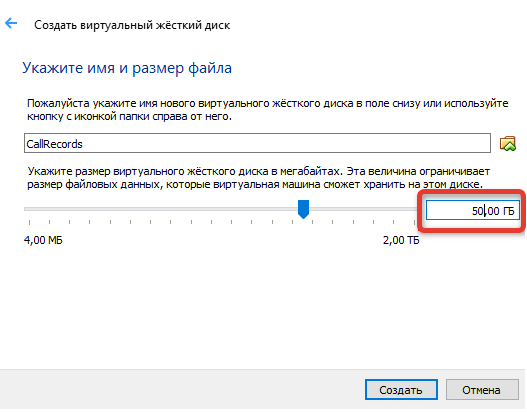

На этом создание дополнительного диска для хранения записей закончено. Теперь не переключаясь с раздела "Носители", сразу укажем оптический диск, с которого будем осуществлять установку.

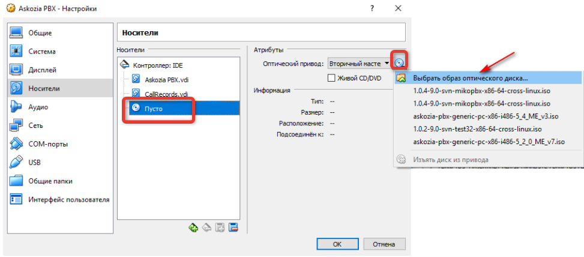

После этого необходимо перейти в раздел **"Сеть"** и произвести настройки сети. Укажем тип подключения **"Сетевой мост"**, а остальные настройки оставим без изменений. 

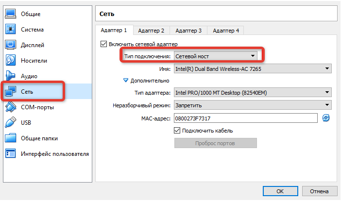

## Установка MikoPBX

Запускаем созданную нами виртуальную машину, после чего MikoPBX запустится с оптического диска, который был указан ранее в режиме **Live CD восстановление**. Об этом будет информировать строка показанная на скриншоте ниже.

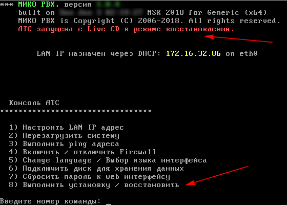

Для выполнения полноценной установки введем номер команды **8** и нажмем клавишу Enter. После чего MikoPBX выведет информацию о доступных для записи жестких дисках. В текущем примере отображаются два диска **SDA, SDB**, которые ранее были созданы. **SDA** - это основной системный диск, который будет использован для установки АТС. Для этого вводим наименование диска **sda**, система запросит подтверждение, подтверждаем нажатием Y. После выбора системного диска куда будет установлена АТС, система предложит Вам также выбрать диск, созданный ранее для хранения записи разговоров. Укажите второй диск **SDB** и продолжите следовать инструкциям. Если система не предложила выбор диска для хранения записей, его можно будет указать позже в меню установленной **АТС**.

!!!
Обратите внимание, что наименования дисков могут отличатся для Вашей системы. Будьте предельно внимательны с выбором необходимого диска, так как все данные на нем будут полностью очищены.
!!!

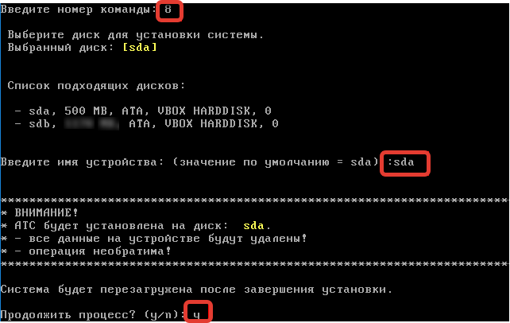

После подтверждения начнется процесс установки, после которого система самостоятельно перезагрузится. После перезагрузки MikoPBX автоматически извлечет из привода установочный диск, который был указан для установки и запустит АТС с диска SDA.

После запуска мы увидим, что надпись "АТС запущена с Live CD в режиме восстановления" исчезла, что означает успешно выполненную установку.

Если на этапе выбора системного диска во время установки система не предложила Вам указать диск для хранения записей разговоров, тогда в меню АТС выберите пункт **"Подключить диск для хранения данных"**.

!!!
Внимание! Если по какой-то причине Вы указали не тот диск для хранения данных, то повторно изменить данную настройку не получится. Нужно будет переустанавливать АТС.
!!!

## Настройка веб-интерфейса АТС
После успешной установки необходимо произвести настройку веб-интерфейса для полноценной работы телефонии в конфигурации. Откройте любой браузер и введите IP адрес полученный АТС в момент запуска. Данный IP отображается в строке **LAN IP назначен......** (см. скриншот).

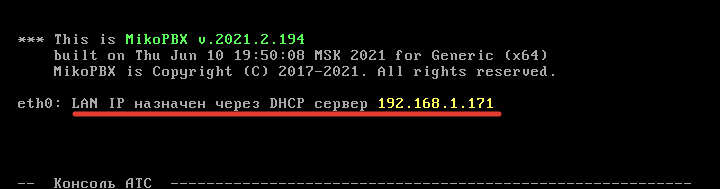

Введя данный ip в браузере, перед Вами откроется веб-оболочка MikoPBX, в которой будут осуществлены все основные настройки работы телефонии. По умолчанию данные для авторизации:
- Логин - **admin**;
- Пароль - **admin**.

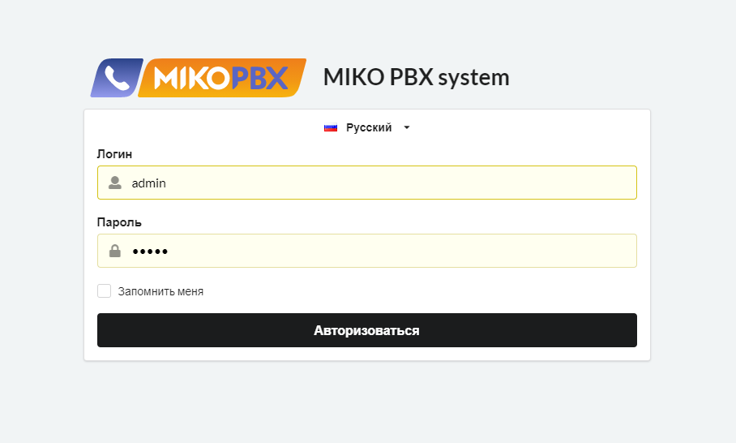

После успешной авторизации Вы будете перенаправлены в рабочее пространство АТС. Первым делом необходимо активировать работу АТС и других продуктов телефонии. Для этого перейдем в раздел меню **"Модули"-"Лицензирование"**. Если Вы приобрели ПЛАТНЫЕ лицензии на использование телефонии МИКО, тогда Вам нужно поочередно в поле **"Активация купона"** ввести все ключи, которые были получены.

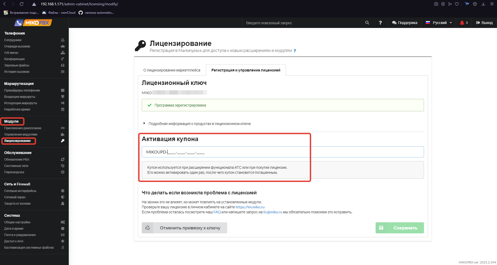

Для активации БЕСПЛАТНОГО периода использования (без обрезки функционала), Вам необходимо на этой же закладке, сначала ввести регистрационные данные Вашей организации и email адрес, куда будут высланы бесплатные ключи для активации программ. Полученные ключи нужно вводить в поле **"Лицензионный ключ"**. После успешной активации станут доступны все возможности использования телефонии, а информация о лицензии будет отражена в разделе подробной информации.

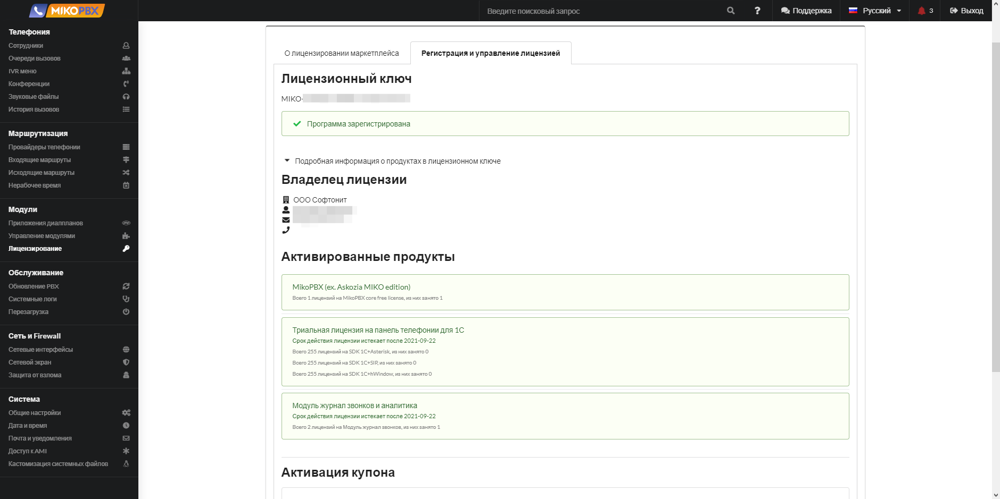
 
Следующим шагом настройки будет установка необходимого модуля панели телефонии, который будет связывать АТС и конфигурацию 1С. Переходим в раздел **"Модули"-"Управления модулями"**. И в списке доступных для установки модулей устанавливаем **"Панель телефонии 4.0 для 1С:Предприятия"**.

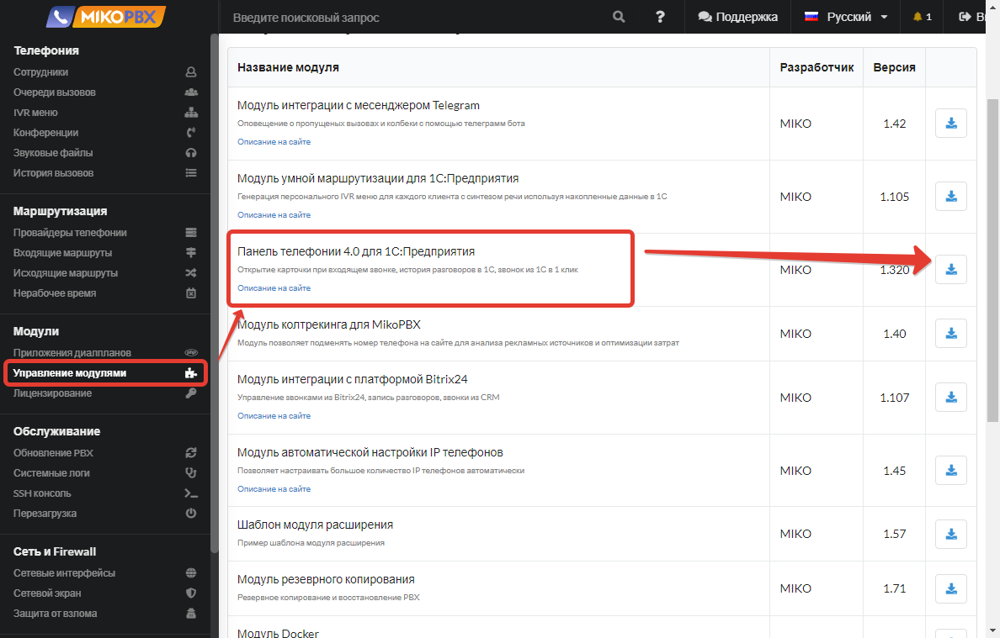

После того как данный модуль будет установлен необходимо открыть его настройки и выбрать один из режимов соединения с конфигурацией "Управление IT-отделом 8". Для настройки доступны два режима: 

1. Через LongPool соединение - это когда 1С осуществляет подключение к самой АТС MikoPBX. Данный вариант подходит для клиент-серверных баз; 

2. Через web сервис - в этом случае подключение осуществляет АТС к 1С, используя заранее опубликованный web сервис. 

Мы рекомендуем использовать режим WEB сервис, так как он более стабилен в работе. Перед тем как вводить данные нужно опубликовать базу и необходимые для работы в этом режиме web сервисы, подробнее об этом в статье ["Настройка телефонии в программе"](https://softonit.ru/FAQ/courses/?COURSE_ID=1&LESSON_ID=815).

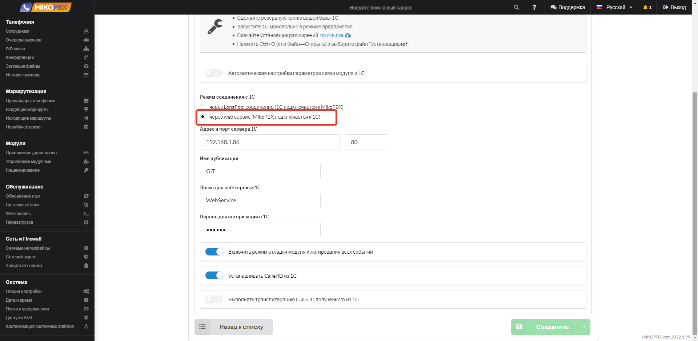

Далее нужно указать провайдера интернет телефонии, который предоставляет данные для подключения по **SIP протоколу**. Для этого переходим в раздел **"Маршрутизация"-"Провайдеры телефонии"**. Вы можете откорректировать имеющегося демо-провайдера, введя свои данные, либо создать нового, нажав на кнопку **"Подключить SIP"**. После нажатия данной кнопки откроется окно добавления нового провайдера. Вам необходимо заполнить основные поля настроек:

- **Название провайдера** - может задаваться любое.

- **Хост или ip адрес** - имя хоста провайдера или его ip адрес для осуществления подключения.

- **Логин** - логин выдаваемый провайдером интернет телефонии для подключений сторонних программ по протоколу SIP. В качестве логина может выступать линия номера телефона, например, когда Вы используете телефонию от Telphin. 

- **Пароль** - пароль от выданного логина. 

Остальные настройки можно оставить без изменений при необходимости их можно откорректировать в любой момент.

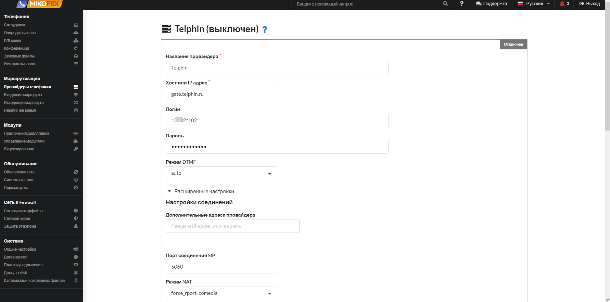

После ввода и сохранения настроек провайдера в списке "Провайдеры телефонии" у него должен загореться зеленый кружок, сигнализирующий об успешной регистрации и работе добавленного провайдера. В некоторых случаях регистрацию можно отключить, тогда кружок будет иметь оранжевый цвет.

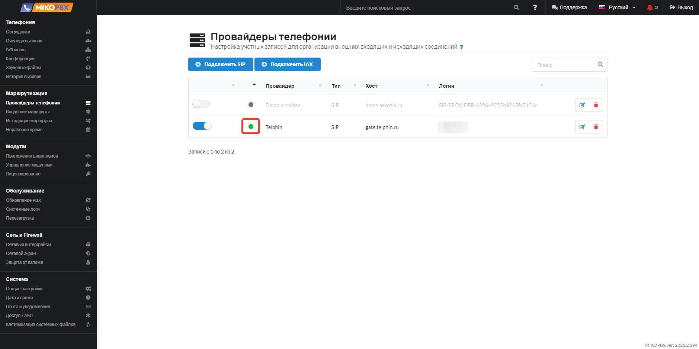

Следующее, что необходимо настроить - это добавить пользователей, которые будут использовать телефонию и софтфон. В разделе меню "**Телефония**" открываем пункт "**Сотрудники**". В открывшемся списке нажимаем кнопку **"Добавить сотрудника"** и вводим основные параметры. Обязательно нужно указать внутренний номер, который будет использоваться для подключения к панели софтфон.

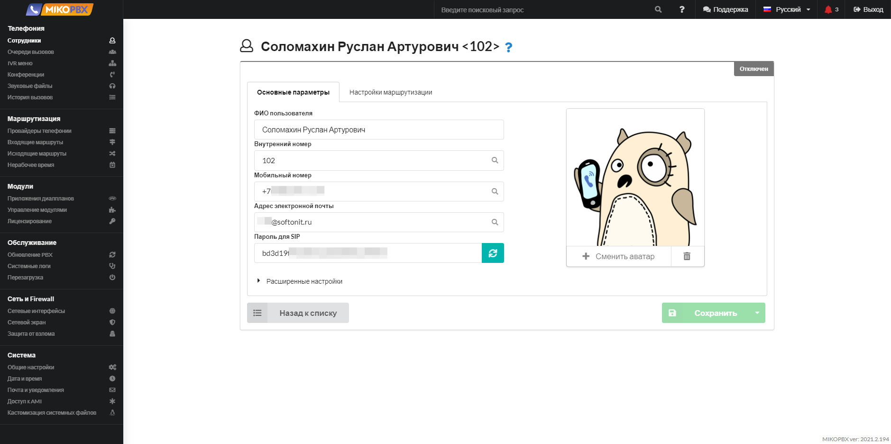

На этом минимальный набор настроек АТС, которые необходимо выполнить для работы подсистемы выполнен. Вам останется настроить под себя входящие и исходящие маршруты звонков, очереди вызовов и IVR меню. Примеры настроек можно посмотреть, открыв демо настройки каждых из перечисленных пунктов.
