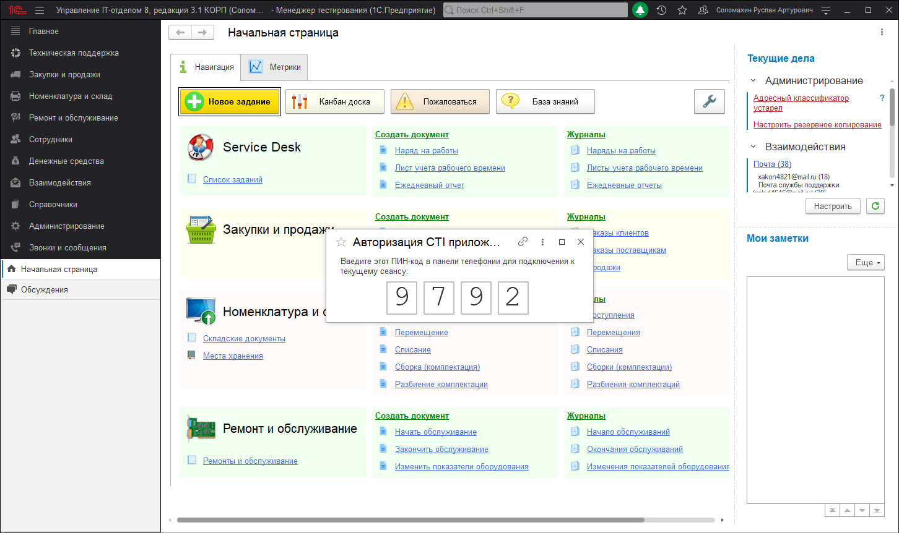

# Установка панели софтфона

Для того, чтобы совершать звонки, используя подсистему "Телефонии", необходимо на локальном компьютере пользователя установить панель СофтФон, которая будет связующим звеном. Первым делом скачиваем дистрибутив панели СофтФон. Скачать последнюю версию софтфона можно прямо из конфигурации. Для этого перейдите в раздел "Звонки и сообщения" - "Установка CTI приложения" и в открывшемся окне нажмите скачать. После того как скачали дистрибутив софтфона запускаем установщик и устанавливаем панель.

!!!
На момент написания статьи версия панели софтфона 2.3.3. После установки панель автоматически проверит наличие новых обновлений и если обновления будут найдены предложит их установить.
!!!

После выполнения установки запускаем софтфон для осуществления подключения пользователя. Откроется окно софтфона, в котором необходимо ввести либо **dns имя** сервера, на котором установлена **АТС** или **IP адрес**. В нашем случае указываем IP и нажимаем кнопку "Далее".

Если связь будет установлена успешна, тогда Вы будете перенаправлены на следующую страницу подключения. В противном случае проверьте доступность сервера АТС с локального компьютера, где запускается панель софтфона. На следующей странице необходимо ввести код подключения, который генерируется в самой конфигурации. Для этого открываем конфигурацию и переходим в раздел **"Звонки и сообщения"-"Авторизация CTI приложения"**. Результатом данных действий будет автоматически сгенерированный код, который нужно будет ввести в самой панели софтфона.

Полученный код вводим в соответствующие поля подключения и дожидаемся успешной автоматической настройки софтфона.

!!!
Если на данном этапе Вы получаете ошибку, обязательно убедитесь, что в конфигурации у подключаемого пользователя указан внутренний номер. А также для данного пользователя создан соответствующий сотрудник на сервере АТС MikoPBX.
!!!

После успешной авторизации необходимо дождаться завершения автоматической настройки панели. По завершению данной операции Вы можете приступать к полноценному использованию подсистемы "Телефония" совместно с нашей конфигурацией.

