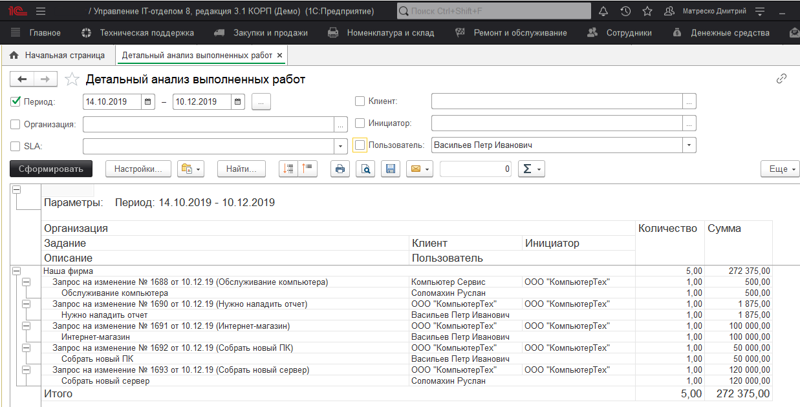

# Анализ работ/детальный анализ работ

Отчет "Анализ работ" *("Техническая поддержка"-> "Анализ работ")* отражает информацию по заданиям на основании, которых был создан документ "Наряды на работы". Выводит количество проведенных работ и их стоимость.

Отчет "Детальный анализ выполненных работ" *("Техническая поддержка"-> "Детальный анализ выполненных работ")* содержит аналогичную, но более детализированную информацию.

