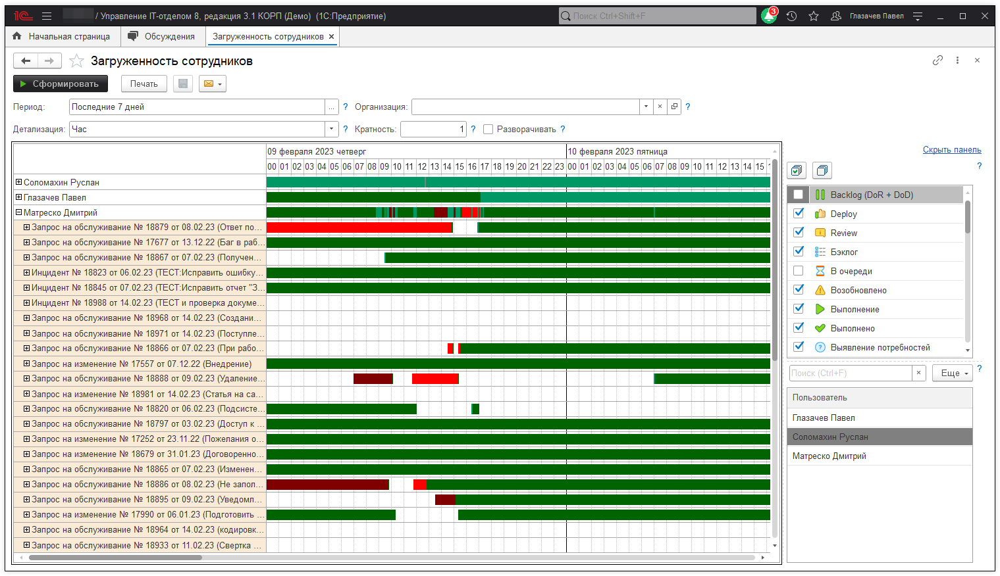
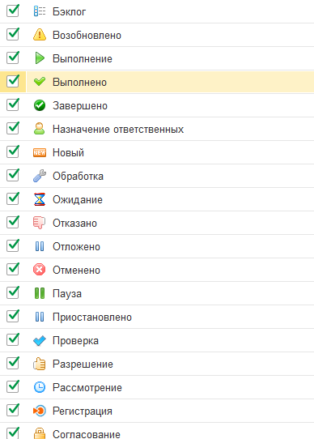

# Загруженность сотрудников

Контролировать загруженность сотрудников можно с помощью одноименного отчета *("Техническая поддержка" -> "Загруженность сотрудников")*. Отчет позволяет наглядно увидеть нагрузку сотрудника по часам, минутам и дням.

Вывод данных осуществляется на основе выбранных этапов задания. Каждый
этап имеет свой цвет (источником цвета является поле "Цвет текста" конкретного этапа процесса)

