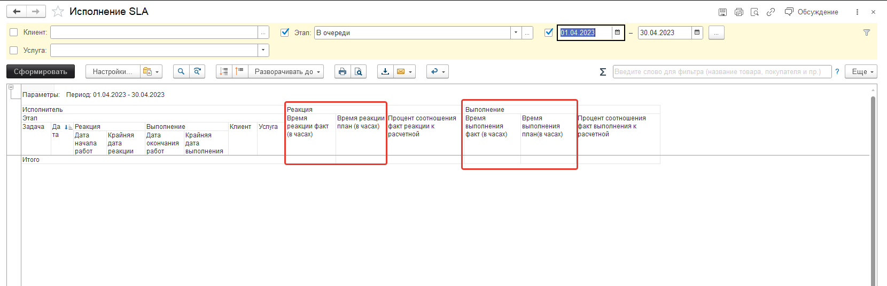
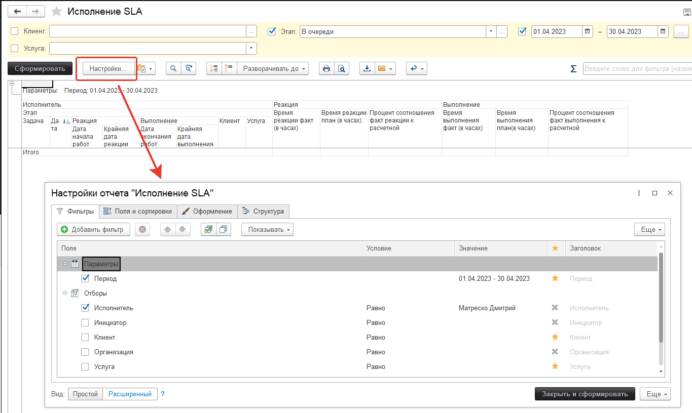
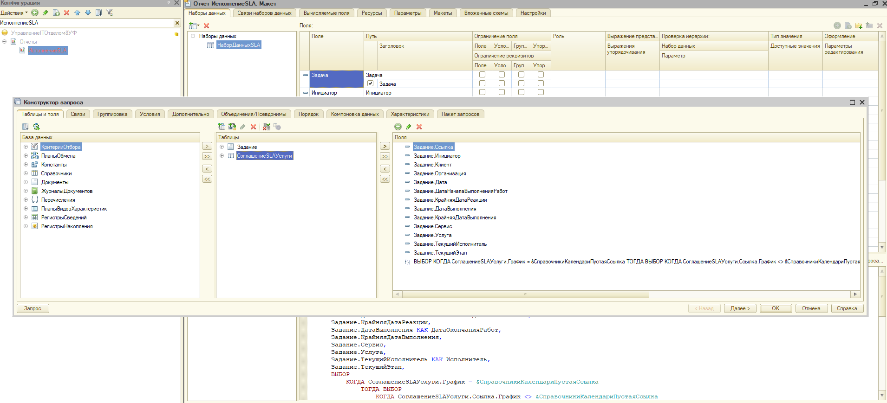
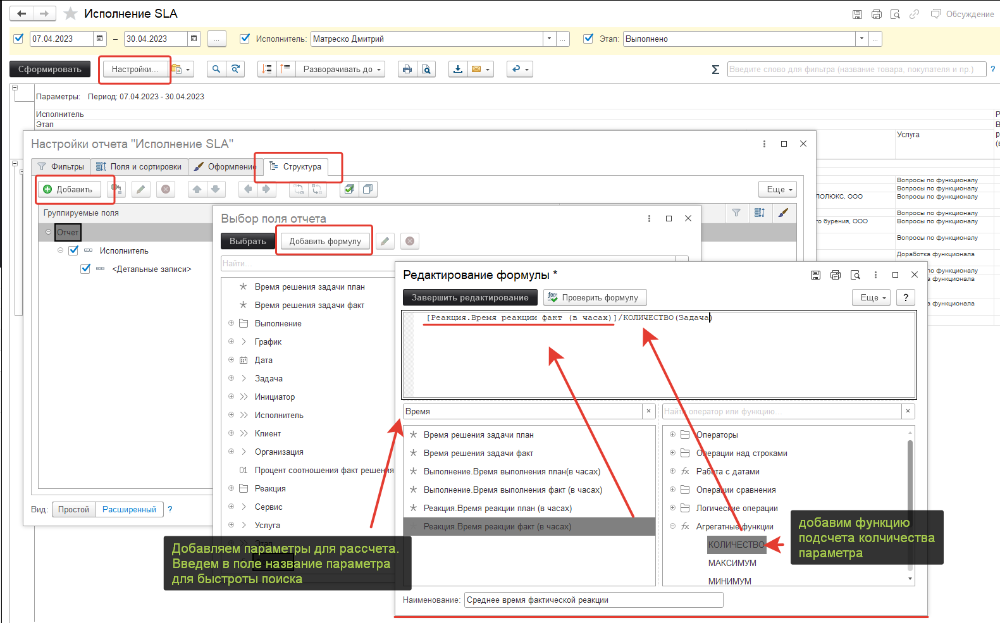
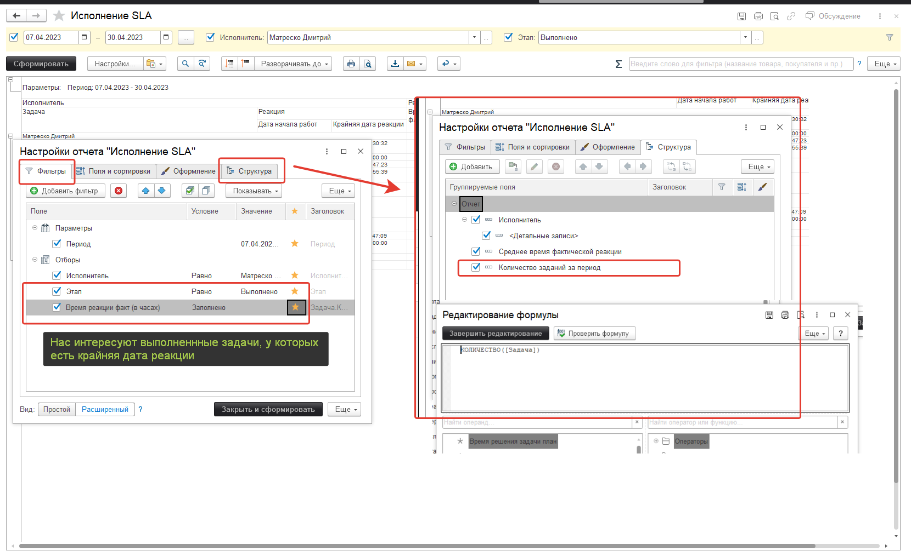
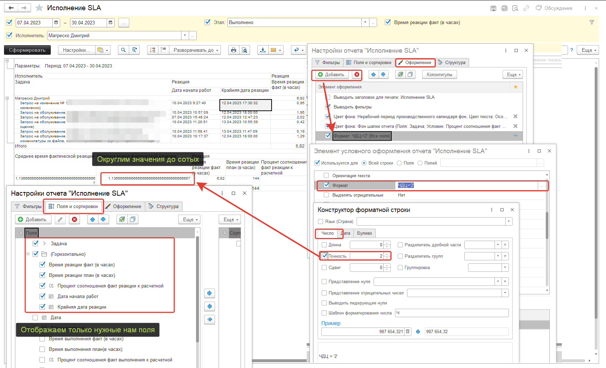
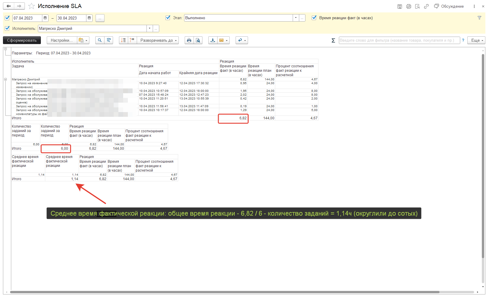

# Настройки отчета
Отчеты в программе весьма гибкие, но при этом сказать, что **«как угодно можно настраивать отчеты»** будет не корректно - т.к. **доступные данны**е для использования будут **ограничены запросом** к базе данных, построенным разработчиком заранее. Тем не менее, возможность видоизменять отчет без привлечения программистов - есть. Для этих целей используются инструменты **СКД**.

!!!
Система компоновки данных (СКД) – является визуальным средством для построения и вывода отчетов, без использования кодирования на языке 1С. Т.е. мы можем задавать источники данных, способ их вывода на экран, при этом, не написав ни строчки кода.
!!!

**Как использовать данный инструмент покажем на примере, но данный механизм относится к платформе 1С, поэтому более подробную информацию по работе с данной системой вы можете найти в интернете.**

*Задача: выводить в отчет информацию о среднем времени реакции и среднем времени выполнения задач по исполнителям.* 

**Что для этого нужно?**
* Количество заданий за период
* Сумма фактического времени исполнителя по всем задачам за период
* Вычислить среднее значение по формуле: Сумма времени за период / количество задач за период
Наилучшим образом для решения данной задачи подойдет отчет «Исполнение SLA» , т.к. в нём есть предопределенные поля: «Время реакции факт (в часах)» и «Время выполнения факт (в часах)»  

Путь по умолчанию: **«Техническая поддержка» - «Отчеты по технической поддержке» - «Область SLA» - «Исполнение SLA»**

Для того, чтобы в этот отчет приобрел необходимое нам визуальное представление - изменим настройки отчета.

## 1. Нажимаем кнопку «Настройки...» на панели инструментов:

В открывшемся окне нам становятся доступные вкладки, позволяющие управлять отчетом и менять его итоговое представление как нам необходимо:
1. **Фильтры** - на данной вкладке устанавливаются отборы, критерии по котором задания будут или не будут выводиться в отчет.
2. **Поля и сортировки** - раздел, отвечающий за то, каким образом будут отсортированы поля, выводимые в отчет
3. **Оформление** - возможность задавать условное визуальное отражение полей при соблюдении условий. Так, например, можно красить в зеленый цвет поля, значения которых будет равно нулю
4. **Структура** - главный раздел, определяющий какие именно данные будут использованы для построения отчета. В самом начале мы говорили о том, что доступные для выбора данные ограничены запросом, который был сформирован в процессе разработки данного отчета:

## 2. Изменяем структуру отчета
Добавим в структуру нашего отчета поле «Среднее время фактической реакции», которое будет заполняться на основе расчета формулы: «общее время реакции / количество заданий»  - на изображении ниже пример того, как добавить формулу.

## 1. Добавим фильтров и оформление, уберем лишние поля

Установим отборы заданий и для наглядности добавим поле «Количество заданий за период», чтобы убедиться в корректности нашей формулы среднего расчета. Дополнительно установим округление значений до сотых через условное оформление и скроем ненужные нам поля.

## 4. Результат

