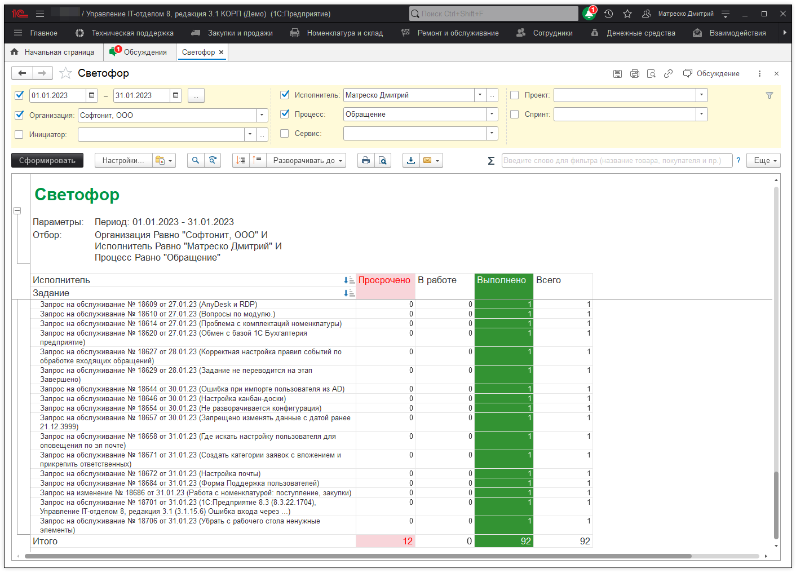

# Отчет "Светофор"

В отчете "Светофор" *("Техническая поддержка" -> "Светофор")* отражена информация о заданиях, которые являются просроченными, находятся в работе, или переведены на этап "Выполнено".
Фильтр, который указывается на период - это фильтр на дату документа. Тут мы пишем не даты когда задание было выполнено, а даты в которых задание было зарегистрировано.

Если необходимо видеть лишь выполненные задания за период - добавьте 2 фильтра по дате выполнения, где первый будет больше, либо равным дате, второй же, меньше, либо равным дате.