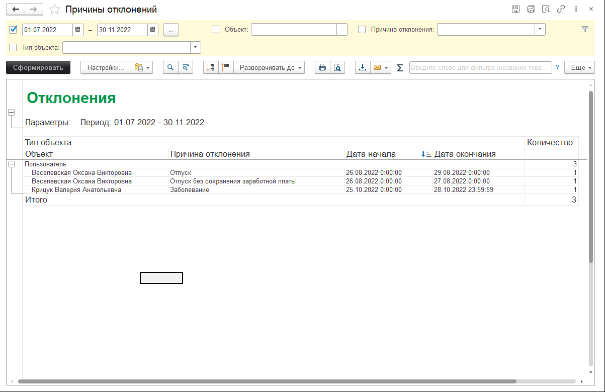

# Причины отклонений

Отчет "Причины отклонений" *("Техническая поддержка"-> "Причины отклонений от графика")* отражает информацию о сотрудниках, которые по определенным причинам были вынуждены отклониться от графика работы. Причины отклонений:
* Авария;
* Заболевание;
* Командировка;
* Отгул;
* Отпуск;
* Отпуск без сохранения заработной платы;
* Отсутствует по невыясненной причине;
* Прогул;
* Регламентные работы.

Отчет формируется на основании документа ["Причины отклонения от графика"](https://softonit.ru/FAQ/courses/?COURSE_ID=1&LESSON_ID=567&LESSON_PATH=1.22.567).

