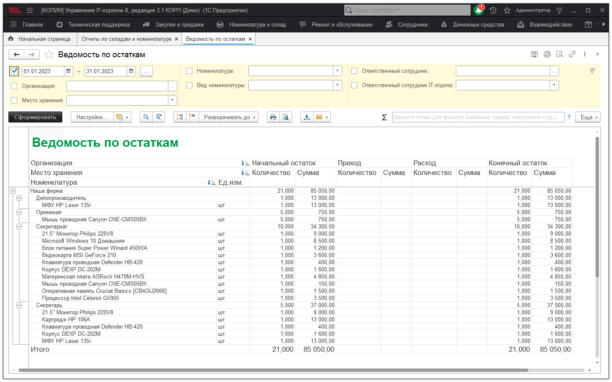
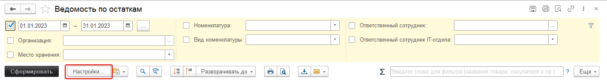
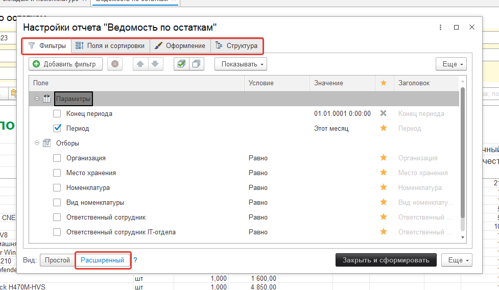

# Работа с отчетами

В конфигурации используются отчеты для вывода на экран, в печать или файл структурированной информации. Пример отчета:

Формировать вывод информации в отчете, можно с помощью группы предопределенных или собственных отборов.

В расширенном виде настроек отчета, можно устанавливать нужные настройки: отборов, полей и сортировки, оформления, структурирования.

**Список ролей для работы с подсистемой "Отчеты".**
* [x] Добавление и изменение вариантов отчетов;
* [x] Добавление и изменение личных вариантов отчета;
* [x] Использование универсального отчета;
* [x] Чтение вариантов отчета;
* [x] Просмотр отчета движения документа;
* [x] Добавление и изменение рассылок отчетов;
* [x] Чтение рассылок отчетов.
