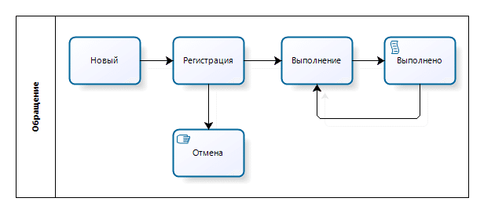
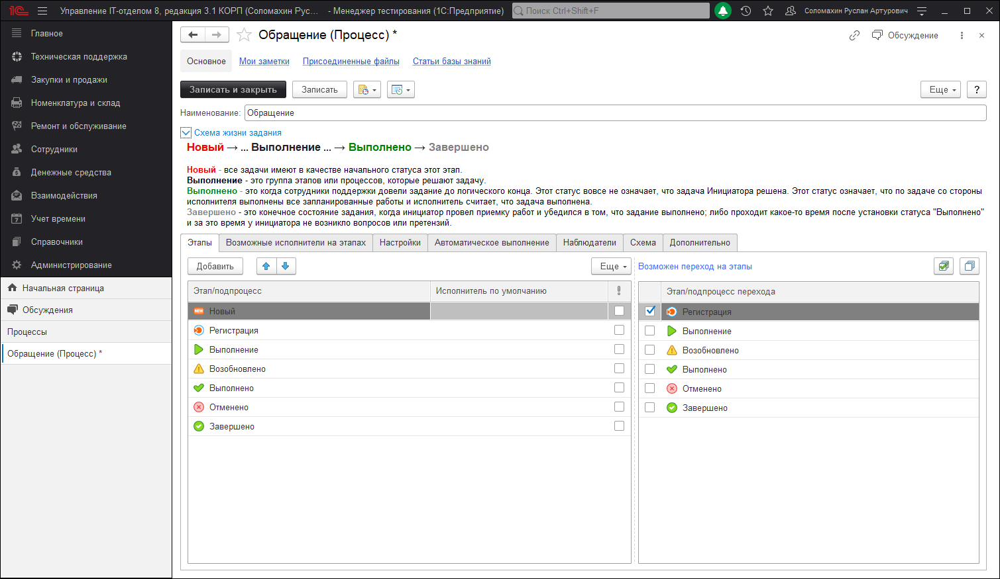
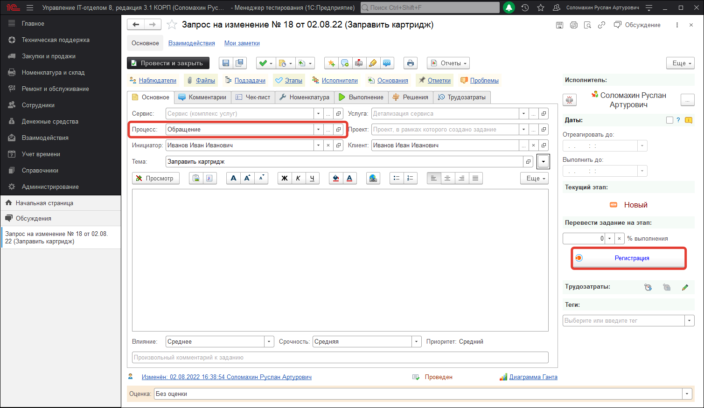

# С чего начать?

Вы готовы к ведению учета? Ну что, начнем?

Прежде всего, Вам необходимо ясно представить цели, которые Вы хотите получить в конце от автоматизации Service Desk и быть морально готовым к кропотливой работе по упорядочиванию задач, их систематизации, обучению пользователей новой системе и т.д.  
На бумаге нарисуйте схему обработки инцидентов (в нашей терминологии и далее – заданий) у Вас в отделе, как бы Вы хотели, чтобы это работало. Есть ли у Вас менеджер по приему заданий, который распределяет задания по направлениям, или Вы будете работать без него? Составьте ПОЛНЫЙ СПИСОК всех возможных процессов в Вашей ИТ-структуре. И для каждой сделайте свою схему. Мы покажем, как настроить работу для одного вида процессов. Остальное Вы сделаете по аналогии.  
Рассмотрим бизнес-процесс обращения пользователей организации (инициаторов) в ИТ-службу на примере следующей схемы (по умолчанию она присутствует в только что установленной конфигурации и называется «Обращение»).  
Допустим, в нашем виртуальном примере есть человек, который отвечает на все телефонные звонки (оператор), фиксирует все данные в самом начале и распределяет эти обращения по исполнителям.  
При этом он регистрирует все данные (тема, текст, приоритет, от кого и т.д.). Потом отдает на выполнение другому специалисту отдела, а тот уже выполняет все, чтобы обратившийся получил решение поставленного задания.  
Причем, человек регистрирующий обращение достаточно грамотен и может решить вопрос самостоятельно, не передавая другому сотруднику. Так же в процессе беседы может оказаться, что обращение было вызвано неграмотностью пользователя вследствие чего, обращение было отменено.  
После того, как оператор выбрал исполнителя, исполнитель может установить другого исполнителя, т.е. передать его другому специалисту, а также самостоятельно выполнить задание. В процессе работы может быть такая ситуация, когда конечный исполнитель указал, что он выполнил задание, но после проверки его инициатором оказалось, что задание не доведено до конца. В таком случае необходимо предусмотреть переход из состояния «Выполнено» в состояние «Выполнение», из которого потом снова можно перейти в состояние «Выполнено» и т.д.  

В результате имеем этапы обращения:

* Новый (обращение еще не рассмотрено оператором)   
* Регистрация (обращение рассмотрено оператором, внесены все реквизиты обращения)  
* Отмена (оператор решил вопрос самостоятельно, или по какой-то причине обращение было отменено)  
* Выполнение (оператор назначил конечного исполнителя)  
* Выполнено (конечный исполнитель выполнил задание)  
* 
По этим этапам нарисуем схему, как в нашей мнимой организации происходит работа с обычным обращением пользователей:

В конфигурации получим процесс *( Техническая поддержка > Процессы )* :

Причем видно, что из шага (этапа) "Новый" (когда задание только что создано) можно перейти на этап "Регистрация", если мы станем на этап "Регистрация", мы должны иметь возможность пойти на два других этапа: либо "Выполнение", либо "Отменено", что, собственно, на втором рисунке и видно. Где текущий этап "Регистрация", а возможные переходы указаны в выпадающем списке. Это возможные переходы на этапы. А в задании получаем:

Видно, что перевести с этапа "Регистрация" можно на один из двух этапов: либо "Выполнение", либо "Отменено". Если мы выберем "Выполнение", то задание будет переведено на новый этап "Выполнение" с этапа "Регистрация", таким образом мы перейдем с одного этапа на другой.

Аналогично и для других этапов.

Последовательный переход с этапа на этап позволит перевести задание из начального этапа "Новый" в конечный этап "Выполнено" или "Отменено".

Исходя из выше составленной схемы и описанными возможностями программы, на данном этапе необходимо определить, как Вы хотите работать с пользователями и их заявками. Конфигурация предлагает несколько вариантов на Ваш выбор:

## 1. Работа службы поддержки через единый ящик поддержки.

Есть служебный почтовый ящик вида support@mymail.ru (или несколько таких ящиков), пользователи на него пишут заявки и служба поддержки работает по этим заявкам. В конфигурации, это реализовано следующим образом: в настройках параметров учета есть список ящиков, с которых выполняется загрузка писем от пользователей (письма попадают в конфигурацию, загружаясь регламентным заданием). На основе загруженных писем, другим регламентным заданием анализируются и создаются новые задания, или, если это переписка уже по существующей задаче, то добавление сообщений в уже созданное задание. Изменение статуса задания, смена ответственного, переписка и т.д. осуществляется в конфигурации, подписчикам задания, в том числе и автору, отправляются уведомления об изменениях по заданию.

При этом, службе поддержки не нужно анализировать почтовые письма, задания создаются из писем, мы лишь контролируем задания.

Такой способ работы самый распространенный.

## 2. Работа от звонков пользователей (Call Center).

Есть диспетчер или разделение исполнителей по ролям, им звонят, они выполняют задания, получив описание проблемы по телефону. Такое тоже встречается, в этом случае, задания в Service Desk, необходимо вносить вручную, там же регистрировать этапы и тонкости решения поставленных заданий. Это необходимо делать, т.к. если не регистрировать эти инциденты, то через время начнутся ситуации, когда что-то забыли, что-то не доделали и т.д. Задания, заведенные в нашем решении никуда не денутся, и помогут Вам ничего не забыть. При этом, есть возможность, если у обратившегося сотрудника, в справочнике физ лица, заполнено поле e-mail, то можно настроить все так, чтобы инициатор задания получал уведомления по почте об изменении своего задания.

## 3. Комбинированный способ поддержки (единый ящик поддержки + Call Center).

В этом способе есть как письма, так и звонки от пользователей. Т.е. ничего не исключает отправку писем пользователями и звонки с заданиями одновременно.

## 4. Пользователи сами заходят в конфигурацию через Веб - клиент (используя интернет - браузер), или через 1С:Предприятие и сами вносят задания в конфигурацию.

Если корпоративная почта отсутствует, но при этом необходима фиксация поручений и контроль их выполнения, то возможен и такой вариант работы с нашей конфигурацией.

## 5. [Мобильное приложение](https://softonit.ru/FAQ/courses/?COURSE_ID=1&CHAPTER_ID=0498)

## 6. [Личный кабинет](https://softonit.ru/FAQ/courses/?COURSE_ID=1&LESSON_ID=595)

## 7. [Telegram бот](https://softonit.ru/FAQ/courses/?COURSE_ID=1&CHAPTER_ID=0678)

Выберите необходимый для себя способ работы для продолжения изучения.

