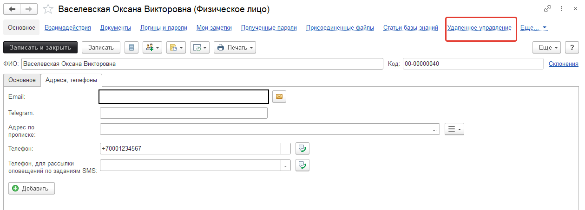
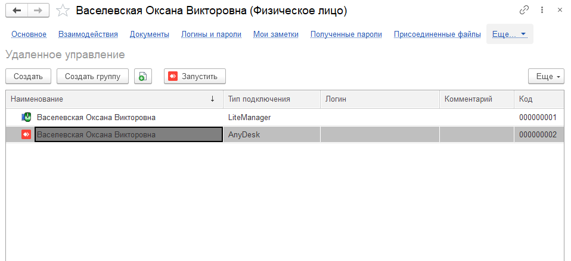

# Удаленное управление

Подсистема позволяет быстро подключаться к компьютерам пользователей.
В объектах "Физические лица", "Места хранения", "Контрагенты", "Пользователи", "Контактные лица", есть дополнительная команда "Удаленное управление":

При нажатии на нее открывается форма с подключением:

Теперь можно нажать на кнопку "Запустить" и запустится внешнее приложение, которое позволит подключиться к конкретному пользователю используя внешнее ПО (Team Viewer, RAdmin и т.д.). Это позволяет быстро подключаться к удаленным компьютерам прямо из конфигурации, что сэкономит ваше время.

!!!
Внимание! Для того, чтобы подсистема работала на клиентском компьютере должны быть установлены программы для удаленного подключения (Team Viewer, RAdmin и т.д.).
!!!

Формы справочника "Удаленное управление" отличаются друг от друга в зависимости от того, как был открыт данный справочник. То есть, если справочник был открыт через объект подключения (пользователя, контрагента, места хранения и т.д.), то форма справочника выглядит как на изображении выше. Если же "Удаленное управление" открыто через раздел "Техническая поддержка", то форма примет иной внешний вид (изображение ниже).

А вот форма редактирования удаленного подключения:

Можно выбрать параметры запуска и основные параметры. Если не понятно какие параметры использовать, нажмите на знак вопроса рядом с параметрами.

Пути к внешним приложениям предопределены, но их можно изменить для каждого пользователя в его персональных настройках.

Функционал удаленного управления использует достаточно широкий выбор вариантов для осуществления удаленного подключения, который был расширен. В состав входят такие программы и подключения как:

* [x] AeroAdmin
* [x] AmmyAdmin
* [x] AnyDesk
* [x] DameWare Mini Remote Control
* [x] HTTP(S)
* [x] LiteManager
* [x] RAdmin
* [x] RDP - возможности подстановки пароля нет
* [x] Remote manipulator system (RMS)
* [x] Team Viewer
* [x] Ultra VNC
* [x] Произвольная команда

!!!
Важно! Функционал доступен в редакции КОРП.
!!!