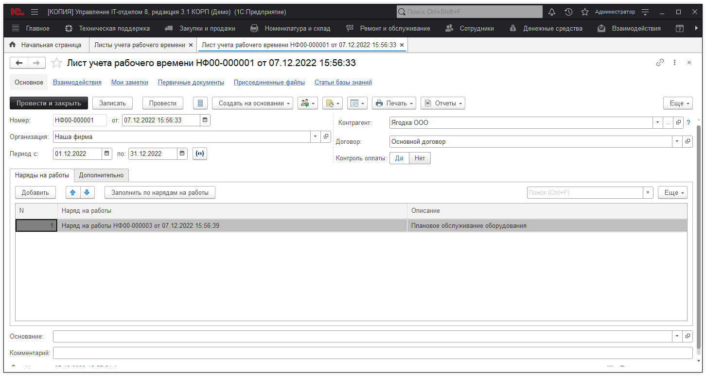
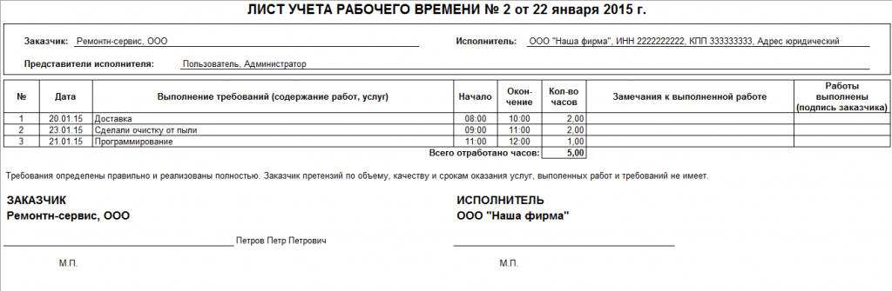

# Листы учета рабочего времени

Листы учета рабочего времени создаются на основании документа ["Наряд на работы"](https://softonit.ru/FAQ/courses/?COURSE_ID=1&LESSON_ID=38) и служит для цели обобщения работ по конкретному клиенту за период.

Документ не дает никаких движение и позволяет на основании создать оплату нарядов ["Учет денежных средств"](https://softonit.ru/FAQ/courses/?COURSE_ID=1&LESSON_ID=83), а в форме списка документа будет видно оплачен ли данный лист учета или нет. Так же содержит печатную форму ЛУРВ:

