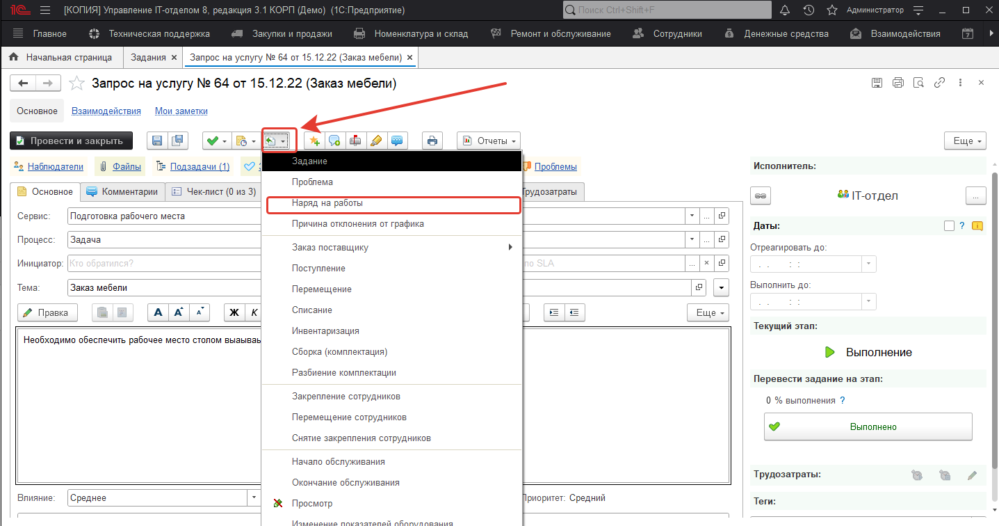
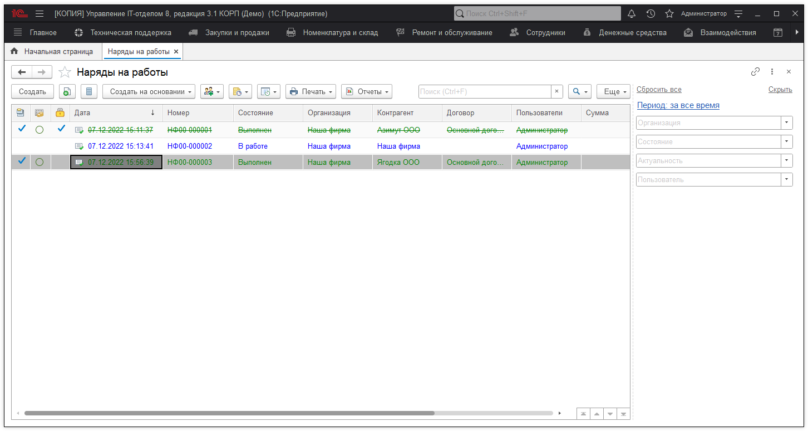
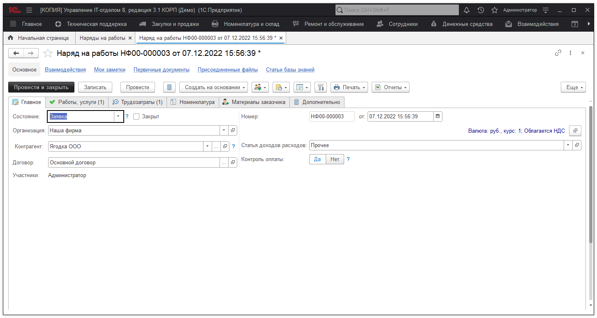

# Наряды на работы

**Наряд на работы** - документ, который фиксирует фактическое время работы сотрудников.

Наряды на работы обычно создаются на основании поступившего задания, но может и использоваться сам по себе. Выглядит совместное использование следующим образом: с начала поступает задание, а затем на его основании создается "Наряд на работы".

Но эта схема не является обязательной. Благодаря гибкости системы Вы можете создать "Наряд на работы" как самостоятельный документ, не привязанный к заданиям.

## Список нарядов на работы

В этом списке документов Вы можете увидеть все наряды на работы и некоторую информацию по ним.

## Окно наряда на работы

В окне наряда на работы Вы можете увидеть и изменить подробную информацию по конкретному факту работы пользователей отдела. Наряд на работы может быть создан на основании "Задания" с автоматическим заполнением данных.

На основании документа "Наряд на работы" можно создать документы "Лист учета рабочего времени" и "Учет денежных средств".
