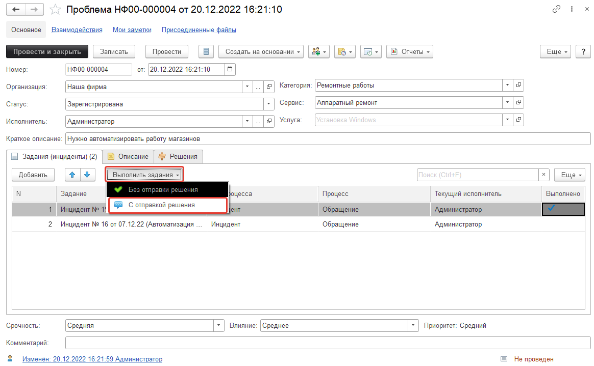

# Управление проблемами

Согласно ITIL: **Проблема–** это неизвестная причина одного или более инцидентов. Одна проблема может породить несколько инцидентов.
В нашем решении реализован механизм управления проблемами ITIL.

Проблема может быть создана как из формы задания, так и из формы списка заданий (множественная). Проблема стоит выше НАД заданиями (инцидентами), так как имеет приоритетную первостепенность. 

После создания открывается форма:

Где мы укажем краткое описание проблемы, список задач (инцидентов), которые участвуют в проблеме. Так же в проблеме может быть Исполнитель, а первоначально проблема имеет статус "Зарегистрирована". При этом статус на "Решена" изменить у проблемы нельзя без выполнения указанных дочерних инцидентов. Так же есть возможность указать Решение для проблемы, тогда при добавлении задания в проблему, в самом задании появится возможность быстро выбрать решение в решениях так как будет видна связь.

Поскольку завершить и закрыть проблему без перевода всех инцидентов на этап "Выполнено" нельзя, в данном документе предусмотрен функционал, позволяющий массово выполнять выделенные задания (инциденты). При этом механизм позволяет выбрать способ выполнения: с отправкой решения или без отправки.

!!!
ВАЖНО! Для того, чтобы задания были переведены на этап "Выполнено" необходимо, чтобы в настройках процесса, который указан в заданиях было заполнено "Значение преопределенного этапа выполнения задания". Данный реквизит заполняется в настройках каждого процесса на закладке "Автоматическое выполнение". Подробнее можно узнать в статье.
!!!

**1. Выполнить задания с отправкой решения.**
Предположим, что в проблеме были выполнены все входящие в ее состав задания и теперь нам необходимо их перевести на этап "Выполнено" и отправить комментарием с пояснением решения. Для этого на закладке "Задания (инциденты)" сочетанием клавиш (CTRL+A) или (CRTL + ЛКМ) выделяем нужные задания и нажимаем кнопку "Выполнить задания" - "С отправкой решения".

!!!
ВАЖНО! Для отправки решения необходимо, чтобы у Вас на закладке "Решения" была указана как минимум одна статья базы знаний, так как текст пояснения выполнения будет браться именно из статей.
!!!

## Рассмотрим каждый из способов:

После этого система в автоматическом режиме переведет все выделенные задания на этап "Выполнено" и в качестве комментария добавит текст из статьи базы знаний, которая была указана на закладке "Решения". При этом если было указано несколько статей, то система объединить текст всех статей в один и добавит его в комментарий к каждому заданию.

**2. Выполнить задания без отправки решения.**
Для тех ситуаций, когда требуется массовое выполнение заданий, но не нужно отправлять комментарий решения, можно воспользоваться кнопкой "Выполнить задания" - "Без отправки решения". В этом случае выделенные задачи будут просто переведены на этап "Выполнено" и комментарий с решением не будет добавлен. При этом не важно указаны на закладке "Решения" статьи базы знаний или нет. 

Для дальнейшего анализа проблем есть отчет "Список проблем", который поможет проанализировать проблемы и выявить причины их появления.

