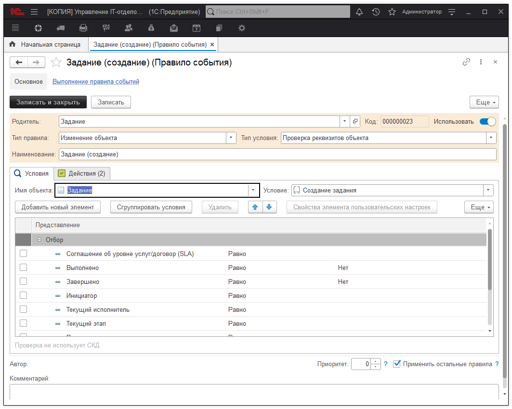
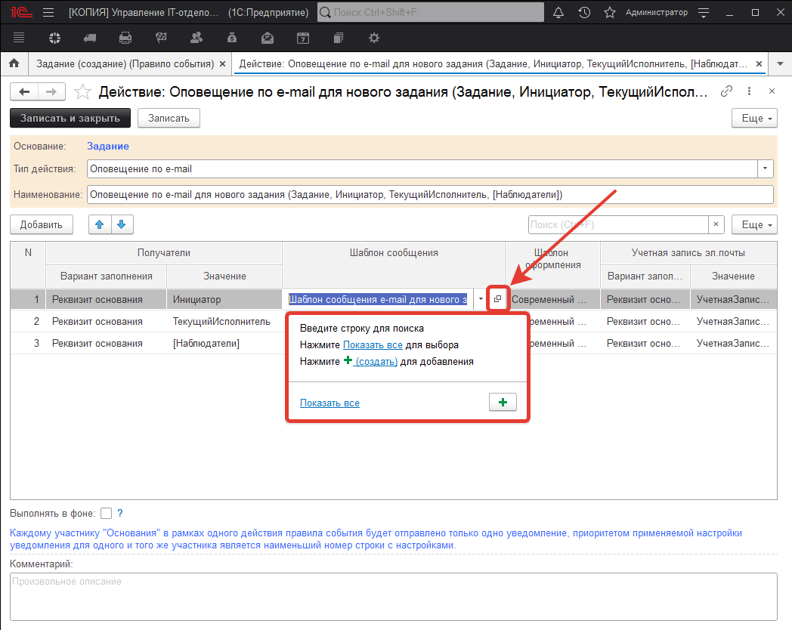
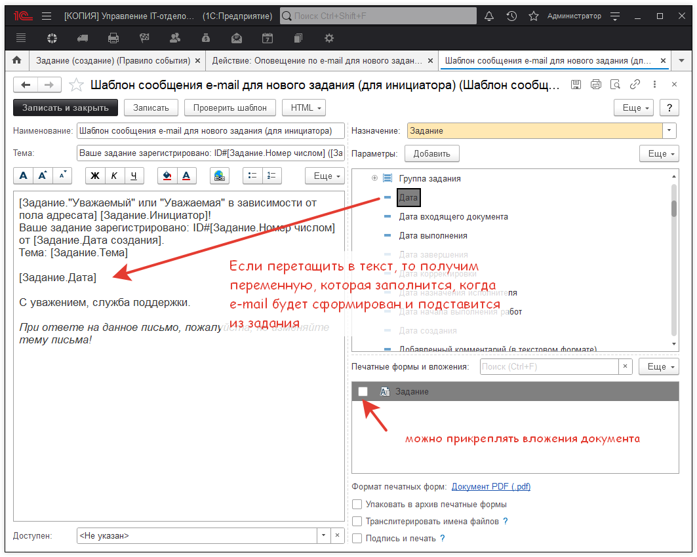
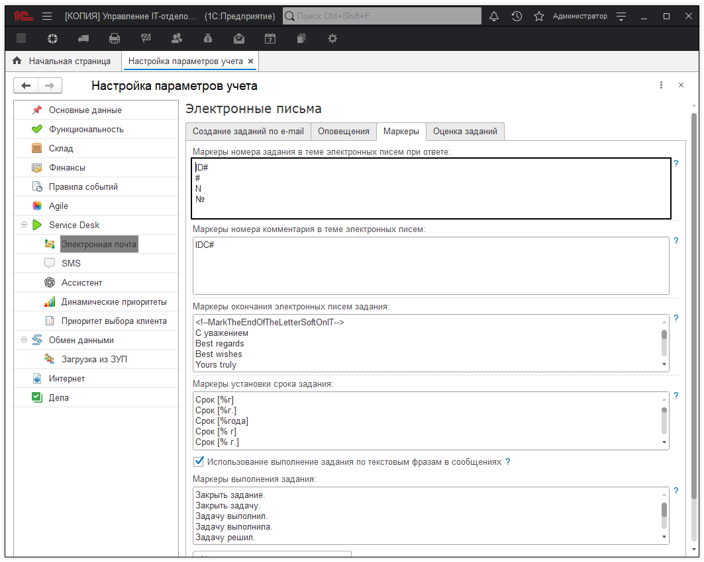

# Есть ли ограничения на изменения шаблонов писем? Можно ли, например, вместо ID# указать № и так далее?

Ограничений особых нет, и да, это возможно.  

Для изменения текстов писем необходим открыть правила событий: 
 
раздел **"Справочники" - "Правила событий"**.  
Найдем нужное нам правило и отредактируем его.  
Предположим, нам необходимо изменить текст письма, которое отправляется пользователю при загрузке заявки из почты.  

Найдем такое правило:

На второй вкладке:

И сам шаблон:

Тут его и можно править. Можно внести свой текст, можно перетаскивать мышкой переменные и добавлять в письмо свои значения. Причем, это как с телом письма можно сделать, так и с темой.   
Но вопрос то был в другом. А именно: как поменять **ID# на №**  
Первое, что хотим отметить - не нужно менять ID на простой - это связано с тем, что если вдруг в теме будет он не в контексте номера, а в другом, то будет проблема...   
Вместо того, чтобы сделать новую задачу, программа будет пытаться вставить комментарий в уже существующее задание.   
Пример темы: "Просьба проверить план закупки №1 на следующий год".   
Напомним, что наша конфигурация умеет не только загружать письма и создавать на их основании задания, но и понимать, что это не новое задание, а переписка по существующей задаче.   
См. статью [Создание заданий на основании электронных писем, которые приходят в службу технической поддержки](https://softonit.ru/FAQ/courses/?COURSE_ID=1&INDEX=Y)
(в конце алгоритм определения, что задача по переписке)  

Программа найдет № поймет, что это маркер номера в теме письма далее прочтет номер задачи (это первый номер), найдет задание с номером 1, оно существует. Программа поймет, что "все звезды сошлись" и не будет создавать новое задание (хотя надо было бы), а добавит в задачу №1 в переписку это письмо.
Да, оно не относится, да это не правильно. Но в программе, если задать маркер №, то будет именно так.
Поэтому необходим маркер, который не встретится просто так в тексте. По умолчанию, мы предлагаем маркер **"ID#"**. Но вы можете поменять маркер или добавить несколько.
Это можно сделать в **"Настройках параметров учета"** (раздел "Администрирование" - "Настройка параметров учета" - "Service Desk" - "Электронная почта" - "Маркеры" - "Маркеры номера задания в теме электронных писем при ответе"). Там можно изменить маркер ID# и/или добавить свой. По одному маркеру на строке.

