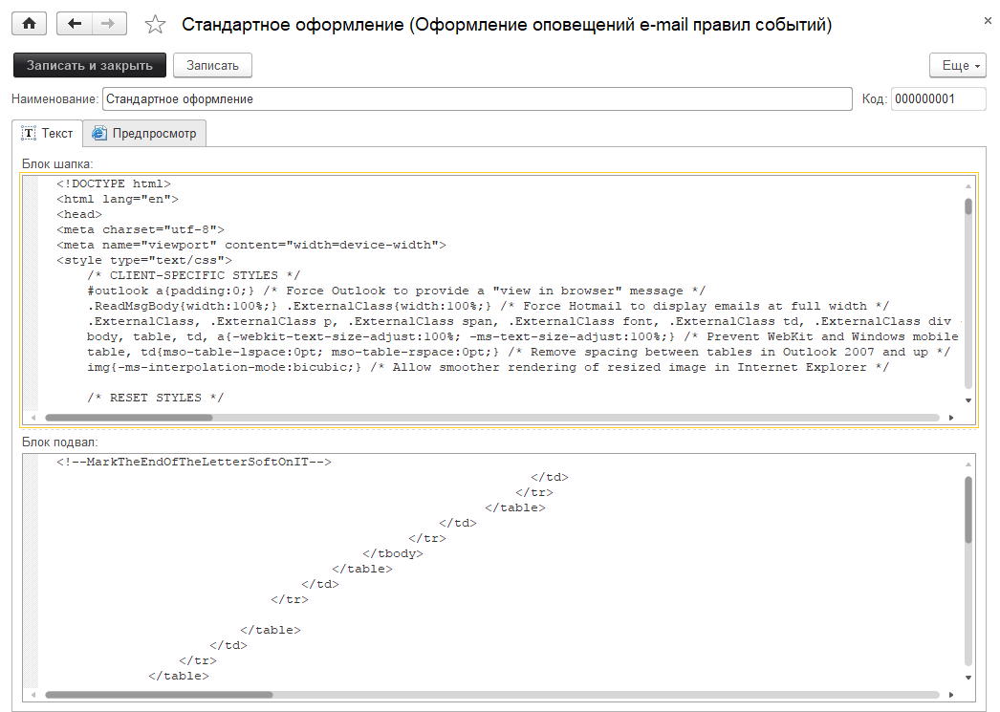
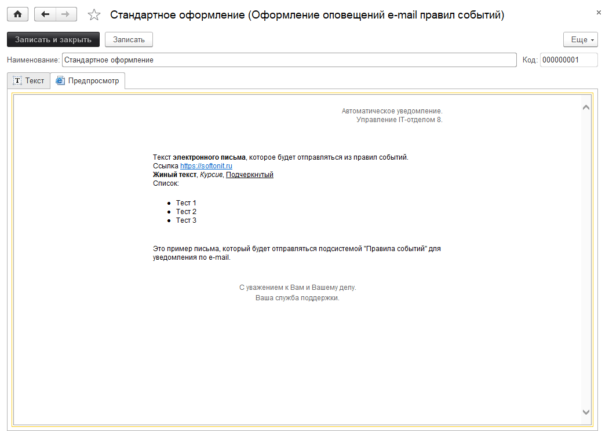
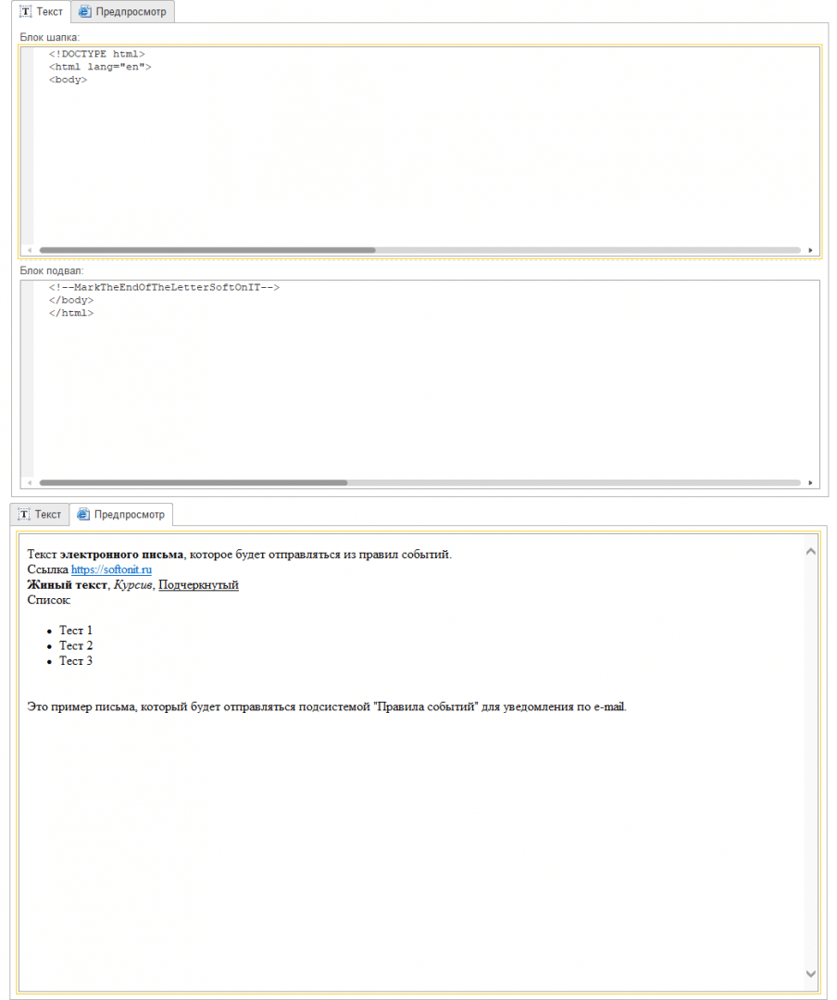

# Изменение оформления шаблона электронных писем (e-mail)

Кастомизация электронных писем (e-mail) часто необходима.  

Предположим, требуется добавить свое: логотипы, ссылки на социальные сети, общую подпись отдела после текста письма и т.д. Подсистема правил событий позволяет это сделать. Для этого, откройте справочник **"Справочники" - "Оформление оповещений e-mail правил событий"**.   

Далее, можно либо изменить стандартный шаблон, либо добавить собственные шаблоны.

**"Блок шапка"** - это то, что будет выведено перед текстом, который будет отправлен. Здесь можно определить свои стили css, свой логотип, который будет идти вверху и т.д. В общем все, что должно идти выше отправляемого текста. Этот блок в обязательном порядке должен содержать два тега: `<html>` и `<body>` (без кавычек).

**"Блок подвал"** - это то, что будет выведено после текста, который будет отправлен. Здесь выводим логотип, который будет внизу (если он нужен), ссылки на социальные сети, стандартная подпись и т.д. Этот блок в обязательном порядке должен содержать два тега: `</body></html>` (без кавычек). Так сказать, закрыть открытые системные теги начала HTML-документа `<html>`, и начала тела письма `<body>`.  
При этом можно посмотреть как будет выглядеть письмо на следующей вкладке "Предпросмотр":

Если Вы хотите видеть минималистичные письма и Вам не нужно оформление (так кстати было до версии 3.0.36), то можете вернуть старый шаблон.  
В шапку добавьте `<html><body>`, в подвал `</body></html>` (без кавычек).   
После этого рассылка будет точно такой же, как и в старых версиях.  

