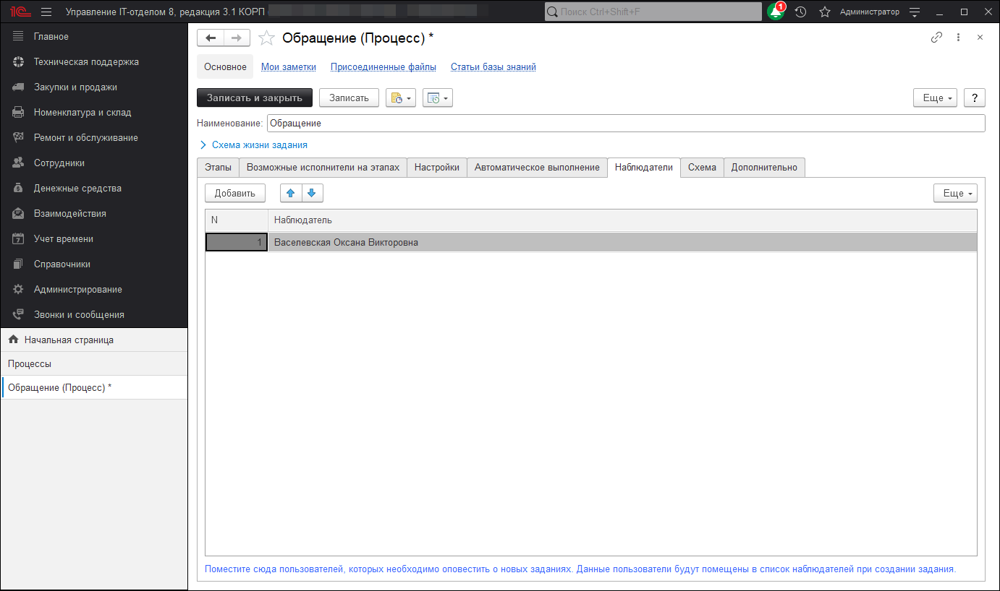
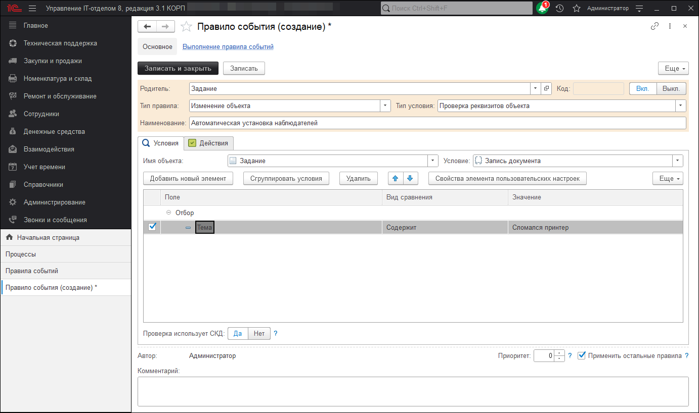
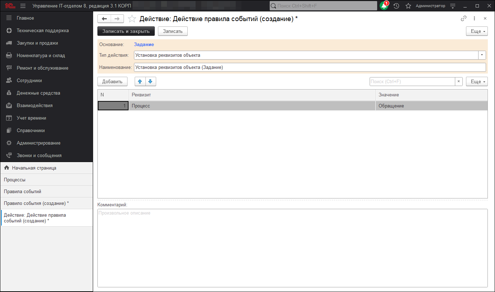

# Автоматическое добавление наблюдателей

С помощью подсистемы "Правил событий" можно не только работать с оповещениями различного рода, но и настроить автоматическую установку реквизитов в документе "Задание". При этом условия начала работы механизма могут быть абсолютно разные. Так, например, сталкиваемся с ситуацией, когда необходимо на основании темы задания установить определенный набор реквизитов, не прибегая к ручному вводу. Или бывают случае, когда обращение поступает и нужно автоматически назначить того или иного исполнителя. Об автоматическом назначении исполнителя можно ознакомиться здесь. В данном уроке рассмотрим ситуацию, когда на основании темы задания нужно автоматически установить в наблюдатели определенных пользователей. Сначала перейдем в раздел "Справочники" - подраздел "Service Desk" - "Процессы", выберем из списка нужный процесс (или создадим новый) и откроем его настройки. Перейдем на закладку "Наблюдатели" и с помощью кнопки "Добавить" укажем список пользователей, которые должны быть добавлены в наблюдатели задания. 

Далее переходим в раздел "Справочники" - "Правила событий" и нажимаем кнопку "Создать", чтобы добавить новое правило событий. Форма создания нового правила событий включает в себя следующие реквизиты:  

* **Тип правила** - данный реквизит определяет поведение правила событий. Варианты выбора: изменение объекта (тип правила, позволяющий изменять документы или справочники),  периодическое событие (тип правила, позволяющая настроить периодическое выполнение), расчет метрик (тип правила, который используется для автоматического расчета метрик);  
* **Тип условия** - данный реквизит определяет вариант условия правила событий и имеет варианты выбора: проверка реквизитов объекта и произвольный алгоритм;  
* **Наименование** - реквизит, который отвечает за название правила события;  
* **Имя объекта** - реквизит, в котором указывает необходимый объект информационной базы для проверки условия правила событий;  
* **Условие** - реквизит, в котором выбирается вариант условия проверки указанного объекта информационной базы.  

После заполнения описанных выше реквизитов необходимо добавить новый отбор по теме задания, по которому будут отбираться для проверки условия новые задания. Нажимаем на кнопку "Добавить новый элемент" и из списка выбираем реквизит "Тема", в виде сравнения указываем вариант "Содержит", а в значение пишем тему задания, при котором будет отрабатывать условие.  

В результате настроек правило событий будет выглядеть следующим образом:

Обращу Ваше внимание на то, что в данном примере мной было выбрано условие "Запись документа", это означает, что отрабатывать и проверять соответствие отбору правило событий начнет в момент, когда произойдет первая запись документа. Прошу не путать с созданием задания, это два разных случая. Вариант условия, указанный в этой статье подходит для заданий создаваемых вручную, если Вы хотите, чтобы подобное происходило с заданиями создаваемыми на основании входящих писем, тогда нужно установить условие "Задание создания". Следующий шаг, создание действия для данного правила событий. Переходим на закладку "Действия" и нажимаем кнопку "Добавить" - "Создать".  В форме создания действия расположены следующие реквизиты: 

* **Тип действия** - реквизит, отвечающий за принцип поведения действия. Имеет значения: *Назначение исполнителя* (используется для настройки автоматического назначения исполнителя), *оповещение по e-mail, telegram, sms* (для создания уведомлений), *проверка обязательных реквизитов* (используется для проверки заполнения ряда обязательных реквизитов), *произвольный алгоритм* (используется для написания собственной логики поведения создаваемого действия), *расчет метрик* (применяется при формировании метрик и KPI), (создать напоминание) (для автоматического создания напоминаний), (установка реквизитов объекта) (используется, чтобы заполнять необходимые реквизиты задания);  

* **Наименование** - реквизит для указывания названия данного действия.  

Так как нам нужно установить определенный процесс в задание, то в этом случае выбираем тип действия "Установка реквизитов объекта". А в табличной части, расположенной ниже добавляем необходимый реквизит и указываем значение, которое он должен принять. В итоге должно получится как на изображении ниже.

В результате подобной настройки, в заданиях, у которых реквизит "Тема" содержит определенное словосочетание будет установлен соответствующий процесс со своими наблюдателями. Таким образом получаем полноценный механизм автоматического добавления наблюдателей в документ "Задание".