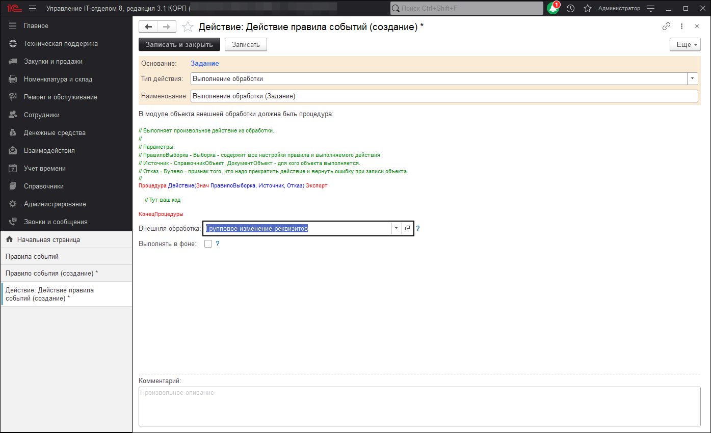

Выполнение обработки
В подсистеме правил событий имеется ряд предопределенных действий, которые отвечают за реализацию различных возможностей работы функционала программы. В этот список действий входят оповещения, установка, проверка реквизитов и так далее. Но иногда для создания определенного правила событий стандартных действий не хватает. Для таких случаев предусмотрен тип действия правила событий "Произвольный алгоритм", который позволят реализовать на языке программирования 1С любую логику работы. В добавление к произвольному алгоритму был разработан дополнительный тип действия "Выполнение обработки". Назначение данного типа полностью аналогично произвольному алгоритму, за исключением того, что здесь используются для выполнения ранее созданные обработки. В реквизите "Внешняя обработка" необходимо выбрать обработку, которая находится в справочнике "Дополнительные отчеты и обработки", если такой нет, то ее можно добавить.

Стоит отметить, что данное действие, как и произвольный алгоритм может выполняться в фоновом режиме, но тогда переменная "Отказ" не будет применяться.