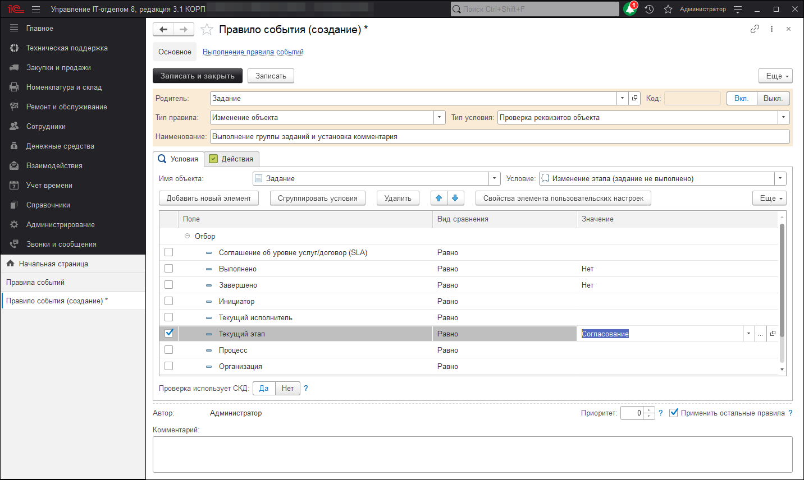
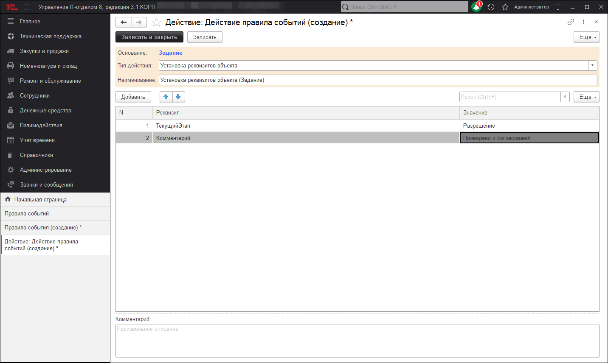
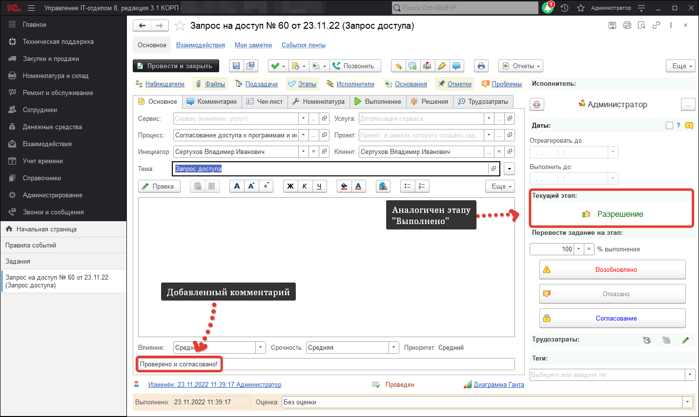

# Групповое выполнение заданий с добавлением единого комментария

Еще одна часто встречающая потребность пользователей заключается в том, чтобы задания, которые переводятся на определенный этап автоматически выполнялись и в них добавлялся согласованный комментарий. Это очень полезная функция, когда происходит процесс согласования. То есть, например, есть процесс согласования каких-либо документов, это отражается в документе "Задание". На заключительном этапе согласования, проверяющему необходимо поставить свою резолюцию в комментариях, а также перевести на этап "Согласовано" (аналогичен "Выполнено"). Хорошо, когда подобных задачек пару, а что делать, когда их пару десятков? В каждом задании придется устанавливать этап и ставить свою печать в виде добавленного комментария. Однако в конфигурации можно настроить для подобных целей подсистему "Правила событий" и сейчас мы разберем как же это сделать. Переходим в раздел "Справочники" - "Правила событий" и создаем новое правило событий. В реквизите "Тип правила" выбираем "Изменение объекта", в тип условия указываем "Проверка реквизитов объекта". Далее в реквизите "Имя объекта" выбираем документ "Задание", а в условие "Изменение этапа (Задание не выполнено)". Следом в отборах правила указываем отбор по полю "Текущий этап" с видом сравнения "Равно" и значением, например, "Согласование".

На следующем шаге переходим на закладку "Действия" и создаем новое действие для данного правила событий. В реквизите "Тип действия" указываем "Установка реквизитов объекта" и добавляем необходимые реквизиты в нашем случае, это реквизит "Текущий этап" и "Комментарий". В значение текущего этапа устанавливаем этап, который переводит задание на этап "Выполнено" в моем случае это этап "Разрешено", а значение комментария указываем необходимый текст комментария.

В результате подобных настроек получаем следующий алгоритм действий. Проверяющий устанавливает в задании этап **"Согласование"**, после чего задание автоматически переходит на этап **"Выполнено"** и добавляет соответствующий комментарий.

