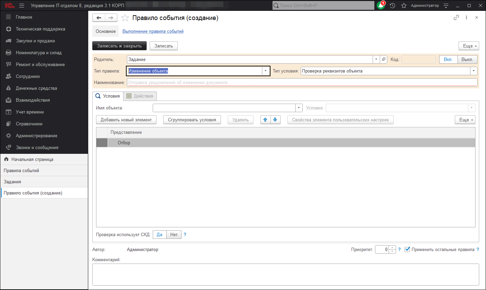
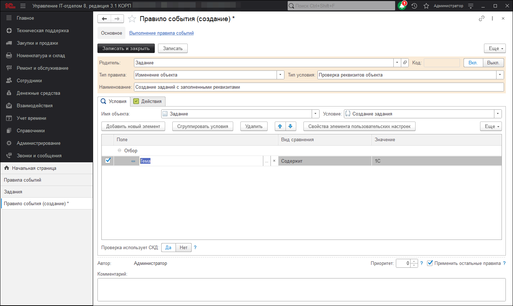
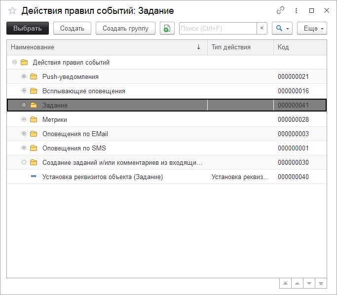
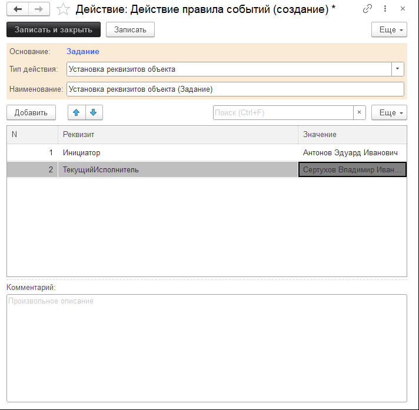
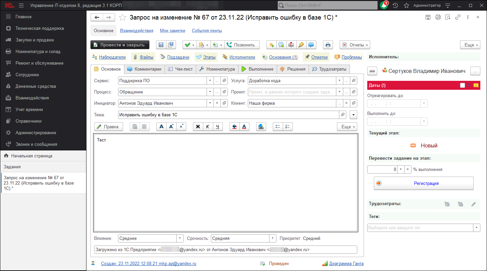

# Заполнение реквизитов на основании темы входящего письма

Подсистема [правил событий](https://softonit.ru/FAQ/courses/?COURSE_ID=1&CHAPTER_ID=0449) позволяет изменять или заполнять по собственному условию реквизиты документа, создавать документы по произвольным условиям. В этом уроке давайте разберем на примере возможность создания нового документа из сообщения отправленного по e-mail. Если в теме письма будет произвольное слово или сочетание слов, тогда документ "Задание" должен будет заполнен инициатором и исполнителем, которых мы укажем в действии правила. Искомой фразой давайте выберем "1С".

Для начала нужно создать своё правило.

**"Тип правила"** оставим без изменений - "Изменение объекта", **"Тип условия"** тоже не будем изменять - "Проверка реквизитов объекта". Заполним **"Наименование"**.  
На вкладке **"Условия"** установим следующие условия:

* **"Имя объекта"** в значение "Задание";   
* **"Условие"** - "Создание задания";  
* **"Отбор"** - "Тема содержит 1С".  

На вкладке **"Действия"** добавим новый элемент и в открывшемся окне создадим новое действие правила *"Установка реквизитов объекта (Задание)"*.

В самом действии "Установка реквизитов объекта (Задание)" установим следующие реквизиты и их значения:

* **"Инициатор"** - "Иванов Иван Иванович";   
* **"ТекущийИсполнитель"** - "Петров".   

После этого сохраним созданное нами правило событий. Далее можно проверить корректность создания задания и заполнения реквизитов. Для этого отправим сообщение с темой, в которой будет "1С" на почтовый ящик, с которого создаются задания.

После этого можно увидеть результат, конфигурация увидела искомое значение "1С" и заполнила инициатора и исполнителя из действия.

Как видите, подсистема довольно простая в понимании с одной стороны, а с другой многофункциональна.
