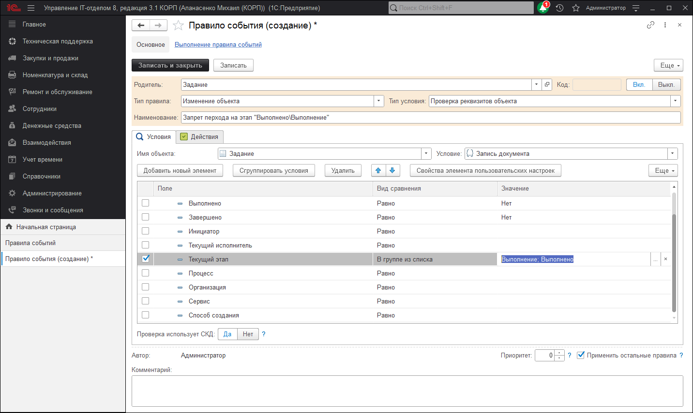
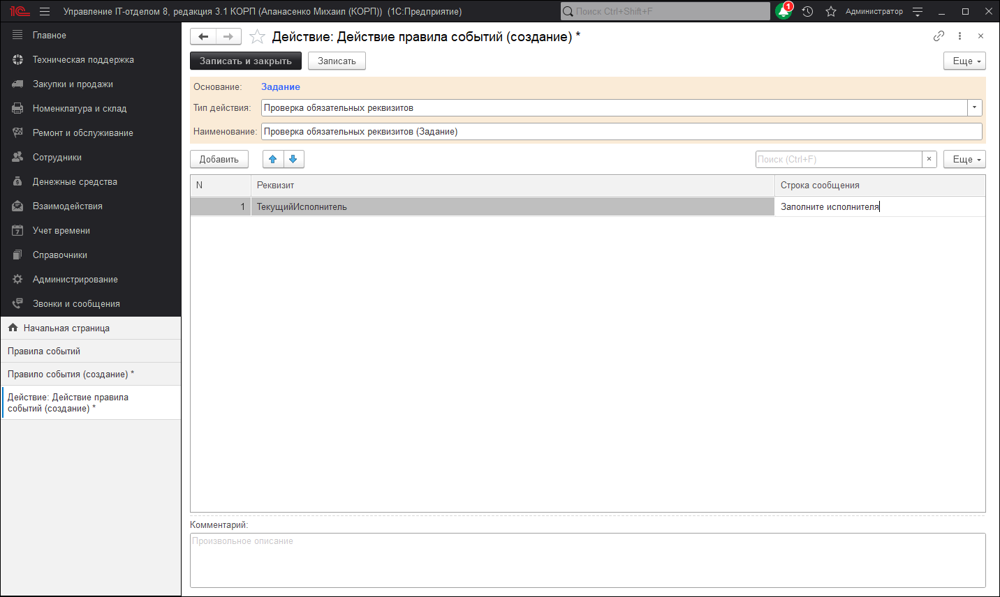
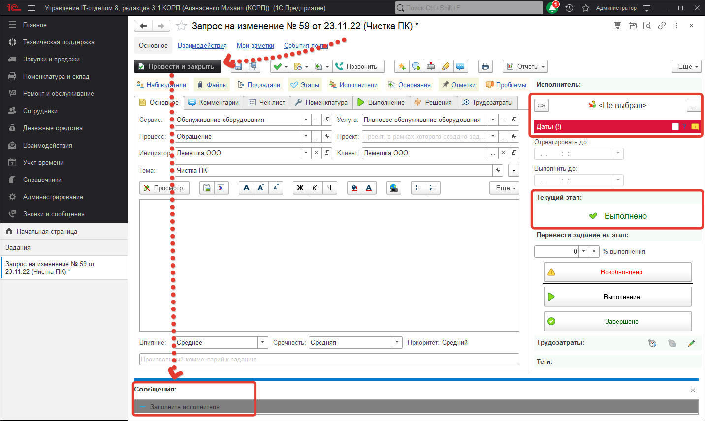

# Запрет перевода задания на этап "Выполнено\Выполнение", если не указан исполнитель

Зачастую встречаются ситуации, которые требуют проверку заполнения определенных реквизитов документа **"Задания"**. Это становиться еще более актуально, когда задание должно быть переведено на этап "Выполнено" или "Выполнение". Согласитесь, что будучи переведенным на выполнение без указанного текущего исполнителя, задание не является корректно заполненным. В свою очередь, это влечет за собой свои проблемы, которые всплывут по ходу работы с заданием. Поэтому сегодня рассмотрим настройку способа запрета перевода задания на этапы "Выполнено" или "Выполнение", если не указан "Текущий исполнитель". Как и прочие тонкие настройки программы, данный способ настраивается с помощью подсистемы "Правила событий".

Переходим в раздел **"Справочники"-"Правила событий"** и нажимаем кнопку **"Создать"**. В настройках создаваемого нового правила событий указываем реквизит "Имя объекта" документ "Задание", а в условие "Запись документа". Данные реквизиты дают понять, что проверяться будет документ "Задание", при попытке записи документа. Тип правила укажем "Изменение объекта", тип условия "Проверка реквизитов объекта". Далее в табличной части отборов нужно установить отбор по текущему этапу. В виде сравнения указать проверку "В группе из списка", что позволит добавить несколько этапов, а в значении укажем необходимые этапы: ***Выполнение, Выполнено***. По указанному отбору, правило событий будет отрабатывать в тех случаях, когда задание будет переведено на один из соответствующих этапов. В результате правило событий будет выглядеть так: 

Далее перейдем к созданию и настройки действия данного правила событий. Открываем закладку **"Действия"** и переходим к созданию нового действия. В реквизите "Тип действия" установим значение "Проверка обязательных реквизитов" и с помощью кнопки "Добавить" добавим проверяемый реквизит "Текущий исполнитель". В строку сообщения можно указать любой произвольный комментарий, который будет выводится в виде подсказки.

Результатом будет проверка заполнения реквизита "Текущий исполнитель", при записи документа "Задания", которое находится на этапе ***"Выполнение\Выполнено"***.

