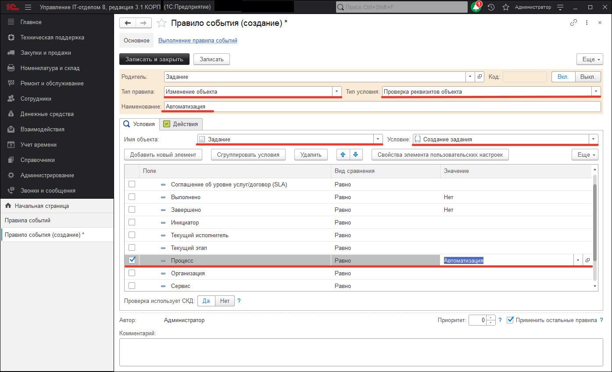
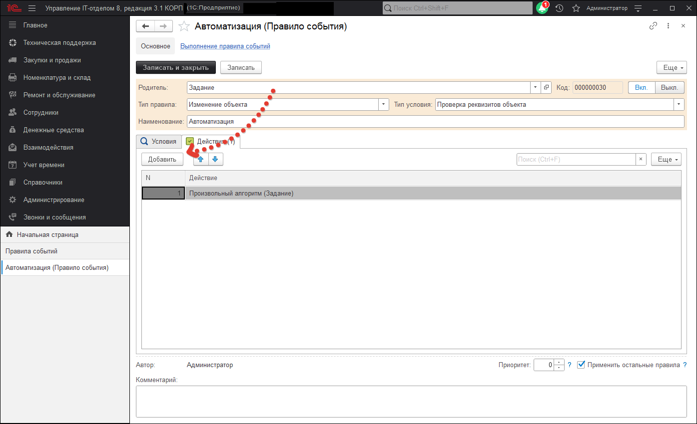
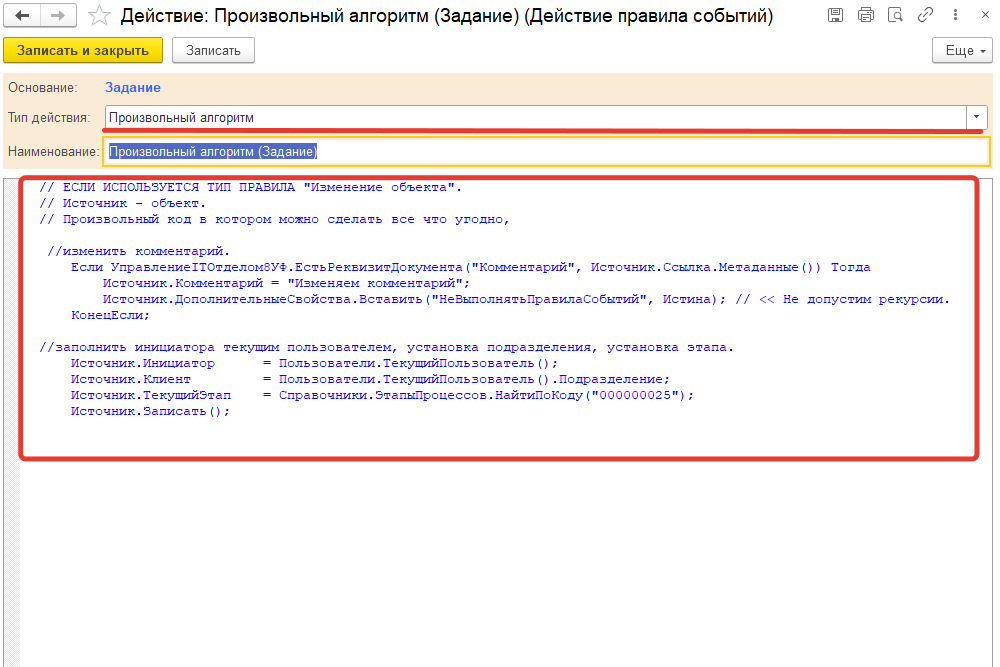
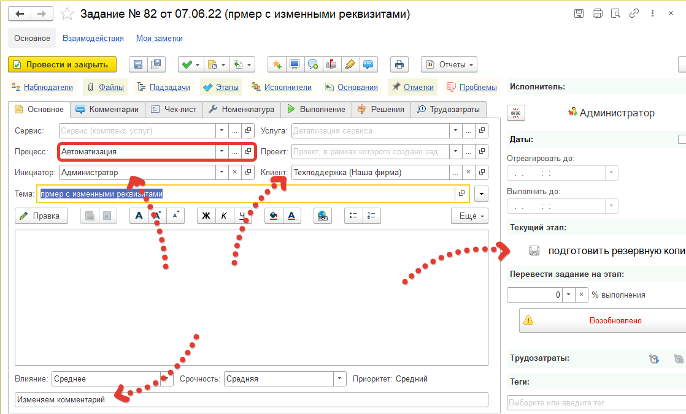

# Использование произвольного алгоритма

Произвольный алгоритм в «Правилах событий» позволяет значительно расширить функционал и возможности за счет написания кода на языке 1с. Для примера, рассмотрим правило событий, которое при установке процесса «Автоматизация», изменяет некоторые реквизиты в документе «Задание». А именно поля Инициатор, Клиент, Комментарий, Текущий этап. Для этого создадим новое «Правило событий», зададим Наименование, установим Тип правила: «Изменение объекта», Тип Условия «Проверка реквизитов объекта», Имя объекта «Задание», Условие «Создание задания» и выставим в отборах Процесс «Автоматизация». Данные настройки нам нужны для того, чтобы при создании документа задания и установки Процесса «Автоматизация», отрабатывал наш произвольный алгоритм.

После настройки отборов, можно перейти на вкладку «Действия» и нажать на кнопку добавить, которая добавит строку. В данной строке мы можем выбрать существующее действие, либо создать новое. Мы создадим новое Действие для правил событий.

В появившемся окне выберем Тип действия Произвольный алгоритм. Для нас откроется поле для ввода кода на языке 1с. Введем код. В данном коде Источник это объект Задание в котором мы изменяем данные.

Теперь если создать документ Задание и указать в нем процесс "Автоматизация" , то после записи, поля изменятся соответственно нашему коду.

