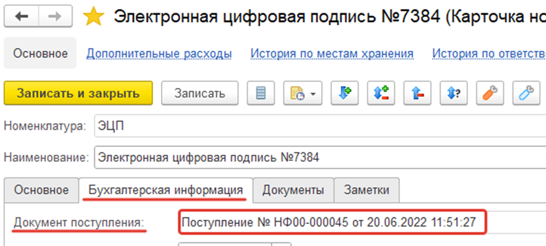
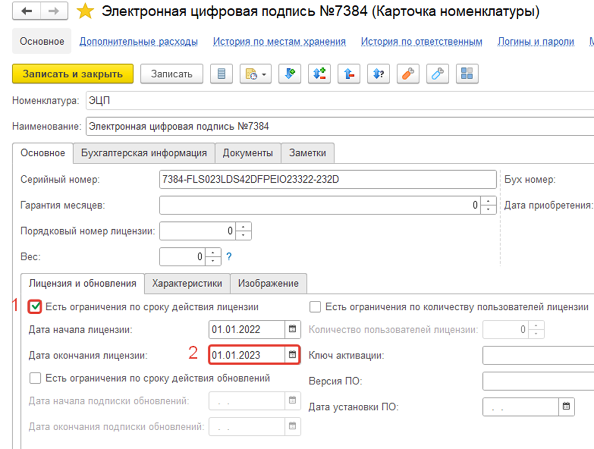
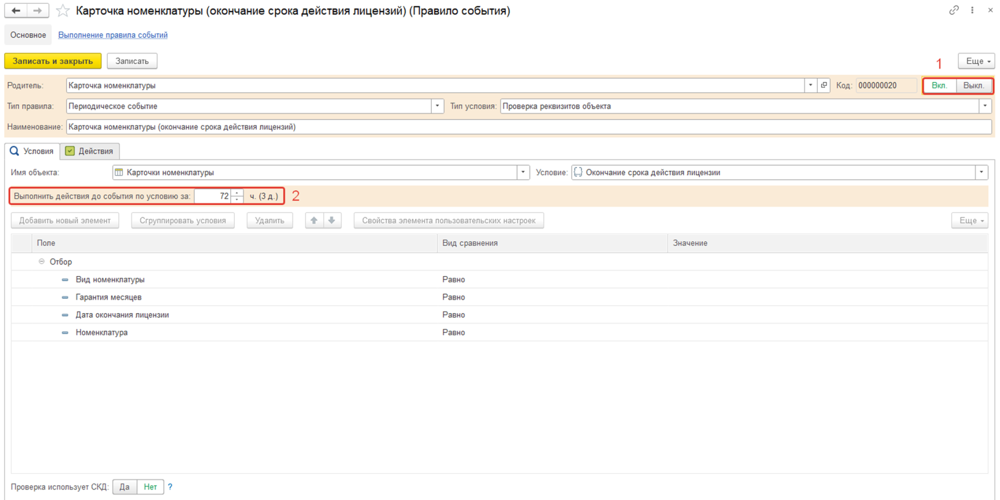
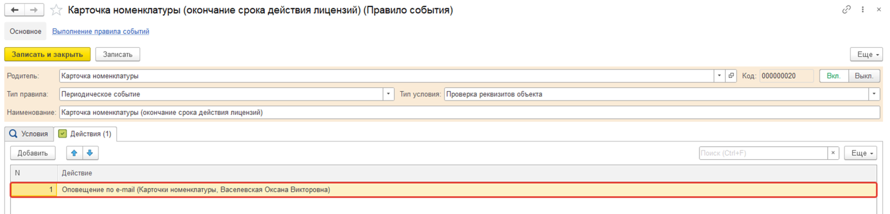
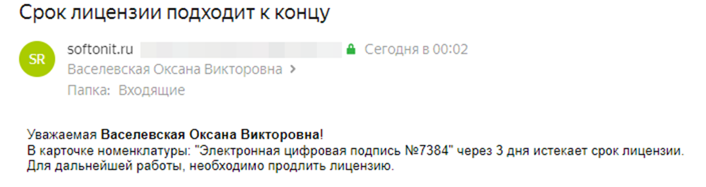

# Оповещение при окончании срока лицензии

Иногда случаются такие ситуации, когда необходимо оповещать сотрудника при окончании срока лицензии заранее. К счастью, в нашем решении данный функционал присутствует при помощи правил событий. Разберемся как это работает в этой статье.

## Оприходование «номенклатуры» и «карточки номенклатуры»

В начале, оприходуйте номенклатуру с видом «Программное обеспечение» с созданной карточкой номенклатуры, чтобы в итоге, в карточке номенклатуры заполнился документ поступления:

Также в карточке включите ограничение по сроку действия лицензии и укажите дату окончания лицензии:

## Правило события

Далее включите правило события, которое будет отрабатывать при окончании срока лицензии. Раздел: **«Справочники» -> «Правила событий» -> «Карточка номенклатуры» -> «Карточка номенклатуры (окончание срока действия лицензий)»**. Если нужно, чтобы событие срабатывало заранее, добавьте время выполнения действия до события (Например, за три дня до окончания лицензии):

После этого устанавливаем действие, которое будет выполняться при событии (Например, оповещение по e-mail):

Cообщение было отправлено за три дня до окончания лицензии:

Как мы видим, в настройке такого механизма нет ничего сложно, и его можно настроить для каждой карточки номенклатуры отдельно.
