# Настройка подсистемы правил событий

Чтобы начать пользоваться подсистемой, необходимо предварительно её настроить. Для этого нужно перейти на вкладку **"Справочники"** в раздел **"Правила событий"**.

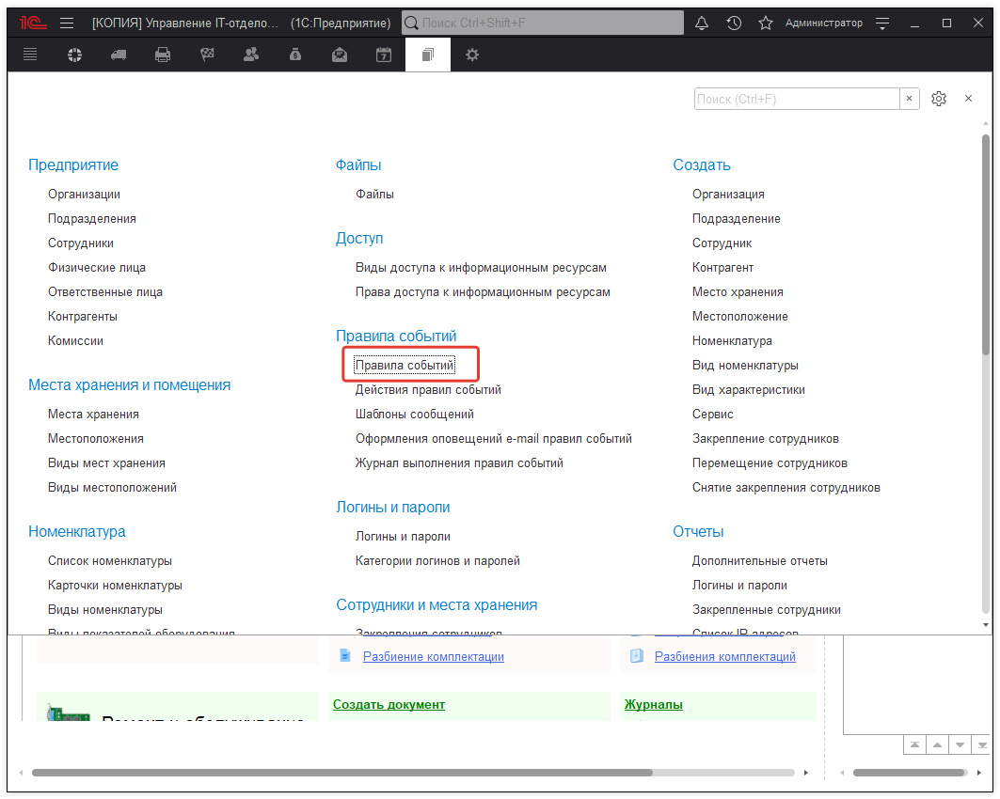

Далее открыть справочник **"Правила событий"**. Программа уже содержит определенный набор правил по умолчанию.

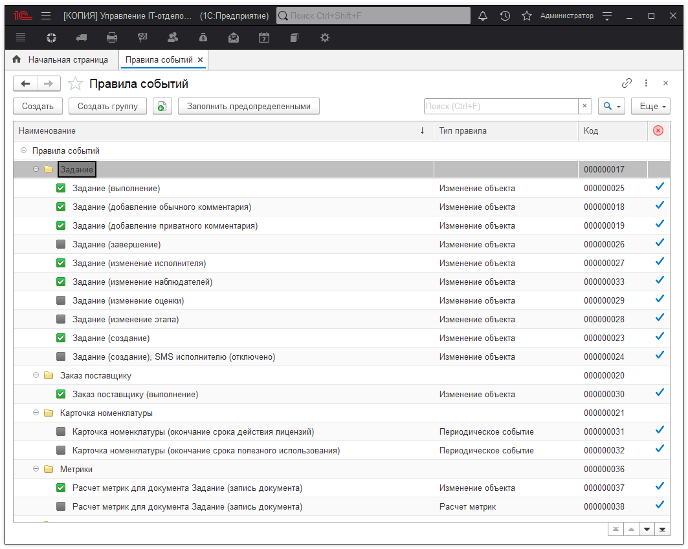

Откроем правило для редактирования.

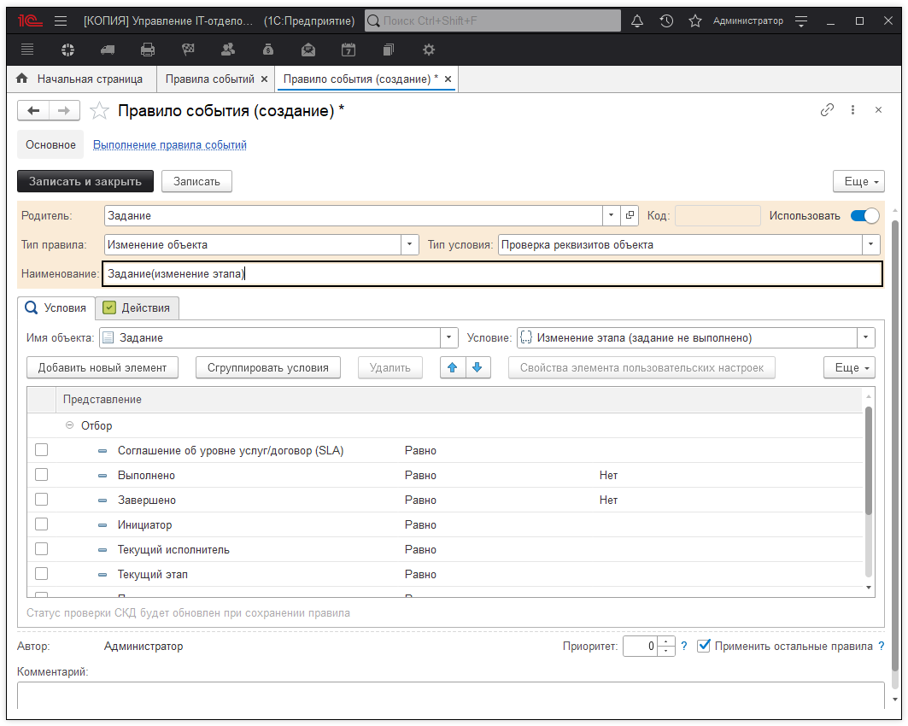

**Здесь можно установить следующие значения:**

* **"Тип правила"** - тип срабатывания правила. Может выполняться один раз - "Изменение объекта" или неоднократно - "Периодическое изменение";   
* **"Тип условия"** - условие, при котором сработает правило. "Проверка реквизитов объекта" - срабатывает при изменении реквизита. "Произвольный алгоритм" - своё условие на встроенном языке 1С;   
* **"Наименование"** - наименование правила события.   

**На вкладке "Условия" можно установить:**

* **"Имя объекта**" - объект, к которому будут применены условия;   
* **"Условие"** - при каких условиях будет срабатывать правило событий;   
* **"Отбор"** - отбор значений, при которых сработает правило событий;   
* **"Проверка использует СКД: Да\Нет"** - Если в таблице СКД (табличная часть отборов) не используются отборы, рекомендуем установить этот переключатель в значение "Нет". При таком подходе правила событий будут работать быстрее за счет уменьшения числа проверок.  

На вкладке **"Действия"** указываются действия, которые будут выполнены при срабатывании условий правила.

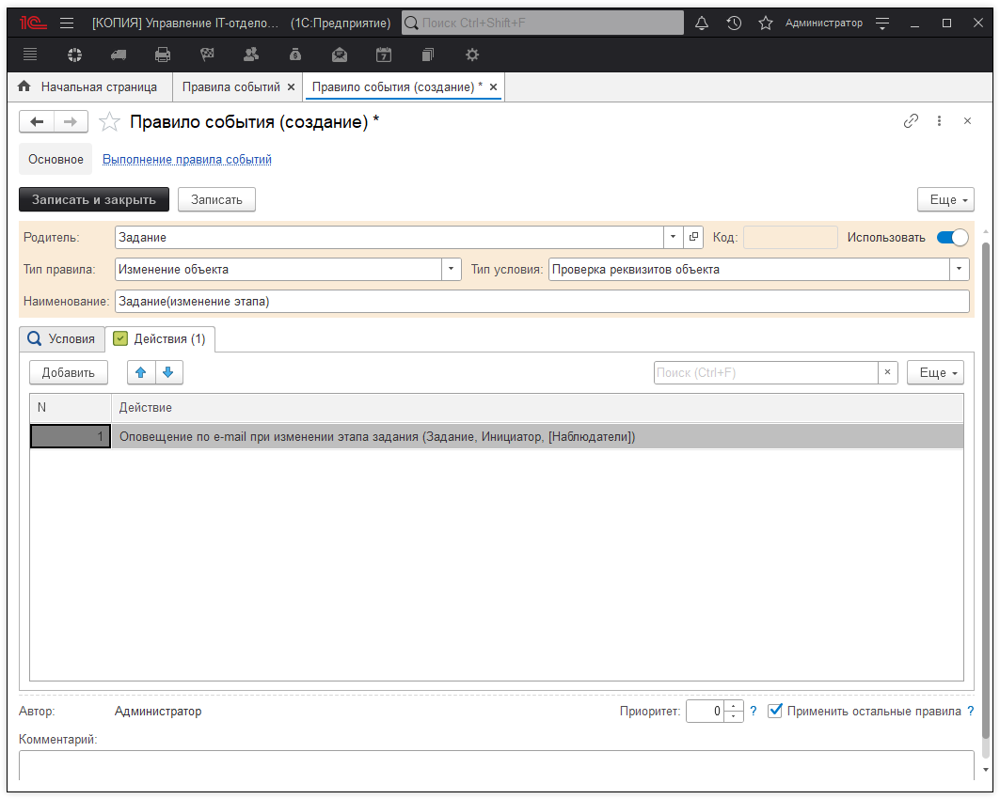

Для того, чтобы добавить действие в правило событий, необходимо нажать на кнопку "Добавить", после чего будет открыт справочник **"Действия правил событий"** (справочник также содержит предопределенный набор действий по умолчанию).

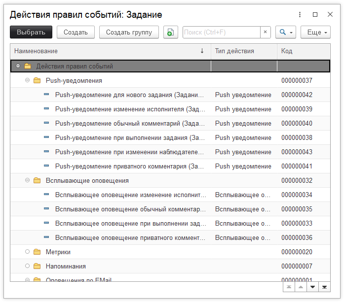

!!!
**Внимание!** Не рекомендуется изменять предопределенные правила событий, так как изменения могут быть затерты в следующем обновлении. Если есть необходимость изменить правило событий, то лучше всего создать свое правило и использовать его.
!!!

Далее выбрать нужное действие и открыть его для редактирования.

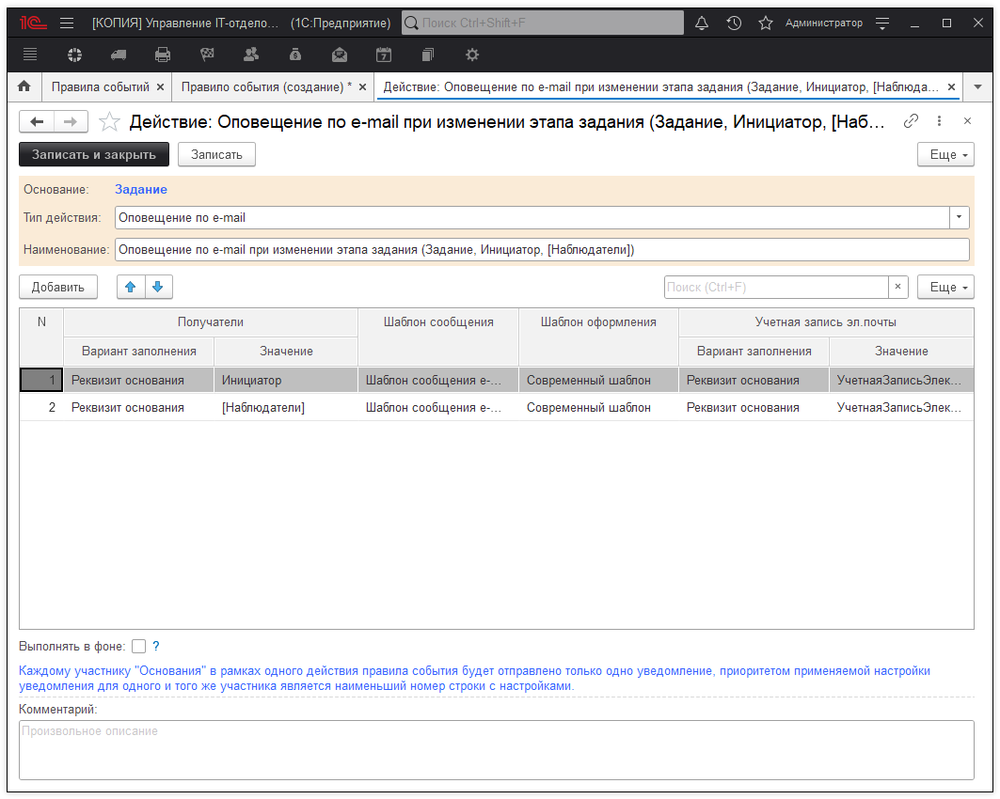

Здесь можно заполнить следующие параметры:

* [x] **"Тип действия"** - тип действия для правила события. Это может быть ***"Оповещение по е-mail", "Оповещение по SMS", "Проверка обязательных реквизитов" , "Произвольный алгоритм", "Создание напоминания", "Установка реквизитов объекта"***, и в случае, если основанием является документ ***"Задание" - "Пересчет SLA"***;
* [x] **"Наименование"** - наименование действия.

Действие с типом **"Оповещение по email"** отвечает за отправку уведомлений по e-mail. 

Строка настройки действия может быть заполнена следующими значениями:

* [x] **"Вариант заполнения" получателя** - может принимать значения "Реквизит основания" (будет использоваться значение реквизита или значение параметра из основания) или "Указанный" (тогда в поле "Значение" можно указать произвольного получателя);
* [x] **"Значение" получателя** - имя реквизита (параметра) из основания, либо указанный пользователем получатель;
* [x] **"Шаблон сообщения"** - шаблон сообщения e-mail для создания уведомления;
* [x] **"Шаблон оформления"** - шаблон оформления создаваемого уведомления;
* [x] **"Вариант заполнения" учетной записи эл. почты** - может принимать значения "Реквизит основания" (будет использоваться соответствующее значение реквизита из основания) или "Указанный" (тогда в поле "Значение" можно указать произвольную учетную запись электронной почты для отправки уведомления);
* [x] **"Значение" учетной записи эл. почты** - имя реквизита из основания, либо указанная пользователем учетная запись электронной почты для отправки уведомления.
В подсистеме можно изменять "под себя" шаблоны сообщений. Для этого нужно открыть справочник "Шаблоны сообщений", выбрать нужный и открыть его для редактирования.

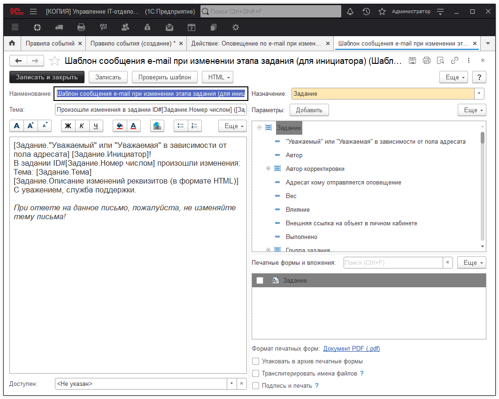

В шаблон сообщения можно прикладывать печатные формы и вложения.

После того, как всё настроено можно посмотреть, что получилось. В документе "Задание" изменим этап и сохраним документ.

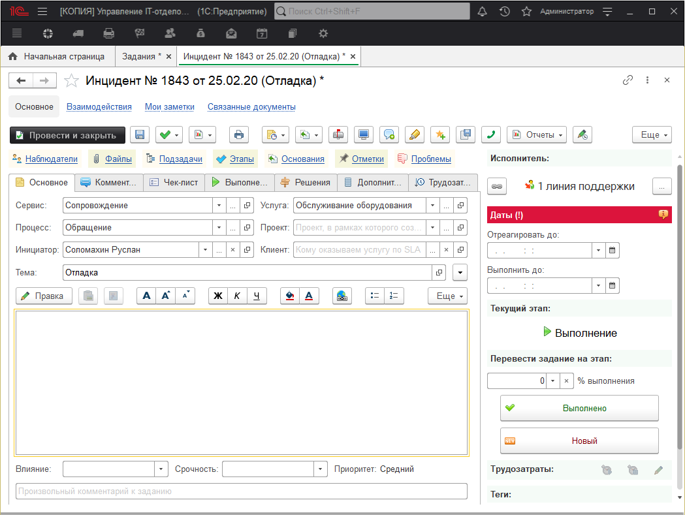

Получится такой результат: создано уведомление в виде **документа "Электронное письмо исходящее"** (раздел "Взаимодействия" - "Исходящие электронные письма").

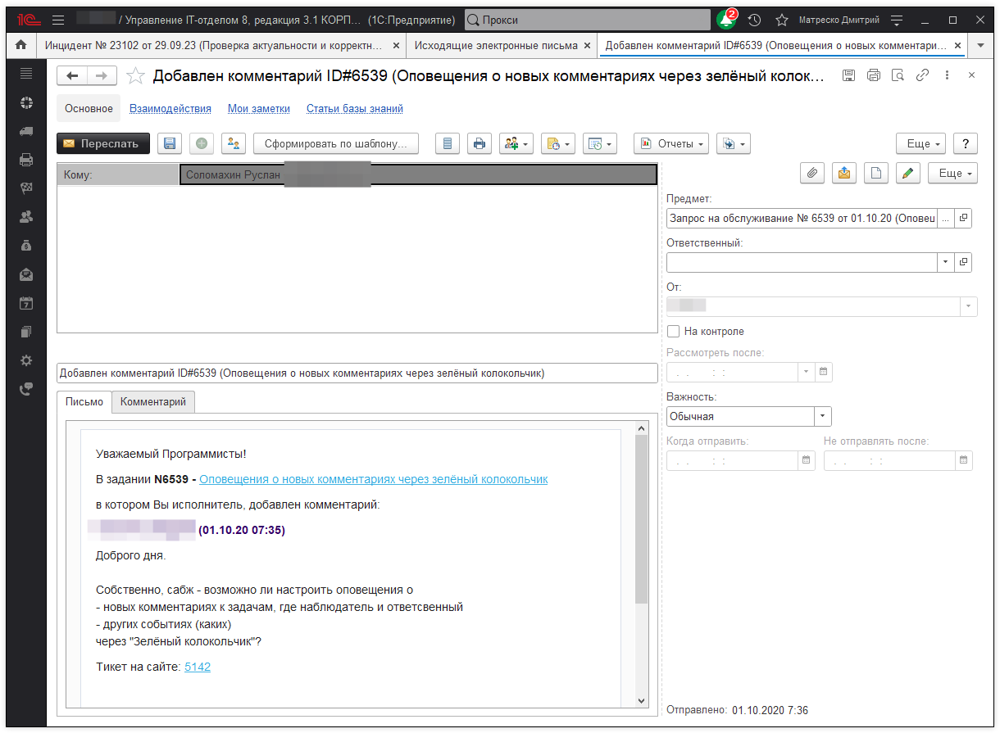

Подсистема событий позволяет гибко настроить, а так же охватить все возможные варианты работы.

Для правила события с типом **"Периодическое событие"** доступен еще один реквизит: **"Выполнить действия до события по условию за"** *"Количество часов"*, который отвечает за какое время до наступления события, указанного в условии правила, выполнить действия правила (например, отправить уведомления по e-mail).

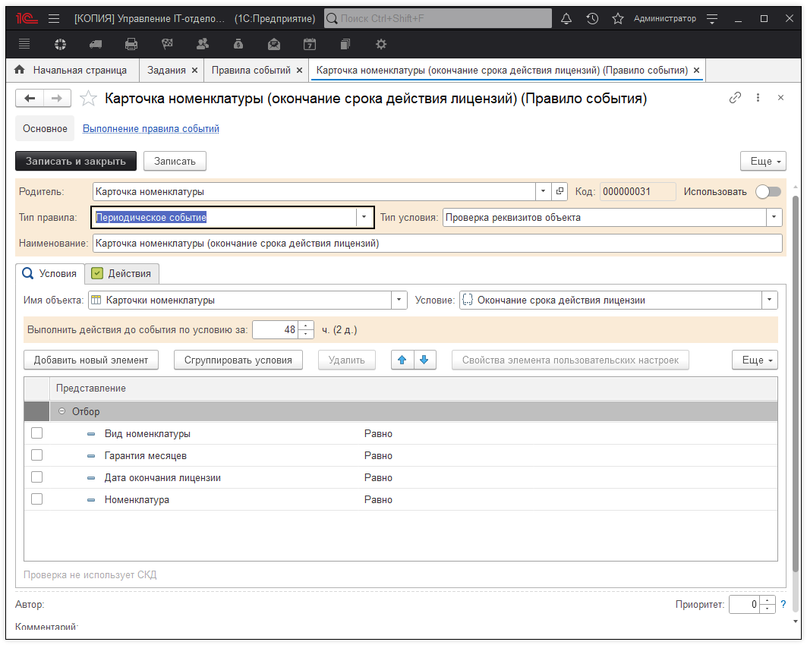

Для проверки правил с типом "Периодическое событие" необходимо, чтобы было включено и настроено **регламентное задание "Проверка и выполнение правил событий"** (раздел *"Администрирование" - "Регламентные и фоновые задания"*).

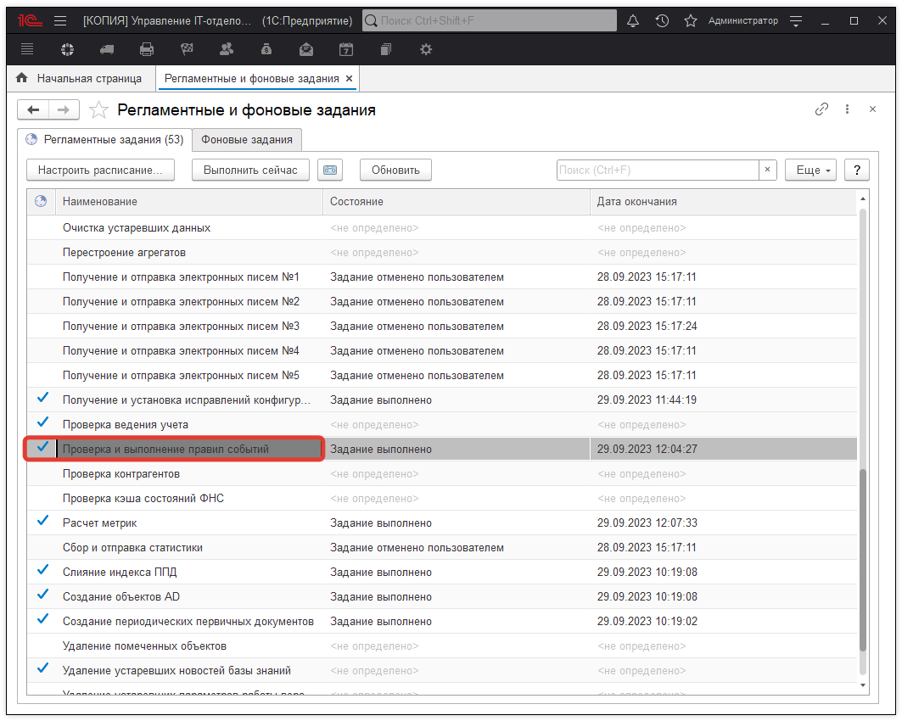

Рассмотрим остальные типы действий правил событий.

Действие с типом **"Оповещение по SMS"** отвечает за отправку уведомлений по SMS.

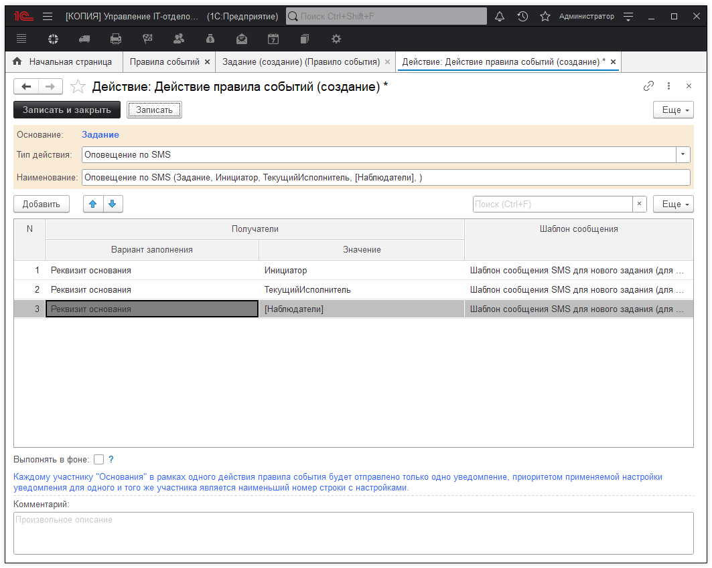

Строка настройки действия может быть заполнена следующими значениями:  

* [x] **"Вариант заполнения"** получателя - может принимать значения "Реквизит основания" (будет использоваться значение реквизита или значение параметра из основания) или "Указанный" (тогда в поле "Значение" можно указать произвольного получателя);  
* [x] **"Значение" получателя** - имя реквизита (параметра) из основания, либо указанный пользователем получатель;  
* [x] **"Шаблон сообщения"** - шаблон сообщения SMS для создания уведомления.  

Действие с типом **"Проверка обязательных реквизитов"** при записи (проведении) объекта правила проверяет заполнение указанных пользователем реквизитов (в дополнение к обязательным реквизитам, которые проверяются программой автоматически).

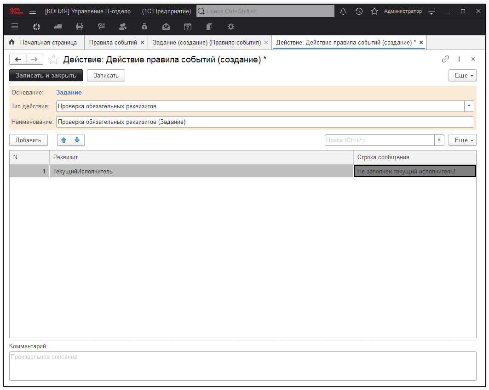

Строка настройки действия может быть заполнена следующими значениями:

* [x] **"Реквизит"** - имя реквизита объекта правила, которое должно быть проверено;   
* [x] **"Строка сообщения"** - сообщение, которое будет отображено пользователю, если указанные реквизит не будет заполнен пользователем.  

Действие с типом "Произвольный алгоритм" описывает инструкции на встроенном языке 1С, которые должны будут выполнены при выполнении условий правила.

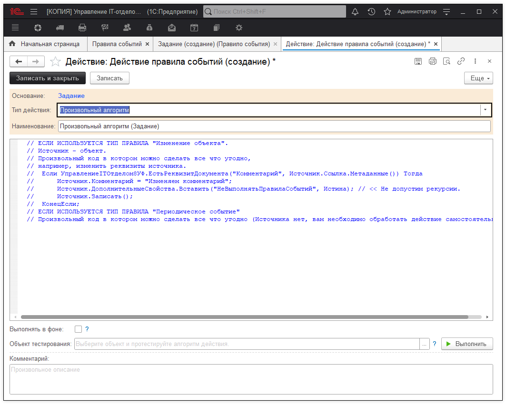

Действие с типом **"Создать напоминание"** создает напоминания в программе указанным в действии пользователям.

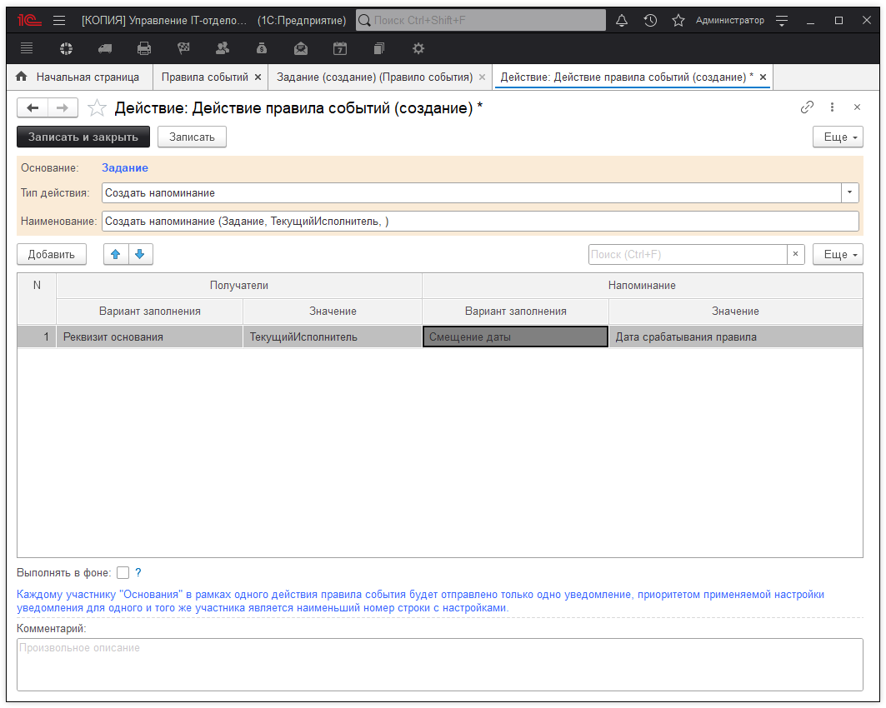

Строка настройки действия может быть заполнена следующими значениями:

* [x] **"Вариант заполнения" получателя** - может принимать значения "Реквизит основания" (будет использоваться значение реквизита или значение параметра из основания) или "Указанный" (тогда в поле "Значение" можно указать произвольного получателя - пользователя программы);   
* [x] **"Значение" получателя** - имя реквизита (параметра) из основания, либо указанный пользователем получатель;   
* [x] **"Вариант заполнения" даты начала отображения напоминания** - может принимать значения "Смещение даты" (дата начала отображения созданного напоминания будет смещена относительно указанного в поле "Значение" значения) или "Указанный" (тогда дату начала отображения напоминания пользователь может установить произвольной);   
* [x] **"Значение" даты начала отображения напоминания** - зависит от указанного "Варианта заполнения" даты (для варианта "Смещение даты" значения могут быть "Дата срабатывания правила", "Через час", "Через день", "Через неделю", "Через месяц" от даты срабатывания правила, либо точная дата, указанная пользователем - для варианта заполнения "Указанный").   

Действие с типом **"Установка реквизитов объекта"** при записи (проведении) объекта правила заполняет перечисленные реквизиты объекта указанными значениями.

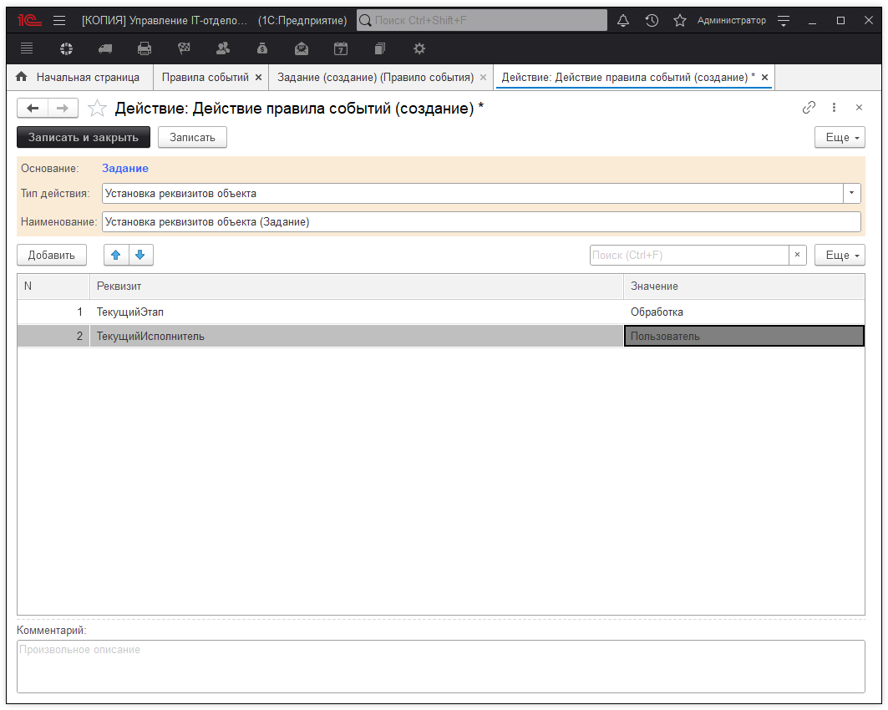

Строка настройки действия может быть заполнена следующими значениями:

* [x] **"Реквизит"** - имя реквизита объекта правила, которое должно быть заполнено;   
* [x] **"Значение"** - значение, которое будет установлено указанному реквизиту.   

Если объектом правила указан **документ "Задание"**, то среди возможных типов действия присутствует действие с типом **"Пересчет Метрик"**, которое используется для формирования данных построения метрик и KPI.

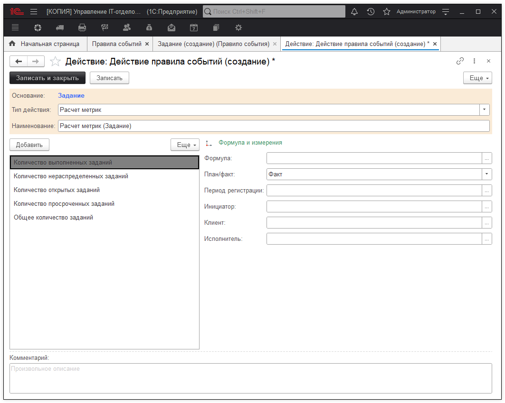
 
Предопределенные реквизиты для ввода формул расчета:  

* **Формула** - формула расчета значений метрики;    
* **План\факт** - признак, где будет учитываться вычисленное значение метрики;     
* **Период регистрации** - формула расчета периода (даты), в котором будет учитываться значение метрики.    

Действие с типом **"Всплывающее оповещение"** отвечает за отправку всплывающих оповещений.  

Табличная часть действия может быть заполнена следующими значениями:

* [x] **"Вариант заполнения" получателя** - может принимать значения "Реквизит основания" (будет использоваться значение реквизита или значение параметра из основания) или "Указанный" (тогда в поле "Значение" можно указать произвольного получателя);   
* [x] **"Значение" получателя** - имя реквизита (параметра) из основания, либо указанный пользователем получатель.   
* [x] **"Шаблон сообщения"** - шаблон сообщения всплывающих оповещений. Для каждого получателя можно создать свой шаблон сообщения с необходимыми параметрами.;   
 
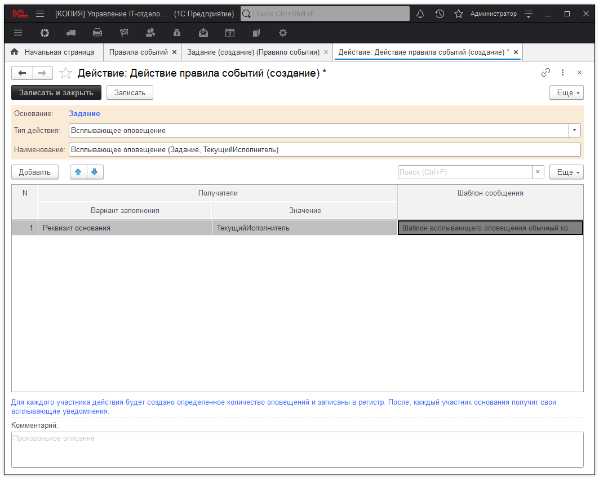

