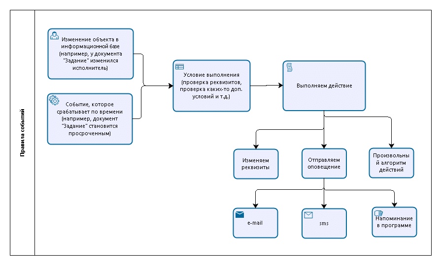

# Общая схема работы правил событий

Определим схему работы подсистемы "Правила событий". Так работает подсистема:

Под изменением объекта в информационной базе следует понимать любое как интерактивное (сделанное пользователем) так и не интерактивное действие с объектами. Это может быть изменение реквизита, создание объекта, добавление строки в табличной части и т.д.   
Событие, которое срабатывает по времени наступает в определенное время для объектов. Например, задание с определенного времени становится просроченным, или карточка номенклатуры с видом номенклатуры "Лицензия", завершается срок действия.   

Одновременно для этих двух типов событий происходят проверка условий, и если условия выполняются делается набор действий: изменяются реквизиты, отправляются оповещения и т.д.
Таким образом с подсистемой, мы можем предусмотреть для объектов и по времени выполнения какие-то действия, которые будут выполняться при определенных обстоятельствах.

Приведем примеры использования.   

* При изменении этапа задания, отправлять оповещение инициатору задания на e-mail о том, что у задания поменялся этап.  
* При добавлении сообщения в задание, отправлять уведомления наблюдателям задания.  
* При создании документа "Заказ поставщику" и установке статуса "В работе" отправлять поставщику письмо с приложенным заказом во вложении.  
* При изменении статуса "Заказа поставщику" на "Выполнено" отправлять уведомление сотруднику организации, который делал заказ первоначально.  
* При окончании ремонта и создании документа "Окончание обслуживания" и изменении состояния, отправлять письмо или sms инициатору.  

Как видите применений у подсистемы масса. Это далеко не полный перечень ее возможностей.

Видеоинструкция [**"Правила событий"**](https://youtu.be/0OenFWsR7og)