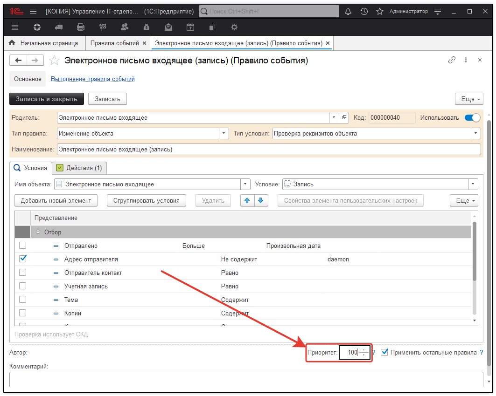
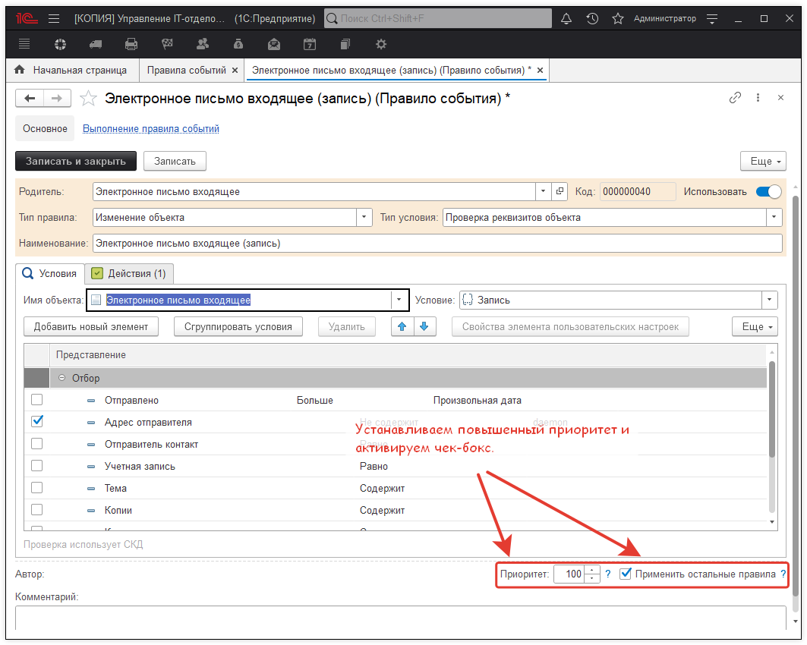
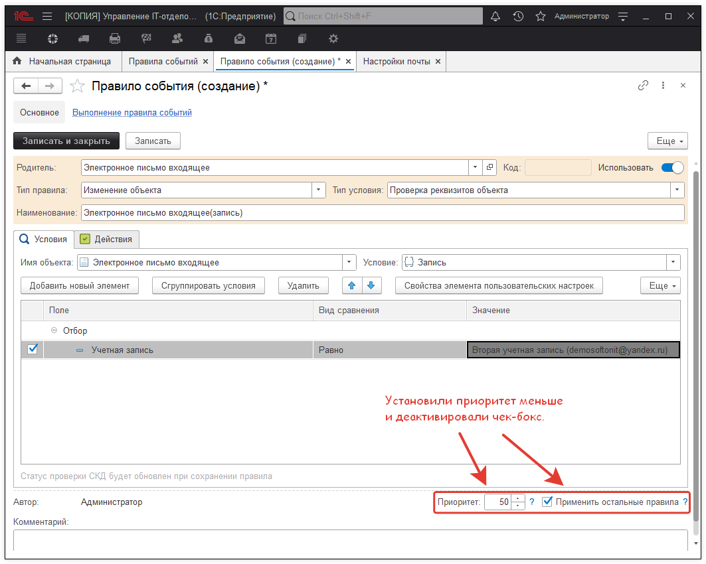

# Приоритет и применение остальных правил

Обычно в полноценно используемой конфигурации задействован ряд различных правил событий, которые отвечают за уведомления, установку реквизитов или выполняют абсолютно другие [произвольные действия](https://softonit.ru/FAQ/courses/?COURSE_ID=1&LESSON_ID=734&LESSON_PATH=1.449.722.734). Нередко бывают случаи, когда имеется несколько правил событий, в которых настроены одинаковые действия, но при этом согласно установленным в них отборам отрабатывать должны по степени важности. Так, например, есть два правила события (типовое и созданное вручную) "Электронное письмо входящее (Запись)", которые принимают входящую почту и на основании этих писем создают заявки с соответствующими реквизитами. К каждому правилу подвязана отдельная учетная запись электронной почты. Автоматическое заполнение реквизитов создаваемых заявок на основании входящих писем на данные учетные записи различаются. Поэтому важно разграничить приоритет выполнения типового и созданного вручную правила. Для этого в настройках правила событий необходимо установить правильно приоритет и при необходимости активировать\деактивировать чек-бокс "Применять остальные правила".  

Перейдем в раздел **"Справочники" - "Правила событий"** и откроем необходимое правило событий. 

В самом низу формы элемента настроек правила событий располагаются необходимые реквизиты "Приоритет" и "Применять остальные правила". Разберем принцип работы и способ применения данных реквизитов.

> **Приоритет и применение остальных правил**
> 
> Реквизит "Приоритет" определяет, в какой последовательности должны быть запущены правила событий, при выполнении регламентной проверки.На практике распределение приоритетов работает следующим образом: есть два правила событий у одного приоритет 100 у другого 50, первым выполнится правило событий, которое имеет приоритет 100. Стоит отменить, если флаг "Применить остальные правила" отключен, то на этом проверка заканчивается и остальные правила с приоритетом ниже не будут выполнены. Для того, чтобы менее приоритетные правила тоже отрабатывали нужно обязательно включить данный флажок. Другими словами, сначала система проверяет среди активных правил событий, те правила, у которых приоритет больше, далее смотрит включен флаг "Применить следующие правила"? Да, включен, значит система переходит к проверке других правил, если флаг был отключен, значит проверка заканчивается. Если система находит несколько правил событий с одинаковым приоритетом, тогда они будут отработаны в том порядке, в каком их определит система. При этом порядок может меняться по-разному в момент выполнения следующей проверки.

Возвращаясь к первоначальному примеру с двумя правилами событий "Электронное письмо входящее(запись)", перейдем к настройкам приоритетного выполнения. Предположим, нам важно, чтобы типовое правило отрабатывало первое, но при этом также нужно выполнить новосозданное если есть соответствия условиям и отборам. 

Для этого установим следующие настройки приоритетности:  

Настройки правила события, созданного вручную.

Прошу заметить, что во втором правиле событий была убрана галочка "Применить остальные правила", это связано с тем, что в данной ситуации нам не нужно выполнять остальные правила ("Электронное письмо входящее(запись)"), так как в наличие только два правила с расставленными приоритетами. В результате, в программу поступает входящее письмо. Запускается регламентная проверка, в первую очередь будет проверяться на соответствие условий предопределенное правило (типовое) событий, если данное письмо подходит под условия, тогда создастся новое задание на основании этого электронного письма. Однако проверка не закончится и система проверит второе правило с приоритетом ниже. И только после это регламентная проверка будет закончена. Если входящее письмо будет соответствовать условиям второго правила, то система проведет аналогичную проверку и создаст задание уже вторым правилом событий. Вот таким нехитрым образом работает механизм приоритетов правил событий.
