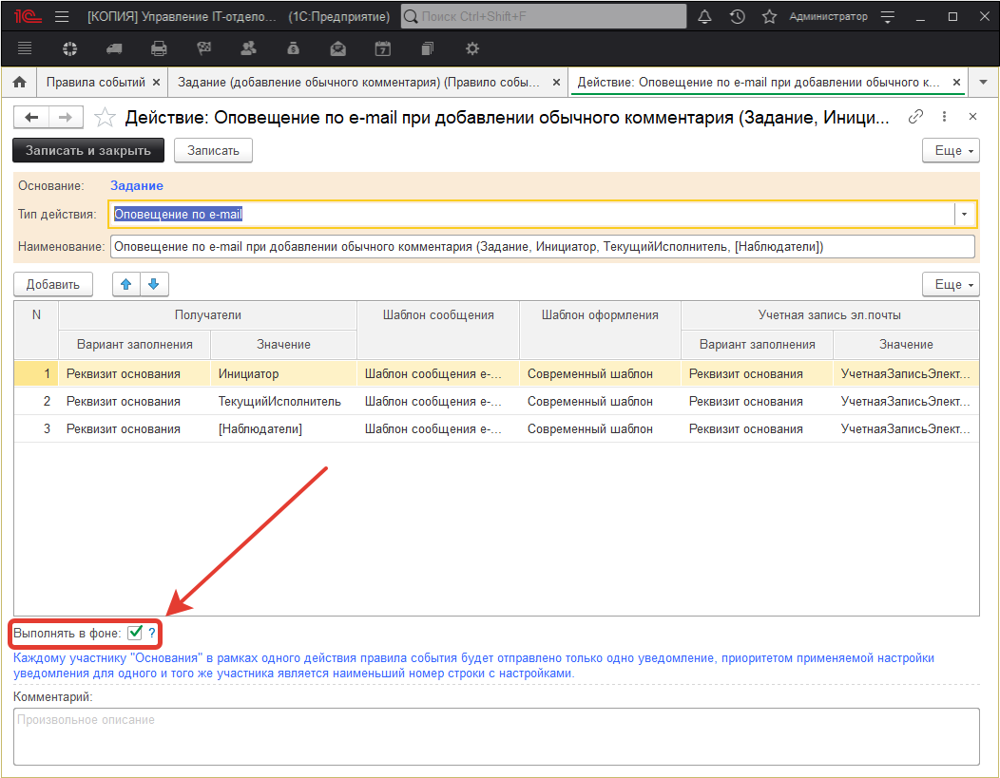
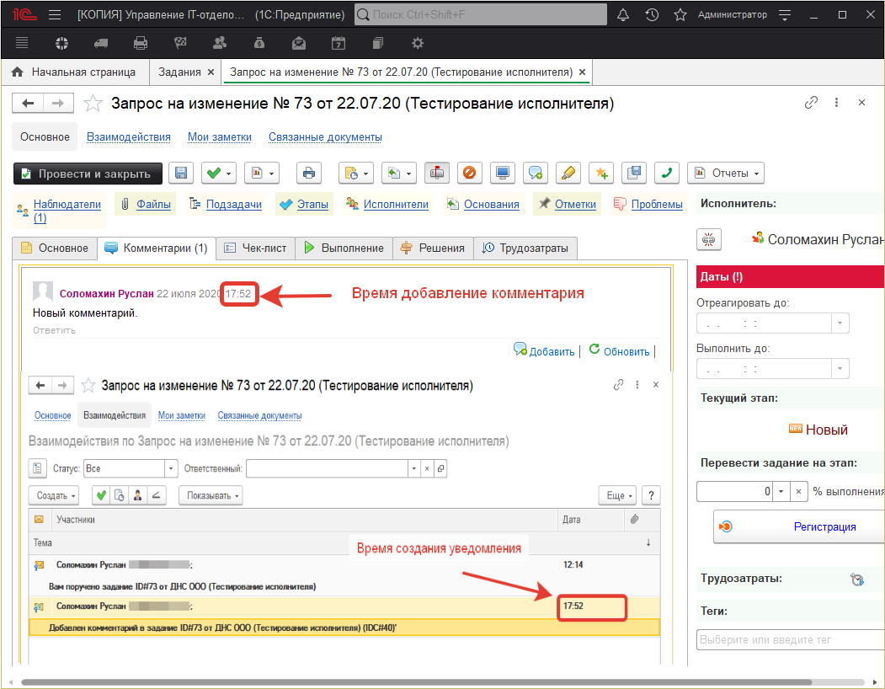
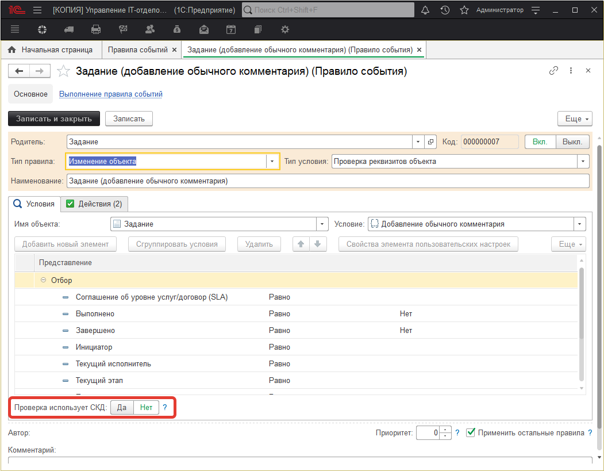

# Работа правил событий в фоновом режиме

## Подсистема "Правила событий"

**Подсистема "Правила событий"** - это удобный и гибкий механизм, позволяющий изменять и настраивать логику работы практически всего функционала  конфигурации. Однако при всей своей полезности, данная подсистема достаточно требовательна к ресурсам системы и при большом количестве одновременно используемых правил может наблюдаться ухудшение производительности в части работы с документом "Задание". Для большего понимания, давайте представим рабочую базу, в которой используются правила событий, отвечающие за отправку оповещений по e-mail,sms,telegram при создании нового задания. При всем при этом, оповещения должны отправляться инициатору, исполнителю (или группе исполнителей), наблюдателям, а также отправка может осуществляться согласно каким-либо отборам. Это действительно может серьезно помешать рабочему процессу, поэтому нами было принято решение полностью пересмотреть и оптимизировать механизм правил событий. Новый подход заключается в работе правил событий, используя фоновый режим, а также добавление возможности отключения неиспользуемых отборов (таблиц СКД). При этом сохранена возможность работы правил событий в прежнем режиме. Можете использовать старый подход или перейти на новый по своему желанию.

### Работа правил событий в фоновом режиме.

Раньше правила событий отвечающие за уведомления работали совместно с запуском регламентного задания "Получение и отправка электронных писем". Что это значит?  
В момент срабатывания регламентного задания запускается регламентная проверка, которая проверяет соответствующие объекты информационной базы на выполнение условия заложенного в правиле событий. После того, как соответствующий объект или объекты были найдены создается необходимое оповещение и только после этого осуществляется отправка уведомления.   Например, есть предопределенное правило событий "Задание(создание)", которое осуществляет отправку уведомления о создании нового задания инициатору, исполнителю и наблюдателям. В программе создается новое задание, далее мы ждем, когда по настроенному расписанию выполнится регламентное задание "Получение и отправка электронных писем". Как только регламентное задание выполняется, осуществляется регламентная проверка, находится соответствующее новое задание, создается уведомление и отправляется получателям на почту.   

По такому принципу ранее работала система оповещения с помощью правил событий. Теперь же все работает иначе и быстрее. Правило событий не ждет момент выполнения регламентного задания, а в фоновом режиме при записи документа создает уведомление и помещает в очередь выполнения фонового задания. То есть, оповещение создается мгновенно, а отправка осуществляется в соответствии с расписанием регламентного задания "Получение и отправка электронных писем".  

**Рассмотрим подробнее.**   

Для того, чтобы включить работу правила события в фоновом режиме, нужно в действии правила события активировать чек-бокс "Выполнять в фоне".

!!!
**ВНИМАНИЕ!!!**Если используется действие типа "Произвольный алгоритм" или "Выполнение обработки", переменная "Отказ" не будет применена при работе в фоновом режиме. Также с осторожностью стоит использовать данный механизм в файловых базах. 
!!!

В результате включения данного механизма, при добавлении комментария в задании, уведомление создается мгновенно и автоматически помещается на очередь выполнения фоновым заданием. И созданное оповещение будет отправлено регламентным задание "Получение и отправка электронных писем".

Данный механизм применим для оповещений (e-mail, telegram, sms), произвольного алгоритма и выполнения обработки. 

### Отключение отборов (таблиц СКД).

Если в правилах событий не используются никакие отборы, по которым должна осуществляться выборка объектов на соответствия условию, то в подобных правилах событий можно и нужно отключать таблицу отборов (СКД). Это позволит увеличить скорость, за счет сокращения числа проверок.

!!!
**ВАЖНО!!!** Функционал фонового выполнения правил событий доступен с релиза **3.1.7.4.** Возможность отключения проверки таблиц СКД доступна с релиза **3.1.7.1.**
!!!