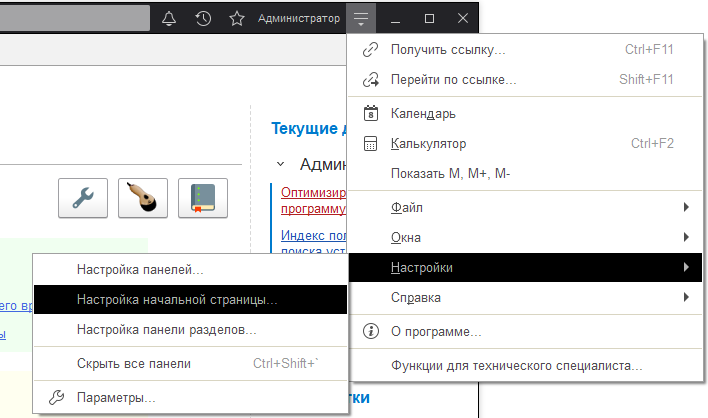
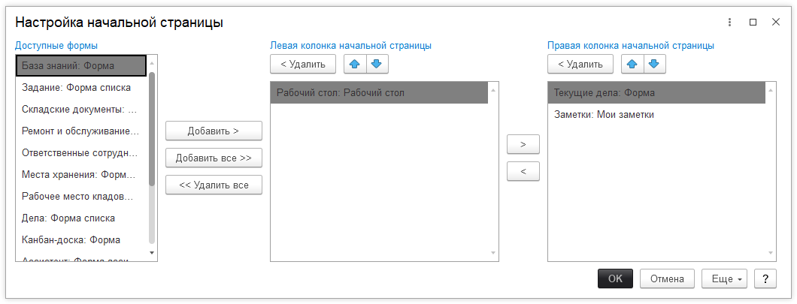

# Изменяем рабочий стол

В конфигурации есть возможность изменить рабочий стол, который отображается по умолчанию, например, на список заданий. Для этого необходимо открыть форму настройки:

В открывшейся форме можем изменить рабочий стол формами в конфигурации по своему усмотрению из доступных форм.

