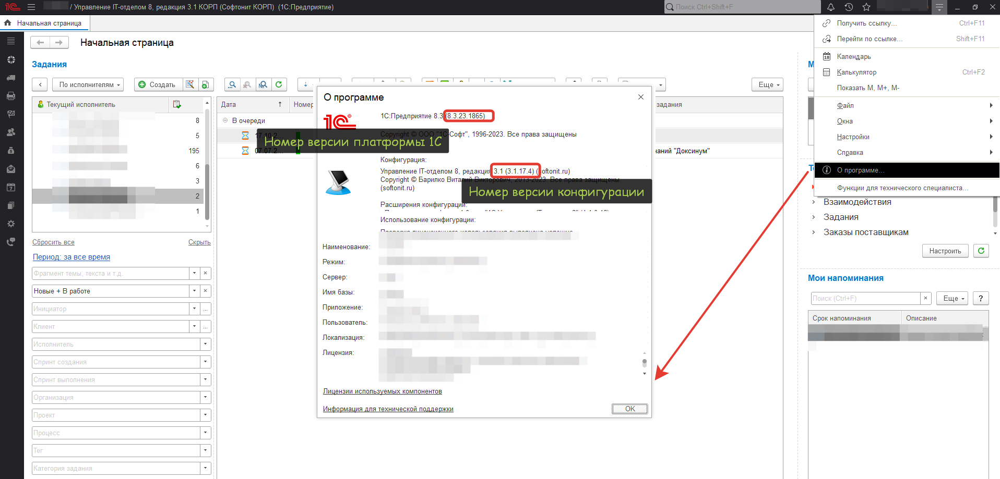

# Как узнать номер текущей версии конфигурации

Номера версий можно узнать в информации "О программе" нажав на кнопку "i" (information, информация)

Как видите здесь указан номер версии платформы 1С:Предприятия и номер версии используемой конфигурации.