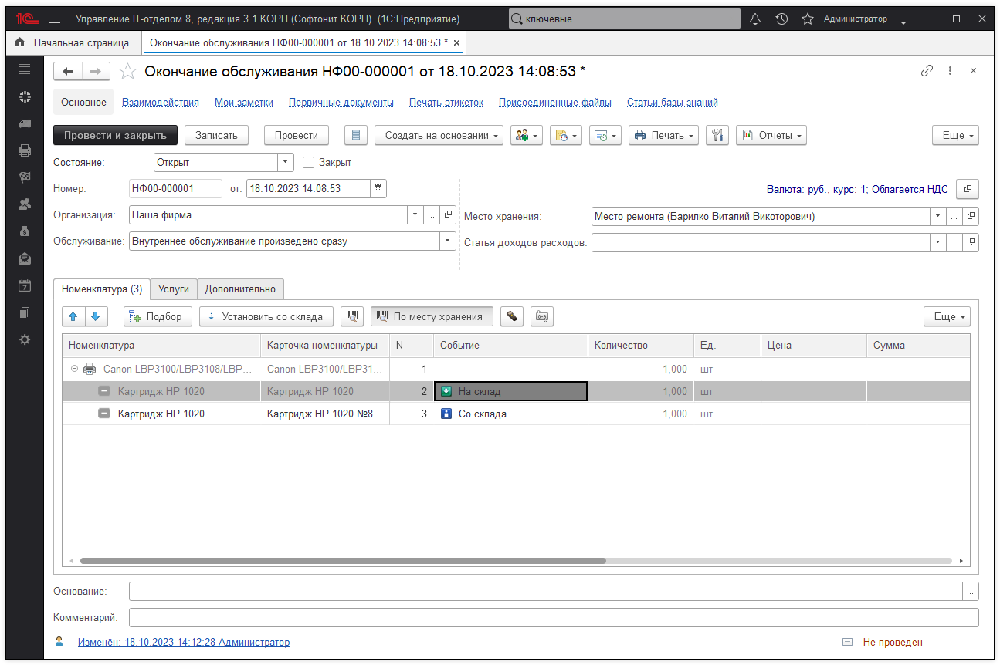
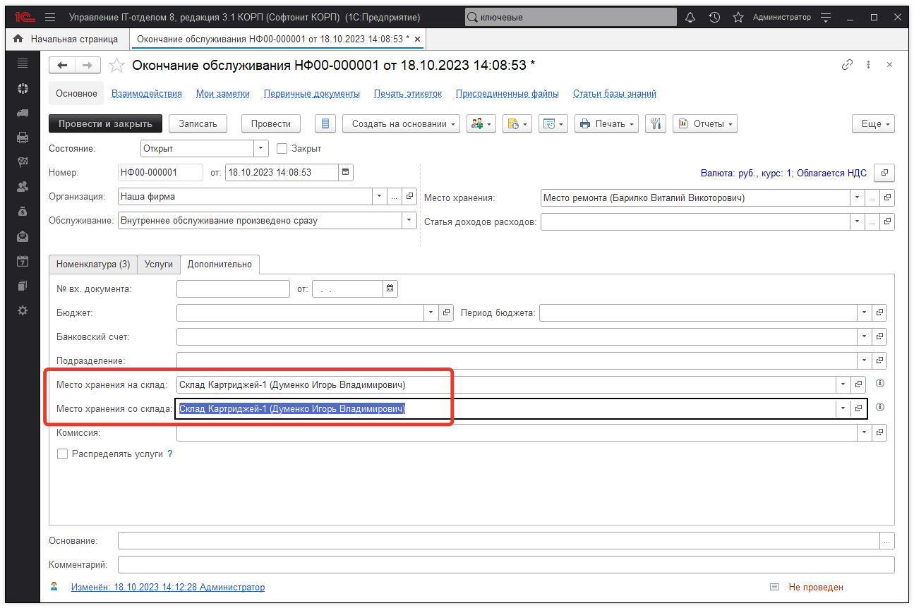
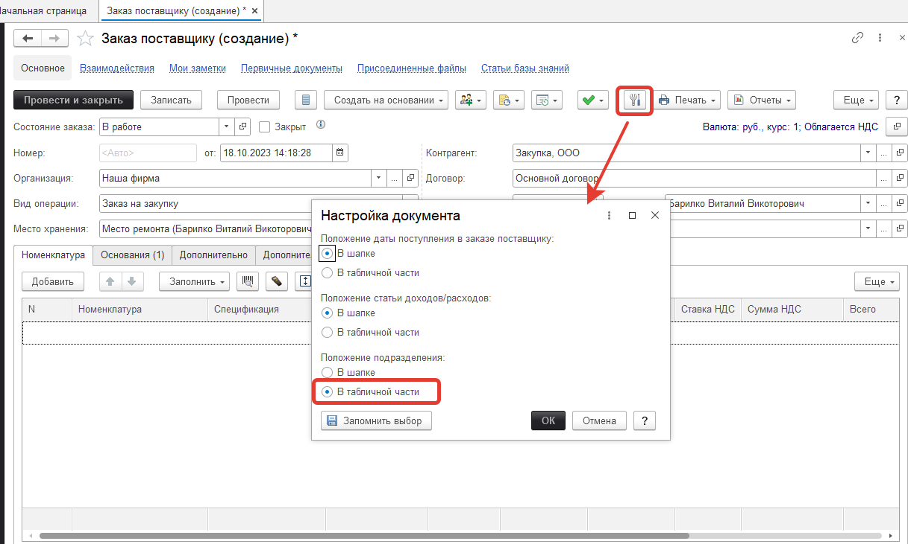
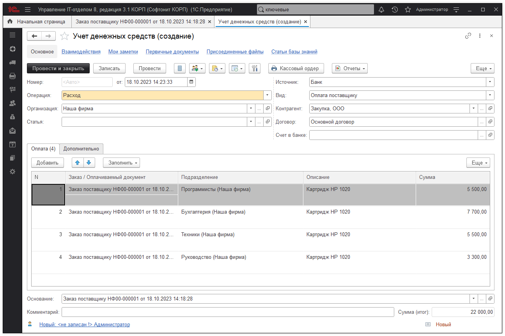
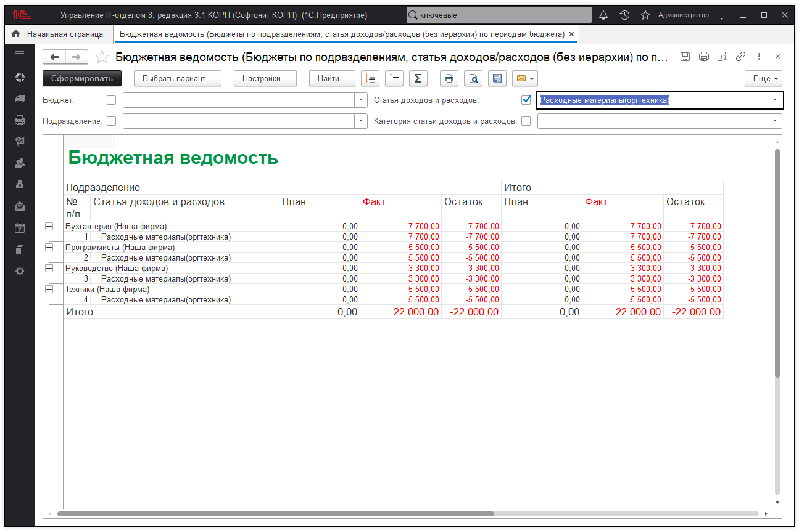

# Пример по закупке картриджей

## Рассмотрим следующую задачу:

1. В течении месяца от разных подразделений собираются заявки на расходные материалы для принтеров (например 20 картриджей). По мере того как заявки собираются, по ним выдаются картриджи из наличия на складе.

2. В конце месяца на основании собранных заявок формируется заказ поставщику. Один заказ на 20 картриджей.

3. Поставщик выставляет 1 счет на 20 картриджей. Его оплачивают.

4. Получаем товар и он попадает на общий склад.

5. А дальше все повторяется.

**Основная задача учитывать расходы по подразделениям.**

На основании полученной заявки создаём документ "Окончание обслуживания" (это избавит нас от оформления накладных перемещения).

Важно в документе на закладке "Дополнительно" заполнить **"Место хранения на склад"** и **"Место хранения со склада**" (в нашем случае это одно и тоже место хранения картриджей):

В конце месяца формируем документ "Заказ поставщику" (указав в настройках документа "Положение подразделения: в табличной части" можно сразу отметить какому подразделению сколько картриджей требуется):

Результат:

Факт оплаты счета поставщика отражаем созданным документом "Учет денежных средств" (также указав в настройках документа "Положение подразделения: в табличной части"):

Сформируем отчет "Бюджетная ведомость" в варианте "Подразделение, статья затрат (без иерархии) по периодам бюджета":

О том, как запланировать бюджет можно прочитать в [статье](https://softonit.ru/FAQ/courses/?COURSE_ID=1&LESSON_ID=80).

