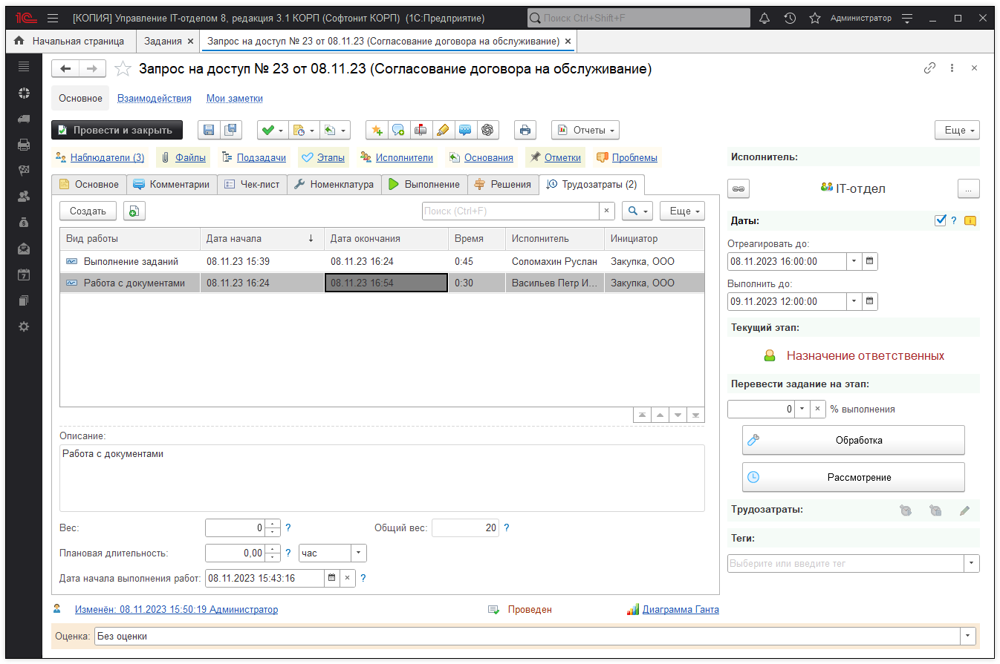

# Создание нового процесса

Процессы в конфигурации имеют значимую роль в работе подсистемы **"Техническая поддержка"**. В программе имеется ряд предопределенных процессов, но зачастую у пользователей возникает необходимость в создание собственных процессов. Давайте подробно разберем создание нового процесса.

Откроем форму списка справочника "Процессы". Для этого перейдем в раздел ***"Справочники" -> подраздел "Service Desk" -> "Процессы"***. Перед нами будет выведен весь список, уже имеющихся процессов конфигурации.  

Чтобы создать новый процесс необходимо нажать кнопку "Создать" (рис 1). Также на форме списка можно с помощью одноименной кнопки, создать новую группу, в которой будут сгруппированы определенные виды процессов.

Перед нами откроется форма создания нового процесса. Данная форма имеет два реквизита "Наименование" и "Вес", а также табличные части: "Этапы", "Возможные исполнители на этапах", "Настройки" и т.д (о табличных частях поговорим позже, более подробно). Интуитивно понятно, для чего предназначен первый реквизит, а вот второй реквизит нужно разобрать. Вес процесса используется при автоподсчете общего веса задания и может принимать значения от 0 до 9999. То есть, вес процесса может влиять на порядок выполнения заданий исполнителем. Назовем новый процесс, например, согласование, а реквизит вес оставим без изменений (рис 2).

В табличной части "Этапы" с помощью кнопки "Добавить" добавим необходимые этапы, которые будут использоваться в данном процессе (рис 3). Также стоит отметить, что в процессе по мимо этапов можно добавить необходимые подпроцессы, которые имеют ряд своих этапов. Таким образом можно построить иерархическую структуру, состоящую из процессов и подпроцессов.

После того, как добавили все необходимые этапы, нужно осуществить схему перехода между этапами данного процесса. Это можно сделать следующим образом, в левой колонке табличной части выделите этап, а в правой колонке активируйте чек-бокс возле этапа, на который возможно осуществить переход (рис 4). Аналогичные действия необходимо провести с каждым из этапов процесса.

С помощью кнопок вверх\вниз (рис 5) или сочетанием клавиш Ctrl+Shift+Up\Ctrl+Shift+Down, можно перемещать элементы левой колонки табличной части "Этапы" вверх или соответственно вниз.

Также у каждого из этапов можно установить исполнителем по умолчанию пользователя или группу пользователей. То есть, переводя задание на определенный этап, будет автоматически изменяться исполнитель в соответствие с указанным значением в данном реквизите (рис 6). При этом возможность перевода на следующий этап будет доступна пользователю, относящегося к данной группе исполнителей.

Как говорилось ранее, нужно уделить больше внимания каждой из табличных частей. Ведь в них производятся важные настройки процесса, которые в дальнейшем могут влиять на работу с подсистемой "Техническая поддержка". Перейдем на закладку "Возможные исполнители на этапах", в данной табличной части указываются, прошу заметить ВОЗМОЖНЫЕ исполнители. То есть единственным отличием между данной табличной частью и реквизитом "Исполнитель по умолчанию" является то, что исполнитель по умолчанию проставляется без возможности выбора. Другими словами, если, например, исполнителем по умолчанию установлена группа пользователей IT-отдел, то полностью вся группа будет выставлена исполнителем, а не конкретный пользователь этой группы. А табличная часть "Возможные исполнители на этапах" дает возможность выбора конкретного пользователя, входящего в указанную группу или список пользователей (рис 7).

Далее перейдем на закладку "Настройки" (рис 8), в которой указывается тип процесса, позволяющий классифицировать задания по данному процессу, а также список чек-боксов:  

* [x] вывод прошлых исполнителей в списке выбора исполнителей;   
* [x] не использовать в задании;  
* [x] не изменять в задании;   
* [x] при переходах на этапы никогда не вводить комментарии;  
* [x] добавлять нового инициатора в наблюдатели;  
* [x] не переходить на этапы выполнения без указания решений.  

В программе каждый чек-бокс из вышеперечисленных имеет свое пояснение.

На закладке "Автоматическое выполнение" можно установить настройки таким образом, чтобы задание, находясь на установленном этапе, автоматически было переведено на необходимый этап (состояние этапа должно быть "Выполнен" или "Закрыт"), в течение указанного срока, если последнее изменение по заданию было ранее n-часов (рис 9). Для более ясного понимания как закрывается задание, рекомендую ознакомиться со [статьей](https://softonit.ru/FAQ/courses/?COURSE_ID=1&LESSON_ID=622&LESSON_PATH=1.22.25.622) или раскрыть подсказку "Схема жизни задания".

Табличная часть "Наблюдатели" позволяет указать пользователей программы, которые будут автоматически помещены в список наблюдателей, если при создание нового задания будет указан данный процесс (рис 10-11).

Закладка "Схема" не влияет на сам процесс, а приводится лишь для справочной информации. Однако если процесс состоит из большого количества этапов и подпроцессов, то изобразив схематично взаимосвязь между ними, легче воспринимать роботу и предназначение процесса (рис 12).

И заключительная закладка "Дополнительно", на которой можно установить родительскую группу процесса, а также добавить произвольный комментарий для справочной информации (рис 13).

После того, как создали новый процесс давайте, на примере, рассмотрим его использование в задание. Задача состоит в согласование нового договора на предоставление аутсорсинговых услуг нашем клиенту (рис 14).

Назначенный исполнитель производит обработку задания. Указывает свои трудозатраты на данном этапе, после переводит задачу на следующий этап "Назначение ответственных". На данном этапе исполнителем по умолчанию назначается группа пользователей IT-отдел, в соответствии с настройками, произведенными при создании процесса. IT-отделом осуществляется назначение ответственных сотрудников, которые будут предоставлять наши услуги, эти действия документируются, отмечаются трудозатраты и задание переводится на следующий этап (рис 15).

Задание переведено на этап "Рассмотрение", где исполнителем по умолчанию является Шатова Марина Александровна. Данный сотрудник оценивает правильность подготовленных бумаг и если все верно, то отправляет документы на согласование в бухгалтерию. При этом она также отмечает свои трудозатраты и переводит задание на следующий этап "Согласование" (рис 16).

И так, когда документы были проверены и одобрены бухгалтерией, главный бухгалтер отмечает трудозатраты и переводит задание на этап "Согласовано" (рис 17).

На этом этапе задание является выполненным, при этом учтены все трудозатраты сотрудников, участвовавших в выполнении. Теперь, используя отчет "Трудозатраты", можно увидеть сколько было затрачено времени (по каждому пользователю) на согласования договора контрагента (рис 18).

