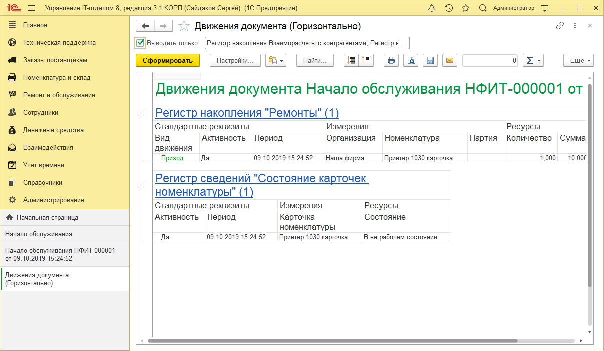

# Движения документов Начало обслуживания и Окончание обслуживания

Документы предназначены для отражения факта ремонта или обслуживания оборудования. Движения документы делают по регистрам накопления: Взаиморасчеты с контрагентами, Обслуживание контрагентами, Остатки и Ремонты, регистры сведений: Бюджеты, Состояния карточек номенклатуры. Т.к. видов обслуживания, а также событий для номенклатуры может быть много, довольно сложно разобраться какие движение и по каким регистрам создаёт документ. В этой статье постараемся разобраться со всеми.

## Начало обслуживания

### Внутреннее обслуживание

* **Регистр накопления Ремонты** - движение в приход (+);
* **Регистр сведений Состояние карточек номенклатуры** - В не рабочем состоянии.

## Начало обслуживания

### Обслуживание контрагентом

* **Регистр накопления Обслуживание контрагентам**и - движение в приход (+);
* **Регистр накопления Остатки** - движение в расход (-);
* **Регистр накопления Ремонты** - движение в приход (+);
* **Регистр сведений Состояние карточек номенклатуры** - В не рабочем состоянии.

При создании документа Окончание обслуживания, на основании документа Начало обслуживания, движения обратные, за исключением регистра накопления Остатки. Движения по этому регистру "двойные" - приход/расход, сделано так для того, чтобы увидеть движения в отчетах. Данное поведение встретиться в будущем для регистра накопления Ремонты.

## Окончание обслуживания на основании Начала обслуживания

### Внутреннее обслуживание

* **Регистр накопления Остатки** - движение в приход/расход (+-);
* **Регистр накопления Ремонты** - движение в расход (-);
* **Регистр сведений Состояние карточек номенклатуры** - В рабочем состоянии.

**Окончание обслуживания на основании Начала обслуживания**

**Внутреннее обслуживание**

#### Списание
* **Регистр накопления Остатки** - движение в расход (-);
* **Регистр накопления Ремонты** - движение в расход (-).

**Окончание обслуживания на основании Начала обслуживания**

**Внутреннее обслуживание**

#### На склад

* **Регистр накопления Остатки** - движение в расход/приход (-+);
* **Регистр накопления Ремонты** - движение в расход (-);
* **Регистр сведений Состояние карточек номенклатуры** - В рабочем состоянии.

**Окончание обслуживания на основании Начала обслуживания**

### Обслуживание контрагентом

* **Регистр накопления Обслуживание контрагентами** - движение в расход (-);
* **Регистр накопления Остатки** - движение в приход (+);
* **Регистр накопления Ремонты** - движение в расход (-);
* **Регистр сведений Состояние карточек номенклатуры** - В рабочем состоянии.

**Окончание обслуживания на основании Начала обслуживания**

**Обслуживание контрагентом**

#### Списание
* **Регистр накопления Обслуживание контрагентами** - движение в расход (-);
* **Регистр накопления Ремонты** - движение в расход (-).

**Окончание обслуживания на основании Начала обслуживания**

**Обслуживание контрагентом**

#### На склад
* **Регистр накопления Обслуживание контрагентами** - движение в расход (-);
* **Регистр накопления Остатки** - движение в приход (+);
* **Регистр накопления Ремонты** - движение в расход (-);
* **Регистр сведений Состояние карточек номенклатуры** - В рабочем состоянии.

Со связкой документов Начало обслуживания и Окончание обслуживания разобрались, но бывают случаи, когда нужно создать документ Окончание обслуживания без создания Начала обслуживания. В этом случае вид документа может быть следующим:

* **Внутреннее обслуживание** - обслуживание производилось своими силами на складе ремонта;
* **Внутреннее обслуживание произведено сразу** - обслуживание производилось своими силами на месте хранения оборудования;
* **Обслуживание контрагентом** - обслуживание производится контрагентом, при этом оборудование забирается;
* **Обслуживание контрагентом произведено сразу** - обслуживание производится контрагентом на месте хранения оборудования.

## Окончание обслуживания

### Внутреннее обслуживание

* **Регистр накопления Остатки** - движение в приход/расход (+-);
* **Регистр накопления Ремонты** - движение в приход/расход (+-);
* **Регистр сведений Состояние карточек номенклатуры** - В рабочем состоянии.

**Окончание обслуживания**

**Внутреннее обслуживание**

#### Списание
* **Регистр накопления Остатки** - движение в расход (-);
* **Регистр накопления Ремонты** - движение в приход/расход (+-).

**Окончание обслуживания**

**Внутреннее обслуживание**

#### На склад
* **Регистр накопления Остатки** - движение в приход/расход (+-);
* **Регистр накопления Ремонты** - движение в приход/расход (+-);
* **Регистр сведений Состояние карточек номенклатуры** - В рабочем состоянии.

**Окончание обслуживания**

### Внутреннее обслуживание произведено сразу  
* **Регистр сведений Состояние карточек номенклатуры** - В рабочем состоянии.

**Окончание обслуживания**

**Внутреннее обслуживание произведено сразу**
#### Списание
* **Регистр накопления Остатки** - движение в расход (-).

**Окончание обслуживания**

**Внутреннее обслуживание произведено сразу **  
#### На склад
* **Регистр накопления Остатки** - движение в приход/расход (+-);
* **Регистр сведений Состояние карточек номенклатуры** - В рабочем состоянии.

**Окончание обслуживания**

### Обслуживание контрагентом

* **Регистр накопления Обслуживание контрагентами** - движение в расход (-);
* **Регистр накопления Остатки** - движение в приход (+);
* **Регистр накопления Ремонты** - движение в расход (-);
* **Регистр сведений Состояние карточек номенклатуры** - В рабочем состоянии.

**Окончание обслуживания**  

**Обслуживание контрагентом**   
#### Списание  
* **Регистр накопления Обслуживание контрагентами** - движение в расход (-);
* **Регистр накопления Ремонты** - движение в расход (-);
* **Регистр сведений Состояние карточек номенклатуры** - В рабочем состоянии.

**Окончание обслуживания**  

**Обслуживание контрагентом**  
#### На склад
* **Регистр накопления Обслуживание контрагентами** - движение в расход (-);
* **Регистр накопления Остатки** - движение в приход (+);
* **Регистр накопления Ремонты** - движение в расход (-);
* **Регистр сведений Состояние карточек номенклатуры** - В рабочем состоянии.

**Окончание обслуживания**  

**Обслуживание контрагентом**  
#### Добавление
* **Регистр накопления Остатки** - движение в приход (+);
* **Регистр сведений Состояние карточек номенклатуры** - В рабочем состоянии.

**Окончание обслуживания**   

### Обслуживание контрагентом произведено сразу
* **Регистр сведений Состояние карточек номенклатуры** - В рабочем состоянии.

**Окончание обслуживания**  

**Обслуживание контрагентом произведено сразу**

#### Списание
* **Регистр накопления Остатки** - движение в расход (-).

**Окончание обслуживания**   

**Обслуживание контрагентом произведено сразу**

#### На склад
* **Регистр накопления Остатки** - движение в приход (+);
* **Регистр сведений Состояние карточек номенклатуры** - В рабочем состоянии.

**Окончание обслуживания**  

**Обслуживание контрагентом произведено сразу**

#### Добавление
* **Регистр накопления Остатки** - движение в приход (+);
* **Регистр сведений Состояние карточек номенклатуры** - В рабочем состоянии.

