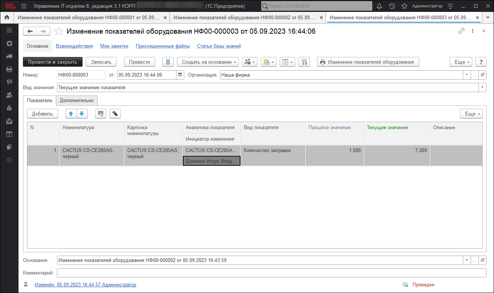
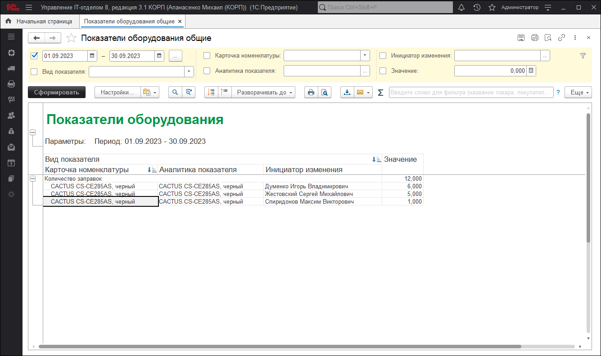

# Изменение показателей оборудования

Очень часто хочется получать информацию о комплектующих, которые имеют показатели, изменяющиеся со временем.
Например, количество заправок картриджей, количество отпечатанных листов бумаги и т.д.

С помощью данного документа можно вести учет числовых показателей оборудования, таких как: количество заправок картриджей, количество отпечатанных листов и т.д. Т.е. это какой-то числовой показатель, который будет накапливается со временем. Для просмотра сколько всего раз был заправлен картридж, отпечатано листов и т.д. воспользуйтесь отчетом "Показатели оборудования".

**Отчет "Показатели оборудования"**