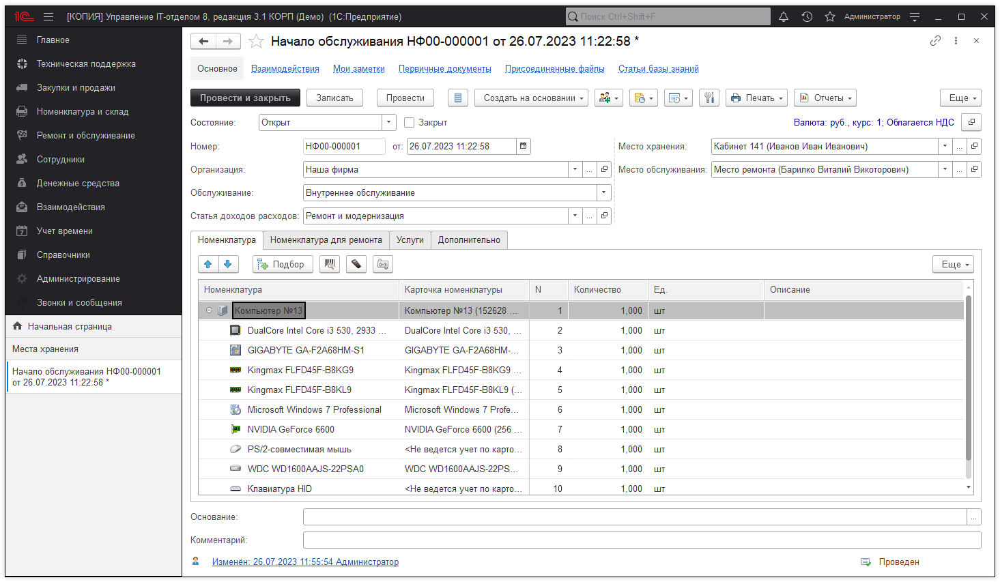

# Начало обслуживания

Документ **"Начало обслуживания"** предназначен для фиксирования факта переноса оборудования для ремонта или обслуживания в место ремонта или передачу контрагенту, который делает ремонт (обслуживание).

Рассмотрим сквозной пример работы подсистемы.

***Пример.*** Допустим на "Компьютере №13" сгорела материнская плата, необходимо ее заменить на новую, которая есть на складе.

Для решения поставленное задачи в конфигурации необходимо забрать системный блок с места хранения "Кабинет 141", где хранится данный компьютер и отнести в "Место ремонта". Т.к. ремонт будет проходить не на рабочем месте сотрудника, закрепленного за "Кабинет 141", то необходимо системный блок перенести на место ремонта.

**Создаем документ "Начало обслуживания"**

* **Организация** - это наша фирма, за которой закреплено оборудование для ремонта;
* **Обслуживание** - может иметь два значения: внутреннее обслуживание или обслуживание контрагентом. В зависимости от выбранного реквизита оборудование будет перемещено либо на склад, либо контрагенту для ремонта (соответственно будет показано либо место обслуживание, либо контрагент с договором);
* **Место хранения** - место, с которого перемещается оборудование;
* **Место обслуживани**я - место, куда перемещается оборудование на время ремонта;
* **Дерево "Номенклатура"** содержит всю номенклатуру, которую необходимо отдать в ремонт;
* **На закладке "Номенклатура для ремонта"** указывается список номенклатуры, который необходимо приобрести для осуществления ремонта основной техники. Например, для ремонта ПК сначала нужно приобрести деталь, так как в наличие на текущий момент у нас ее нет.
* **На закладке "Услуги"** необходимо выбрать дополнительные платные услуги. Например, доставку до контрагента, если ремонт осуществляет контрагент;
* **
* **На закладке "Дополнительно"** размещены дополнительные сведения по бюджетам и подразделению.

Видим, что на компьютере стоит GIGABYTE GA-F2A68HM-S1, которую необходимо заменить.

Так же выбрали в реквизите обслуживание **"Внутреннее обслуживание"**, т.к. ремонт собственными силами. Если обслуживание будет контрагентом, то необходимо выбрать другой вид. Но об этом чуть позже. На закладке "Номенклатура", нажимаем "Подбор" и выбираем то, что будет перемещено на место обслуживания из места хранения "Кабинет 141".

После создания и заполнения документа проведем его. Теперь системный блок "Компьютер №13" с остатков места хранения "Кабинет 141" убран и перемещен на место хранения "Место ремонта".

Первый шаг сделан, мы забрали системный блок для ремонта. Переходим ко второму шагу.

[Перейти далее >>](https://softonit.ru/FAQ/courses/?COURSE_ID=1&LESSON_ID=76)